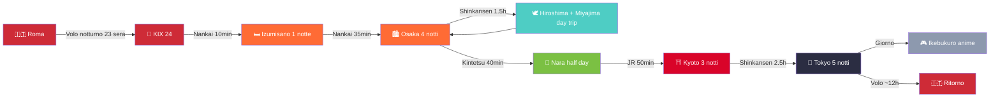
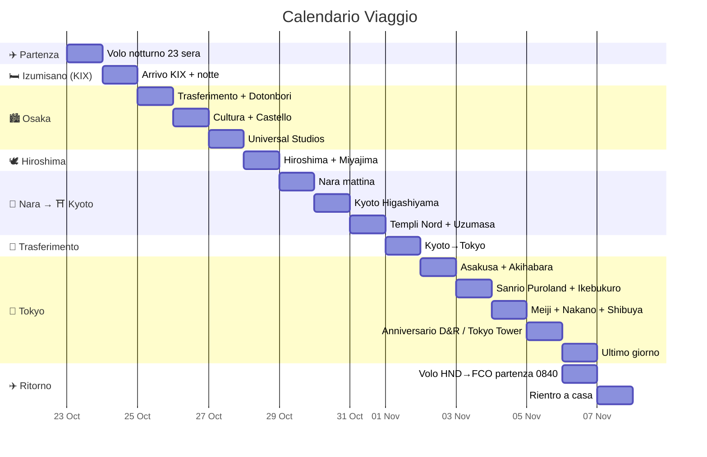

> Creato da @Lorenzo · @Davide · @Rebecca
> ⚡ **Stato:** ✅ **VOLI PRENOTATI** (China Eastern, 09/08/26) · ✅ alloggi prenotati · 🔵 **USJ PRENOTATO (05/09/26)** · ✅ **Sanrio Puroland (09/09/26)** · ✅ **Assicurazione sanitaria (09/09/26)** · ❌ da prenotare: JR Pass + posti treno, Kyoto→Tokyo, Skytree, Shibuya Sky, Uzumasa, eSIM
> ⚠️ **Allergie Rebecca (CRITICO):** soia, pesce, crostacei, frutta secca, banana, fragola, kiwi, arancia, nichel (lieve). Rebecca **deve cucinare da sola** — alloggi con cucina obbligatori. Vedi [[Allergie Alimentari Rebecca]] per guida completa.

# Giappone 2026 — 23 Ottobre (partenza) · 6 Novembre (ritorno)

Roma → KIX → Izumisano → Osaka → Hiroshima → Nara → Kyoto → Tokyo · 15 giorni / 14 notti

## 🎫 Voli Prenotati — China Eastern (09/08/26, tot. 3.289 € / 3 pax)

| Tratta | Data | Orari | Volo | Costo/pax |
|---|---|---|---|---|
| 🛫 **Andata** FCO → KIX | 23 Ott | 21:10 → 24 Ott 21:00 | MU788 + FM3051 (via PVG) · **16h50** | 575,54 € |
| 🛬 **Ritorno** HND → FCO | 6 Nov | 08:40 → 18:15 | MU576 + MU787 (via PVG) · **17h35** | 520,79 € |
| **Totale A/R** | | | | **1.096,33 €** |

> 📄 Dettaglio segmenti, orari scali e storico monitoraggio: [[Prenotazione China Eastern (09-08-26)]]. ⚠️ **Rebecca:** pasto speciale (no soia/pesce/crostacei/frutta secca) — verificare a bordo e sugli scali PVG.

## Riepilogo Tappe

| Tappa | Giorni | Notti | Date |
|:---|:---:|:---:|:---|
| Partenza Italia (volo notturno) | — | — | 23 Ott |
| [[Osaka(大阪市)#Izumisano\|Izumisano (KIX, notte di arrivo)]] | 1 | 1 | 24–25 Ott |
| [[Osaka(大阪市)]] (base per Hiroshima e Nara) | 4 | 4 | 25–29 Ott |
| [[Hiroshima(広島)]] + [[Miyajima (宮島)]] (day trip) | 1 | — | 28 Ott |
| [[Nara (奈良市)]] (half day) | 0.5 | — | 29 Ott |
| [[Kyoto(京都)]] | 3 | 3 | 29 Ott – 1 Nov |
| [[Tokyo(東京)]] | 6 | 5 | 1–6 Nov |
| Ritorno Italia | — | — | 6 Nov |

---

## Info Generali

> ℹ️ Fuso, valuta, IC card, eSIM, lingua, cambio: **[[Info pratiche]]**.

> 🌡️ **Nota meteo:** le temperature indicate giorno per giorno sono il **clima medio storico** di fine ottobre / inizio novembre (fonte: JMA) — non previsioni reali. Verifica le previsioni 1–2 giorni prima della partenza.

---

## Trasporti — JR Pass NON conviene

JR Pass nazionale **non conviene**: meglio **[[JR pass|JR Kansai-Hiroshima Area Pass]] (17.000 ¥ ≈ 92 €)** + **Kyoto→Tokyo** riservato (~13.650 ¥ ≈ 74 €) + Suica/Icoca. Tabella tratte e dettagli: [[JR pass]].

---

## Legenda

| Simbolo | Significato |
|---|---|
| 🟢 **LIBERO** | Da fare liberamente, nessuna prenotazione |
| 🟡 **DA PRENOTARE** | Va prenotato in anticipo (settimane/mesi prima) |
| 🔵 **PRENOTATO #COD** | Già prenotato con codice conferma |
| ⚪ **OPZIONALE** | Solo se c'è tempo/energia |
| 🅿 **PIANO B** | Alternativa in caso di pioggia/chiusura |

---

## Budget Giornaliero (per persona)

| Giorno  |   Data    |    Cibo    | Trasporti  |  Ingressi  |    TOT     |
| :-----: | :-------: | :--------: | :--------: | :--------: | :--------: |
|    1    | 23–24 Ott |    15 €    |    10 €    |     —      |    25 €    |
|    2    |  25 Ott   |    25 €    |    14 €    |     —      |    39 €    |
|    3    |  26 Ott   |    30 €    |    8 €     |    8 €     |    46 €    |
|    4    |  27 Ott   |    25 €    |    5 €     |    88 €    |   118 €    |
|    5    |  28 Ott   |    25 €    |  — (pass)  |    5 €     |    30 €    |
|    6    |  29 Ott   |    30 €    |    7 €     |    10 €    |    47 €    |
|    7    |  30 Ott   |    30 €    |    8 €     |    6 €     |    44 €    |
|    8    |  31 Ott   |    30 €    |    8 €     |    20 €    |    58 €    |
|    9    |   1 Nov   |    25 €    |    86 €    |    13 €    |   124 €    |
|   10    |   2 Nov   |    30 €    |    10 €    |     —      |    40 €    |
|   11    |   3 Nov   |    35 €    |    12 €    |    25 €    |    72 €    |
|   12    |   4 Nov   |    35 €    |    10 €    |    18 €    |    63 €    |
|   13    |   5 Nov   |    35 €    |    12 €    |    8 €     |    55 €    |
|   14    |   6 Nov   |    35 €    |    5 €     |    5 €     |    45 €    |
|   15    |   7 Nov   |    15 €    |    15 €    |     —      |    30 €    |
| **TOT** |           | **~420 €** | **~210 €** | **~206 €** | **~836 €** |

> Spese giornaliere **~836 €/persona** (stime in loco: cibo 420 + trasporti 210 + ingressi 206 — aggiornate con i prezzi reali: USJ 88,25 · Sanrio 19,97 · Skytree 12,50 · Shibuya 18,48 · Uzumasa 15,22 · Museo 1,09 · Kyoto→Tokyo 74,18). Costi fissi **reali** (da [[Spese Reali]]): **Volo 1.096,33 + Alloggio 359,89 + JR Pass 92,39 + Spese personali ~400 + Assicurazione 53,43 + eSIM 20 + Bagagli 17,17 = ~2.039 €** → **TOTALE ~2.875 €/persona** (~2.850–2.950 €). *Tasso: ~184 ¥/€ (ag. 2026).*
> ℹ️ Le voci giornaliere sono stime **leggermente gonfiate come margine per imprevisti**: si correggono solo i refusi reali (es. G7 ingressi riportati al costo effettivo Kodai-ji+Kiyomizu ~6 €).

### Alloggi

| #   | Città                  | Struttura                                                        | Date                                           | Notti     | Cucina                        | Ref              |                  |
| --- | ---------------------- | ---------------------------------------------------------------- | ---------------------------------------------- | --------- | ----------------------------- | ---------------- | ---------------- |
| 0   | [[Osaka(大阪市)#Izumisano\|Izumisano (KIX)]]                                                | [[KURA Hotel Izumisano\|KURA Hotel Izumisano]] | 24–25 Ott | 1                             | ✅ Kitchenette    | 🔵 **PRENOTATO** |
| 1   | [[Osaka(大阪市)]]         | [[Osaka - Hanazonocho Apartment 103\|Hanazonocho Apartment 103]] | 25–29 Ott                                      | 4         | ✅ Angolo cottura              | 🔵 **PRENOTATO** |                  |
| 2   | [[Kyoto(京都)]]          | [[Kyoto - Miro Nijo Hotel\|Miro Kyoto Nijo Hotel]]               | 29 Ott–1 Nov                                   | 3         | ✅ Cucina attrezzata           | 🔵 **PRENOTATO** |                  |
| 3   | [[Tokyo(東京)]]          | [[Tokyo - Taito City Guesthouse\|Taito City Guesthouse]]         | 1–6 Nov                                        | 5         | ✅ Cucina condivisa (1° piano) | 🔵 **PRENOTATO** |                  |
>
> 🏠 Ogni alloggio ha una pagina dedicata con indirizzo, servizi, e note per Rebecca.

---

# ITINERARIO

---

## Giorno 1 — Venerdì 23 (sera) · Sabato 24 Ottobre — Partenza & Arrivo KIX

**Difficoltà:** 1/4 · **Budget:** ~25 €

**⏱️ Orari indicativi:**
- **18:10** Check-in FCO (volo 21:10, ~3h prima)
- **21:10 → 14:40 (24/10)** Volo MU788 FCO→Shanghai PVG (11h30)
- **14:40–17:25** Cambio a Shanghai PVG (2h45)
- **17:25 → 21:00** Volo FM3051 PVG→KIX (2h35)
- **21:00** Arrivo KIX · Icoca + attivazione eSIM · Nankai Airport Express (~10 min, ¥520) → Izumisano
- **~22:00** Check-in KURA Hotel Izumisano (self) · cena leggera (konbini)

Preparativi e partenza dall'Italia. Volo notturno per Osaka (KIX) **via Shanghai (PVG)** — China Eastern **MU788 + FM3051** (prenotato), partenza **venerdì 23 sera alle 21:10** → arrivo **sabato 24 alle 21:00**. La prima notte si dorme a **Izumisano**, a 2 fermate dall'aeroporto — niente stress di trasferimento notturno fino al centro.

**Checklist pre-partenza:**
- [ ] Passaporti validi 6+ mesi
- [ ] [[Emergenze e Sicurezza#Assicurazione Viaggio|Assicurazione viaggio]] stampata
- [ ] eSIM attivata sul telefono (Klook o Airalo)
- [ ] Suica digitale su iPhone / Wallet
- [ ] Bancomat per prelievi yen (avvisa la banca)
- [ ] Copie digitali documenti su cloud
- [ ] Carica power bank, cavi, adattatore
- [ ] 👕 **Valigia pronta** — vedi [[Packing List]] per lista completa
- [ ] 🗣️ **Frasario giapponese** stampato — vedi [[Frasario Giapponese]]
- [ ] 🏥 **Pasto speciale volo per Rebecca** (contatta compagnia aerea: no soia, no pesce, no crostacei, no frutta secca)
- [ ] 📋 **Cartellino allergie in giapponese** (plastificato) — vedi [[Frasario Giapponese#Cartellino Allergie di Rebecca]]
- [ ] 🏠 **Verificare cucina in TUTTI gli alloggi** — vedi [[Allergie Alimentari Rebecca#Check-list Alloggi]]
- [ ] 📱 **Scaricare app:** Google Maps offline, Safety Tips, Google Translate

**Venerdì 23 (sera):**
- Partenza per aeroporto
- Volo notturno **MU788 FCO→PVG** (11h30) + **FM3051 PVG→KIX** (2h35) — ~16h50 totali con scalo a Shanghai 2h45
- 🅿 **PIANO B:** Se il volo è in ritardo, nessun impatto — il giorno 2 è volutamente leggero

**Sabato 24 — Arrivo a KIX:**
- 🛬 **Volo prenotato:** MU788 (FCO→PVG 11h30) + FM3051 (PVG→KIX 2h35) · cambio a Shanghai 2h45 · arrivo KIX **21:00**
- Ritira **[[Icoca]]** alle macchinette JR in aeroporto (o carica Suica digitale)
- [[E-sim panoramica delle disponibili\|eSIM]] — attivala subito all'arrivo
- **Nankai Airport Express** → [[Osaka(大阪市)#Izumisano|Izumisano]] (~8-10 min, ¥520)
- Check-in al **KURA Hotel Izumisano** (self check-in con codice via email, check-in dalle 16:00)
- Cena leggera nelle vicinanze (konbini o izakaya locali)
- 🅿 **PIANO B (volo in ritardo):** KURA hotel è a 10 min dall'aeroporto — raggiungibile con l'ultimo Nankai senza problemi

---

## Giorno 2 — Domenica 25 Ottobre — Trasferimento a Osaka · Shinsaibashi (pomeriggio) & Dotonbori (sera)

**Difficoltà:** 2/4 · **Budget:** ~40 € · **Meteo:** 18–23°C, 30% possibilità pioggia (dati JMA)

**⏱️ Orari indicativi:**
- **07:30** Sveglia · colazione (konbini)
- **09:30** Check-out KURA Hotel
- **10:00–10:34** Nankai Main Line Izumisano → Namba (~34 min, ¥610)
- **10:50** Metro Yotsubashi Line → Hanazonocho · check-in/deposito bagagli
- **12:00–13:00** Pranzo zona Namba
- **13:15–16:15** **Shinsaibashi** (shopping) — spostata qui dal Giorno 3
- **16:30–17:00** Tempio Hozen-ji
- **17:15–18:30** Riposo (⚪) / primo assaggio Dotonbori di giorno
- **19:00** Cena Dotonbori (street food / alternative)
- **20:30** Dotonbori illuminato
- **22:00** Rientro appartamento

**Mattina — Trasferimento a Osaka:**
- Check-out KURA Hotel **entro le 10:00**
- **Nankai Main Line** → Namba (~34 min, ¥610, su Icoca) — oppure JR → Tennoji se preferisci
- Metro Yotsubashi Line → **Hanazonocho** → check-in appartamento
- Deposito bagagli in stazione se il check-in è nel pomeriggio

**Pomeriggio | Shinsaibashi & Hozen-ji (tutto a piedi da Namba):**
- **Shinsaibashi** — la via dello shopping di Namba: arcata coperta **Shinsaibashi-suji** (moda, cosmetici, elettronica; negozi ~10:30–20:30). Da fare **al pomeriggio**, quando gli store sono aperti (di sera chiudono presto) · ⚠️ domenica pomeriggio molto affollata
- [[Tempio Hozen-ji (法善寺)]] #4/5 🟢 — a 2 min da Dotonbori, statua coperta di muschio, atmosfera raccolta

**Sera | Dotonbori (illuminato):**
- [[Dotonbori (道頓堀)]] #5/5 🟢 — il canale illuminato, le insegne al neon, il granchio meccanico del Kani Doraku. **Non serve vederlo di giorno**: si torna dopo cena con le luci accese

**Cibo — Alternative:**
- 🅰️ **Street food** [[Dotonbori (道頓堀)]]: takoyaki (¥500), okonomiyaki (¥1.000), kushikatsu (¥800)
- 🅱️ **Bib Gourmand:** [[Mangiare in Giappone]] (Dotonbori, ¥500–800) · [[Mangiare in Giappone#Osaka|Kushikatsu Daruma]] (Shinsekai, ¥1.000–2.000)
- 🅲 **Seduti:** [[Mangiare in Giappone#Catene e Cibo Economico|Okonomiyaki Kiji]] (Umeda, Bib Gourmand ¥1.000–2.000) · ramen · [[Mangiare in Giappone#Kaitenzushi (Conveyor Belt Sushi)|Kura Sushi]] (¥100–500/piatto)
- 🅳 **Rebecca:** [[Mangiare in Giappone#Gyudon e Curry per Rebecca (Sicuri!)|Saizeriya]] (Namba, pasta aglio e olio ✅) · [[Mangiare in Giappone#Gyudon e Curry per Rebecca (Sicuri!)|Matsuya]] (gyudon senza salsa) · [[Mangiare in Giappone#I Preferiti di Rebecca — dalla sua Google Maps|yakiniku]] (Namba, carne alla griglia ✅) · **cucina in hotel**
- 🍨 **Dopo:** matcha gelato (¥300–500) · crepes giapponesi

**Trasporti:** Nankai ¥610 + metro Yotsubashi (~¥200) + Suica
🅿 **PIANO B (pioggia):** Namba Walks (shopping coperto) + Hozen-ji → cena al coperto a Dotonbori

---

## Giorno 3 — Lunedì 26 Ottobre — Osaka: Cultura & Quartieri

**Difficoltà:** 3/4 · **Budget:** ~46 € · **Meteo:** 18–23°C, 25% pioggia (dati JMA)

**⏱️ Orari indicativi:**
- **07:00** Sveglia · colazione
- **08:15** Uscita → Castello di Osaka (metro ~20 min)
- **09:00–10:00** Castello di Osaka (apertura 9:00) · giardini Nishinomaru 10:00–10:30
- **10:45** Metro → Shitennoji-mae (~15 min)
- **11:00–12:00** Tempio Shitenno-ji
- **12:15–13:15** Pranzo zona Shinsekai
- **13:30–15:00** Shinsekai + Tsutenkaku (⚪ ¥900)
- **15:15–18:00** Nipponbashi Den Den Town (⭐ Lorenzo) — **più tempo** (~2h45: Shinsaibashi ora è al Giorno 2)
- **18:15** Relax / rientro verso Namba
- **19:00** Cena Namba
- **21:30** Rientro

**Mattina | Cluster Castello:**
- [[Castello di Osaka (大阪城)]] #4/5 🟢 (9:00, ¥600) — arrivo entro 9:00 per evitare code
- Passeggiata nei giardini Nishinomaru (¥350)
- *Spostamento:* Metro Midosuji Line → Shitennoji-mae (~15 min, ¥230)

**Pomeriggio | Cluster Shinsekai (ritmo rilassato — Umeda rimosso):**
- [[Tempio Shitenno-ji (四天王寺)]] #4/5 🟢 (9:00–16:30, ¥500)
- [[Shinsekai (新世界と通天閣​)]] #4/5 🟢 — atmosfera retrò, kushikatsu
- [[Torre Tsutenkaku (通天閣)]] #2/5 🟢 (¥900, optional)
- [[Nipponbashi Den Den Town (でんでんタウン)]] #4/5 ⭐ **Lorenzo** — Osaka's Akihabara: retrogame, anime, figure, elettronica. Negozi ~10:00–19:30. A ~10 min a piedi da Shinsekai/Ebisucho (o 1 fermata Sakaisuji → Nihonbashi). **Prevedere ~2h30** — ora che Shinsaibashi è al Giorno 2 si gira con calma (chi non è interessato può riposare o salire al Tsutenkaku)

> 🧘 **Giornata tranquilla (modifica 03/09/26):** [[Umeda Sky Building (梅田スカイビル)]] **rimosso** — niente trasferimento a Umeda, si resta in zona **Minami** (Shinsekai → Namba). Nessuna corsa: se si è stanchi si rientra presto o si prosegue con calma verso Namba.

**Cibo oggi — Alternative:**
- 🅰️ **Pranzo gyudon:** [[Mangiare in Giappone#Catene e Cibo Economico|Sukiya]] (gyudon ¥400) · [[Mangiare in Giappone#Catene e Cibo Economico|Yoshinoya]] (¥400) · [[Mangiare in Giappone#Catene e Cibo Economico|Matsuya]] (curry ¥380)
- 🅱️ **Pranzo ramen:** [[Mangiare in Giappone#Catene e Cibo Economico|Ichiran]] (¥1.000–2.000) · Tenkaippin (¥800–1.200)
- 🅲 **Cena Lorenzo&Davide:** izakaya a Namba (¥1.500–3.000) · [[Mangiare in Giappone#Bib Gourmand — Qualità-Prezzo|Kushikatsu Daruma]] (Bib Gourmand, Shinsekai, ¥1.000–2.000) · [[Mangiare in Giappone#Kaitenzushi (Conveyor Belt Sushi)|Sushiro]] (¥100–500/piatto)
- 🅳 **Rebecca pranzo:** [[Mangiare in Giappone#Gyudon e Curry per Rebecca (Sicuri!)|Matsuya]] (gyudon senza salsa) · konbini (yogurt, frutta, uovo sodo) · [[Mangiare in Giappone#I Preferiti di Rebecca — dalla sua Google Maps|yakiniku]] (carne alla griglia ✅) · preparato in hotel
- 🅴 **Rebecca cena:** [[Mangiare in Giappone#Gyudon e Curry per Rebecca (Sicuri!)|Saizeriya]] (Namba, pasta aglio e olio ✅) · [[Mangiare in Giappone#Gyudon e Curry per Rebecca (Sicuri!)|Sukiya]] (riso + uovo ✅) · [[Mangiare in Giappone#Catene e Cibo Economico|Royal Host]] (steak ✅) · **cucina in hotel**

**Sera | Namba:**
- Rientro con calma e cena in zona Namba — **Shinsaibashi non serve più qui** (fatto al Giorno 2 di pomeriggio, quando i negozi sono aperti)

🅿 **PIANO B (pioggia):** Sostituisci Castello con TeamLab Botanical Garden (#4/5) — solo serale 18:30–21:30

---

## Giorno 4 — Martedì 27 Ottobre — Universal Studios Japan

**Difficoltà:** 4/4 (camminata intensa) · **Budget:** ~118 € · **Meteo:** 18–23°C, 25% pioggia

**⏱️ Orari indicativi:**
- **07:00** Sveglia · colazione
- **08:00** Partenza → JR Osaka Loop Line → Universal City (~15 min, ¥180)
- **08:30** Arrivo ai cancelli (apertura indicativa 9:00 — verificare calendario)
- **09:00–18:00** USJ: Super Nintendo World (ingresso incluso, orario assegnato) · Harry Potter · Minion/Jurassic — **pranzo coperto da voucher pasto**
- **18:30** Uscita · JR → Namba (~15 min)
- **19:30** Cena Namba (Rebecca: cucina / alternative sicure)
- **21:30** Rientro (giornata ~25.000 passi)

**Giornata intera a [[Universal Studios Japan (ユニバーサル・スタジオ・ジャパン)]]** #3/5 🔵 **PRENOTATO**

> ✅ **Biglietti USJ acquistati il 05/09/26** — **1-day Studio Pass + ingresso Super Nintendo World + voucher pasto**, **88 €/pax**. Portare QR/codice conferma (app o stampa) per il **27 ott**.

*Spostamento:* JR Osaka Loop Line → Universal City (~15 min, ¥180)

**Cibo oggi — Alternative:**
- 🅰️ **Pranzo in USJ:** 🎫 **coperto dal voucher pasto incluso** — verificare i ristoranti accettati al parco · in alternativa hamburger (¥1.500–2.500) · pizza · [[Mangiare in Giappone#Kaitenzushi (Conveyor Belt Sushi)|conveyor belt sushi]] (¥100–500)
- 🅱️ **Cena rientro:** [[Mangiare in Giappone#Catene e Cibo Economico|Sukiya]] (gyudon ¥400) · [[Mangiare in Giappone#Catene e Cibo Economico|Ichiran]] (ramen ¥1.000–2.000) · [[Mangiare in Giappone#Per Fasce di Budget|CoCo Ichibanya]] (curry ¥500–1.000)
- 🅲 **Cena Rebecca:** [[Mangiare in Giappone#Gyudon e Curry per Rebecca (Sicuri!)|Saizeriya]] (Namba, pasta aglio e olio ✅) · [[Mangiare in Giappone#Gyudon e Curry per Rebecca (Sicuri!)|Sukiya]] (riso + uovo ✅) · [[Mangiare in Giappone#I Preferiti di Rebecca — dalla sua Google Maps|Yakiniku Like]] (Namba, carne alla griglia ✅) · **cucina in hotel**
- ⚠️ **Rebecca:** PORTA CIBO DA CASA a USJ (riso, pollo freddo, frutta, uova sode). Niente dentro USJ è sicuro (soia+pesce) — il **voucher pasto** potrebbe non essere utilizzabile per lei → chiedere all'arrivo un'opzione sicura o cederlo a un compagno

**Aree priority:**
- **Super Nintendo World** ✓ *ingresso incluso (orario assegnato — verificare sull'app)* — Mario Kart: Koopa's Challenge
- **The Wizarding World of Harry Potter** — Hogwarts Castle
- **Minion Park** + Jurassic World

**Consigli:**
- 🔵 **Biglietto PRENOTATO (05/09/26):** **1-day Studio Pass + ingresso Super Nintendo World + voucher pasto = 88 €/pax** (tariffa del 27 ott) · **acquisto anticipato OBBLIGATORIO**: dal 2025 niente biglietti al parco
- 🟡 **Express Pass** (~¥8.000–15.000 extra) — NON incluso: da valutare solo per saltare code 2h+ (es. Mario Kart) · acquisto separato
- Arrivare entro 8:00–8:30 (orario tipico novembre: 9:00–20:00; l'apertura effettiva varia per periodo — verificare sul sito ufficiale)
- Scarpe comodissime — si camminano 25.000+ passi

🅿 **PIANO B (fatica/pioggia):** Biglietti già presi — se si è stanchi si esce prima (re-ingresso non consentito) e si rientra a Namba per cena.

---

## Giorno 5 — Mercoledì 28 Ottobre — Hiroshima + Miyajima

**Difficoltà:** 4/4 · **Budget:** ~30 € · **Meteo:** 17–22°C, 25% pioggia · **Attiva JR Kansai-Hiroshima Pass**

**⏱️ Orari indicativi:**
- **05:15** Sveglia · colazione
- **05:50** Uscita · metro Hanazonocho → Shin-Osaka (Yotsubashi → cambio Midosuji, ~20–25 min) → arrivo ~06:15
- **06:15–06:45** Sportello JR West: attivazione **JR Pass** + **prenotazione posti riservati A/R** (30 min di margine: la mattina presto gli sportelli sono pochi)
- **06:45–08:15** Shinkansen Sakura Shin-Osaka → Hiroshima (~1h30)
- **08:30–08:55** JR Sanyo Line → Miyajimaguchi (~25 min, incluso pass)
- **09:00–09:15** Traghetto JR → Miyajima (~10 min, + tassa 100¥)
- **09:30–12:00** Miyajima: Itsukushima Shrine + Daisho-in (controllare maree)
- **12:00–13:00** Pranzo a Miyajima
- **13:15–13:30** Traghetto ritorno · **13:40–14:05** JR → Hiroshima
- **14:15** Bus Meipuru-pu (coperto da pass) o tram → Peace Park (~15 min)
- **14:30–16:30** Museo della Pace (~2h — nov: orario 8:30–18:00)
- **16:30–17:15** Genbaku Dome + parco
- **17:15–17:30** Hondori street (momiji manju da portare a casa) ⚪ — uscita anticipata alle 17:30
- **17:45** Tram Genbaku Dome-mae → Hiroshima St (~15–20 min) → arrivo ~18:05
- **18:05–18:15** Attraversamento stazione → binari Shinkansen (5–10 min)
- **18:15–18:30** Shinkansen riservato → Shin-Osaka (~1h30)
- **~20:00** Rientro Osaka · cena Namba

> 🚆 **Punti critici rivisti (feedback 09/09/26):** ① mattina — sveglia anticipata a **05:15** e uscita **~05:50** per avere ~30 min allo sportello JR West di Shin-Osaka (attivazione pass + posti riservati A/R; i tour operator lasciano mezz'ora abbondante solo per i biglietti). ② rientro — uscita da Hondori alle **17:30** e tram delle **17:45** (la corsa richiede 15–20 min, non 12) così arrivi ai binari Shinkansen con margine sul treno riservato.

> 🟡 **Da attivare oggi (28 ott):** [[JR pass|JR Kansai-Hiroshima Area Pass]] (**17.000 ¥ ≈ 92 €**) — copre Shinkansen A/R Shin-Osaka→Hiroshima + traghetto JR Miyajima + linee JR West per i prossimi 4 giorni (**valido 28 ott–1 nov**)

**06:45–08:15** Shinkansen Sakura: [[Shin-Osaka Station]] → [[Hiroshima(広島)]] (~1h 30m)
**08:30–08:55** JR Sanyo Line → [[Miyajima (宮島)|Miyajimaguchi]] (~25 min, incluso JR Pass)
**09:00–09:15** Traghetto JR → Miyajima (~10 min, incluso pass + **tassa visita 100¥** da pagare al terminal)

**Mattina a Miyajima:**
**09:30–12:00** [[Itsukushima shrine (嚴島神社)]] #5/5 🟢 (6:30–17:30, ¥300) — Torii galleggiante + santuario patrimonio UNESCO
  - [[Tempio Daisho-in (大聖院)]] #3/5 🟢 (8:00–17:00) — tempio più antico dell'isola, foliage autunnale
  - Senjokaku + Pagoda Gojunoto (8:30–16:30, ¥100) ⚪
  - ⚠️ **Maree:** controllare l'orario — torii più scenico con alta marea (luna piena il 26/10 = maree ampie)
**12:00–13:00** **Pranzo a Miyajima — Alternative:**
  - 🅰️ Ostriche alla griglia (¥1.000–2.000) · anago meshi (¥1.500–2.500)
  - 🅱️ Momiji manju (¥300) + street food lungo Omotesando
  - ⚠️ **Rebecca:** ostriche NO (crostacei) — okonomiyaki senza salsa o konbini/pasto al sacco
**13:15–13:30** Traghetto ritorno → Miyajimaguchi
**13:40–14:05** JR Sanyo Line → Hiroshima

**Pomeriggio a Hiroshima:**
**14:15–17:15** [[Memorial Park Hiroshima]] #4/5 🟢 (24H, gratuito)
  - [[Memorial Park Hiroshima|Museo della Pace di Hiroshima]] (nov: 8:30–18:00, ultimo ingresso 17:30, ¥200, ~2h) — emotivamente intenso, 🟡 consigliato biglietto online
  - [[Memorial Park Hiroshima|Genbaku Dome]] — simbolo UNESCO
**17:15–17:30** [[Hondori street]] ⚪ — shopping veloce + momiji manju da portare a casa (uscire alle 17:30 per il tram delle 17:45)
> ⚠️ **Castello di Hiroshima:** il mastio è **chiuso al pubblico da marzo 2026** (rischio sismico) — restano solo giardini + Ninomaru (gratis, fino 16:30 in autunno). Meglio dedicare il tempo a Hondori.

**18:15–18:30** Shinkansen riservato ritorno (posti già prenotati in mattinata) → Shin-Osaka (~1h30, arrivo ~20:00)
🅿 **PIANO B (stanchi/pioggia):** Salta Hondori e rientra entro le 17:30. Se piove forte a Miyajima → inversione: prima Museo della Pace, poi Miyajima se schiarisce

---

## Giorno 6 — Giovedì 29 Ottobre — Nara + Arrivo Kyoto

**Difficoltà:** 3/4 · **Budget:** ~47 € · **Meteo:** 15–22°C, 25% pioggia

**⏱️ Orari indicativi:**
- **07:30** Sveglia · colazione veloce · check-out (self)
- **08:30** Valigie grandi → **Yamato Namba Station Center** (apre 9:00) — **spedizione a Tokyo, consegna 1 nov**
- **09:30–10:10** Kintetsu Namba → Kintetsu Nara (~40 min, ¥570, non-JR) — **solo bagaglio a mano**
- **10:15–13:15** Nara: Parco + Todaiji (Gran Buddha) + Kasuga Taisha (~3h)
- **13:15–14:00** Pranzo Nara (zona stazione)
- **14:05–14:25** A piedi/bus → JR Nara (~20 min)
- **14:30–15:20** JR Nara → Kyoto (~50 min, **incluso pass**)
- **15:30** Metro → check-in Miro Nijo Hotel
- **16:30–18:00** Fushimi Inari (JR 5 min, 24h) — torii nel tardo pomeriggio
- **18:30** Cena Kyoto Station (depachika / alternative)
- **21:00** Rientro hotel

**08:00** Check-out Osaka (self)
**08:30–09:00** Valigie grandi → **Yamato Namba Station Center** (9:00–20:00) per la **spedizione a Tokyo** · *in alternativa spedire il 28 sera*
**09:30–10:10** Kintetsu Line Namba → Kintetsu Nara (~40 min, ¥570 — NON JR) · solo bagaglio a mano

> 🧳 **Bagagli — SPEDITI Osaka → Tokyo (Takkyubin Yamato):** le valigie grandi si spediscono da Osaka direttamente al **Taito City Guesthouse (Tokyo)** con **consegna specificata 1 nov** (limite 7 giorni). Costo **~¥3.160/valigia (160 size) ≈ 17 €** · 3 valigie ≈ 50 €. Si viaggia verso Nara/Kyoto con il **solo bagaglio a mano**. Dettagli, regole e punti critici: [[Trasferimento Bagagli (Takkyubin)]].
> ⚠️ **Da confermare col host di Tokyo** che riceva/conservi i bagagli l'1 nov (private lodging può rifiutare). **Non spedire** valori/documenti/medicine/elettronica.

**Mattina | [[Nara (奈良市)]]:**
- [[Nara (奈良市)#Parco di Nara|Parco di Nara]] 🟢 — cervi Sika, shika senbei (¥150)
- [[Nara (奈良市)#Tempio Todaiji|Tempio Todaiji]] 🟢 (¥800) — Daibutsu (Buddha in bronzo 15m)
- [[Nara (奈良市)]] 🟢 — 3.000 lanterne di pietra

**14:05–15:20** Spostamento a piedi/bus a **JR Nara** (~20 min) → Kyoto (~50 min, **incluso JR Pass**)

**Cibo oggi — Alternative:**
- 🅰️ **Pranzo Nara:** [[Mangiare in Giappone#Budget|kakinoha-zushi]] (sushi in foglia di cachi, ¥800–1.200) · [[Mangiare in Giappone#Catene e Cibo Economico|Sukiya]] (gyudon ¥400) · konbini (onigiri ¥100–200)
- 🅱️ **Cena Kyoto:** [[Mangiare in Giappone#Depachika|depachika Isetan Kyoto Station]] (bento scontati −30% dopo 18:00) · [[Mangiare in Giappone#Catene e Cibo Economico|CoCo Ichibanya]] (curry ¥500–1.000) · [[Mangiare in Giappone#Catene e Cibo Economico|Nakau]] (udon ¥300–600)
- 🅲 **Cena Rebecca:** [[Mangiare in Giappone#Gyudon e Curry per Rebecca (Sicuri!)|Saizeriya]] (Shijo, pasta aglio e olio ✅) · [[Mangiare in Giappone#Gyudon e Curry per Rebecca (Sicuri!)|Sukiya]] (riso + uovo ✅) · [[Mangiare in Giappone#Catene e Cibo Economico|CoCo Ichibanya]] (curry ✅, Kyoto Station) · **cucina in hotel**

**Pomeriggio/Sera | Kyoto:**
- Check-in hotel
- [[Fushimi Inari (伏見稲荷大社)]] #3/5 🟢 (24h, GRATIS) — JR Nara Line → Inari (5 min, incluso JR Pass). 10.000 torii illuminati alla sera, quasi deserto

🅿 **PIANO B (pioggia):** Sostituisci Todaiji con Museo Nazionale di Nara (¥700, al chiuso)

---

## Giorno 7 — Venerdì 30 Ottobre — Kyoto: Higashiyama & Gion

**Difficoltà:** 4/4 · **Budget:** ~56 € · **Meteo:** 15–22°C, 25% pioggia

**⏱️ Orari indicativi:**
- **08:30** Sveglia · colazione
- **09:30** Uscita → Higashiyama (bus/metro ~20 min)
- **10:00–10:45** Sannenzaka / Ninenzaka
- **11:00–12:00** Tempio Kodai-ji
- **12:15–13:15** Pranzo (Nishiki Market / zona Gion)
- **13:30–14:30** Santuario Yasaka
- **14:45–16:00** Gion (Hanamikoji — niente vicoli privati/geisha)
- **16:15–17:45** **Kiyomizu-dera al tramonto** (tramonto ~17:15; uscita entro 18:00)
- **19:00** Cena Gion
- **21:30** Rientro hotel

**Mattina | Higashiyama (Sannenzaka & Kodai-ji):**
- [[Sannenzaka e Ninenzaka (三年坂)(二年坂)]] #4/5 🟢 — viuzze acciottolate, matcha gelato (negozi aperti da ~10:00)
- [[Tempio Kodai-ji (高台寺)]] #3/5 🟢 (9:00–17:00, ¥600) — giardino zen, boschetto bambù (chiude 17:00)

**Pomeriggio | Yasaka & Gion:**
- [[Santuario Yasaka (八坂神社)]] #4/5 🟢 (24h, GRATIS)
- [[Quartiere Gion (祇園)]] #1/5 🟢 ⚠️ **Vietato entrare nei vicoli privati (multa 70€)** — via principale Hanamikoji OK. Rispetta le geisha (niente foto)

**Tramonto | Kiyomizu-dera (16:15–17:45):**
- [[Kiyomizu-dera (清水寺)]] #5/5 🟢 (6:00–18:00, ¥500) — **al tramonto (~17:15)**: terrazza in legno e vista su Kyoto che si accende. ⚠️ Ultimo ingresso ~17:30, uscita entro le 18:00. Foliage autunnale in corso

**Cibo oggi — Alternative:**
- 🅰️ **Pranzo street food:** [[Nishiki Market (錦市場)]] — yakitori, tsukemono, dolci matcha, tofu (¥200–1.000). **Bib Gourmand:** [[Mangiare in Giappone#Bib Gourmand — Qualità-Prezzo|Men-ya Inoichi]] (ramen, Pontochō, ¥1.000–2.000)
- 🅱️ **Pranzo economico:** [[Mangiare in Giappone#Catene e Cibo Economico|CoCo Ichibanya]] (curry ¥500–1.000) · [[Mangiare in Giappone#Catene e Cibo Economico|Hanamaru Udon]] (udon ¥300–600)
- 🅲 **Cena Lorenzo&Davide:** [[Quartiere Gion (祇園)]] — yakitori, izakaya (¥2.000–4.000) · [[Mangiare in Giappone#Bib Gourmand — Qualità-Prezzo|Omen]] (udon, Ginkakuji, ¥1.000–2.000)
- 🅳 **Rebecca cena:** [[Mangiare in Giappone#Gyudon e Curry per Rebecca (Sicuri!)|Saizeriya]] (Shijo, pasta ✅) · [[Mangiare in Giappone#Gyudon e Curry per Rebecca (Sicuri!)|Royal Host]] (steak ✅) · [[Mangiare in Giappone#I Preferiti di Rebecca — dalla sua Google Maps|yakiniku]] (Gion, carne alla griglia ✅) · **cucina in hotel**

**Sera:**
- [[Quartiere Gion (祇園)]] — vicolo sul fiume Kamo, ristoranti con terrazza sull'acqua ⚪

🅿 **PIANO B (troppa folla):** Ginkakuji (Padiglione d'Argento, #1/5) — più tranquillo

---

## Giorno 8 — Sabato 31 Ottobre — Kyoto: Templi del Nord + Uzumasa Kyoto Village + Gion

**Difficoltà:** 3/4 · **Budget:** ~58 € · **Meteo:** 15–22°C, 25% pioggia · 🎃 **Halloween**

**⏱️ Orari indicativi:**
- **09:00** Sveglia · colazione (niente fretta)
- **10:00** Bus → nord Kyoto (~30 min)
- **10:35–11:35** [[Kinkaku-ji (金閣寺)]] (¥500)
- **11:50–12:40** [[Ryoan-ji (龍安寺方丈庭園)]] (⚪, ¥600, a ~15 min a piedi)
- **13:00–14:00** Pranzo (zona nord o di rientro)
- **14:30–15:30** Rientro in centro · pausa breve
- **15:45** Randen (Keifuku) da Shijo-Omiya o bus → **Uzumasa**
- **16:15–19:00** [[TOEI Kyoto studio park (東映太秦映画村)|Uzumasa Kyoto Village]] — **biglietto giornata ¥2.800**: subito **EVA** (ultimo ingresso 17:15) + altre attrazioni anime
- **19:15** Ritorno verso est (~40 min) → **Gion**
- **20:00** Cena a Gion / Ponto-chō
- **21:00–22:30** **Halloween**: Gion, vicoli, fiume Kamo (verificare eventi serali)
- **23:00** Rientro hotel

**Mattina | Templi del Nord:**
- [[Kinkaku-ji (金閣寺)]] #3/5 🟢 (9:00–17:00, ¥500) — Padiglione d'Oro ricoperto di foglia d'oro
- [[Ryoan-ji (龍安寺方丈庭園)]] #2/5 🟢 (8:00–17:00, ¥600) — giardino zen di rocce, meditazione (⚪)

**Tardo pomeriggio | [[TOEI Kyoto studio park (東映太秦映画村)|Uzumasa Kyoto Village]] (16:15–19:00):**
- Villaggio-samurai/parco a tema cinematografico, **riaperto a marzo 2026 dopo il rinnovo** (ex Toei Kyoto Studio Park) · orario tipico 10:00–21:00 (ultimo ingresso 1h prima) · chiuso alcuni martedì
- 🎫 **Biglietto giornata ¥2.800** (serale ¥2.000 solo dopo le 17) · attrazioni extra ¥400–800
- 🎫 **Evangelion Kyoto Base** ✅ **inclusa nel biglietto**: EVA Unit-01 **cavalcabile** (unica al mondo) + test pilota. ⚠️ **Ultimo ingresso 17:15** → entrare entro ~16:00 e fare l'EVA subito
- Altre attrazioni anime (Toei: Kamen Rider ecc.) · **Museo Anime** · ninja/casa stregata (diurne, a pagamento) · noleggio kimono
- *Accesso:* Uzumasa-Koryuji (Randen ~10' da Shijo-Omiya) o JR Hanazono · sito: `en.eigamura.com`

> ⚪ **OPZIONALE — Alternativa a Uzumasa: EN Tea Ceremony (cerimonia del tè)** — piccolo chashitsu a **Gion/Higashiyama** (vicolo subito a sinistra del sanmon di **Chion-in**, ~5–10' da Yasaka) · ~45–60 min, prepari il tuo matcha · **~¥2.500/persona** (gruppo; privata ~¥4.500) · sessioni **13:00–19:00**, chiuso solo 1–3 gen · prenotazione online (asoview/byFood/KKDay). ⚠️ **Da verificare che sia ancora attivo** (segnalazioni di chiusura su Tripadvisor, 2024). Se scegliete EN: **niente trasferimento a Uzumasa**, pomeriggio a Higashiyama/Gion → si resta in zona per cena + Halloween.

**Cibo oggi — Alternative:**
- 🅰️ **Pranzo (nord/rientro):** soba/udon (¥800–1.500) · [[Mangiare in Giappone#Bib Gourmand — Qualità-Prezzo|Omen]] (Bib Gourmand, udon, Ginkakuji, ¥1.000–2.000) · konbini
- 🅱️ **Cena Halloween a Gion:** izakaya a [[Quartiere Gion (祇園)]] (¥2.000–4.000) · [[Mangiare in Giappone#Catene e Cibo Economico|CoCo Ichibanya]] (curry ¥500–1.000) · [[Mangiare in Giappone#Depachika|depachika Daimaru Kyoto]] (bento)
- 🅲 **Rebecca:** [[Mangiare in Giappone#Gyudon e Curry per Rebecca (Sicuri!)|Saizeriya]] (Shijo, pasta ✅) · [[Mangiare in Giappone#Gyudon e Curry per Rebecca (Sicuri!)|Royal Host]] (steak ✅) · [[Mangiare in Giappone#Gyudon e Curry per Rebecca (Sicuri!)|Sukiya]] (riso+uovo ✅) · **cucina in hotel**

**Sera — Halloween a Gion:**
- Cena a [[Quartiere Gion (祇園)]] / Ponto-chō, poi passeggiata tra i vicoli (solo vie principali, niente vicoli privati)
- Alcuni templi possono avere illuminazioni autunnali serali — chiedere in hotel

🅿 **PIANO B (pioggia):** Uzumasa ha molte aree al coperto (nessun problema per la sera); se piove di mattina si salta Ryoan-ji. Cena al coperto a Gion (izakaya con ombrelloni/aree coperte).

---

## Giorno 9 — Domenica 1 Novembre — Kyoto→Tokyo via Shinkansen

**Difficoltà:** 2/4 · **Budget:** ~122 € · **Meteo Kyoto:** 15–22°C → **Meteo Tokyo:** 12–17°C (inizio Nov, clima medio JMA)

**⏱️ Orari indicativi:**
- **08:00** Sveglia · colazione
- **09:00** Check-out (self) — **niente sosta**: [[Nishiki Market (錦市場)|Nishiki]] già visitato al Giorno 7
- **09:25** Metro Nijo → Kyoto Station
- **09:45** Acquisto biglietto singolo + **prenotazione posto riservato** (Hikari)
- **10:15–12:55** Shinkansen Hikari Kyoto → Tokyo (~2h40, ¥13.320 — pranzo ekiben/depachika)
- **13:30** Metro → Taito · check-in/deposito bagagli
- **13:50–15:00** Sistemazione · pausa
- **15:15** Metro → Oshiage/Skytree (~15 min)
- **15:40–17:00** [[Tokyo skytree (東京スカイツリー)]] **al tramonto (~16:40)** · [[Pokemon Center Skytree Town]]
- **17:15–19:00** **Solamachi**: shopping + cena
- **19:30** Rientro guesthouse · riposo

**Mattina:**
- Check-out Kyoto ~09:00 (self). Nishiki Market non serve ripeterlo (fatto al G7)
- Kyoto → Tokyo: biglietto singolo + **posto riservato** Hikari

**Pomeriggio:** Shinkansen Hikari → Tokyo (~2h40, ¥13.320) · arrivo ~13:00

**Cibo oggi — Alternative:**
- 🅰️ **Pranzo shinkansen:** depachika Isetan Kyoto Station (bento ¥800–1.500) · ekiben (¥800–1.200) · konbini
- 🅱️ **Cena Solamachi (Oshiage):** ristoranti e food court (ramen, okonomiyaki, dolci) · [[Mangiare in Giappone#Gyudon e Curry per Rebecca (Sicuri!)|Saizeriya]] · konbini
- 🅲 **Rebecca:** [[Mangiare in Giappone#Gyudon e Curry per Rebecca (Sicuri!)|Saizeriya]] (pasta ✅) · [[Mangiare in Giappone#Gyudon e Curry per Rebecca (Sicuri!)|Matsuya]] (gyudon senza salsa) · konbini · **cucina in guesthouse**

**Pomeriggio/Sera | Tokyo Skytree & Solamachi (primo sguardo da casa):**
- Check-in a **Taito (Asakusa/Ueno)** — [[Tokyo - Taito City Guesthouse]]
- **Tokyo Skytree** (1 nov = **domenica → ¥2.600**; ~¥2.100–2.300 online) — salita verso il tramonto (~16:40)
- **Pokemon Center Skytree Town** (Solamachi) + cena/shopping a Solamachi
- 🧭 **Akihabara** → domani (G10) pomeriggio pieno · **Tokyo Tower/Roppongi** → G13 (anniversario D&R / opz. Lorenzo)

🅿 **PIANO B (stanchi dal viaggio):** cena vicino all'hotel e passeggiata leggera ad Asakusa/Ueno — Skytree si fa al G10 (niente perdite, è già nel piano).

---

## Giorno 10 — Lunedì 2 Novembre — Tokyo: Asakusa → Akihabara (nerd)

**Difficoltà:** 4/4 · **Budget:** ~40 € · **Meteo:** 12–17°C, 25% pioggia

**⏱️ Orari indicativi:**
- **08:00** Sveglia · colazione
- **08:30** Passeggiata ad Asakusa (Kaminarimon, Nakamise)
- **08:45–10:30** Tempio Senso-ji (apertura 6:30 — mattina presto, poca folla)
- **10:45–12:00** Nakamise/negozi + fiume Sumida (⚪)
- **12:15–13:15** Pranzo Asakusa
- **13:20** Metro → Akihabara (~15 min)
- **13:45–18:30** **Akihabara** (elettronica, arcade, anime, retro) 🧭 ⭐ Lorenzo
- **18:45–19:45** Ameyoko (Ueno) — street food
- **20:30** Rientro guesthouse

**Mattina | Asakusa (stacco e cibo):**
- [[Asakusa(浅草)]] #5/5 🟢 — [[Asakusa(浅草)]] (porta lanterna), [[Asakusa(浅草)]] (via shopping)
- [[Tempio Senso-Ji (浅草寺)]] #5/5 🟢 (6:30–17:00, GRATIS) — tempio più antico di Tokyo
- 🗼 **Tokyo Skytree già vista al G9** (tramonto + Solamachi) → oggi non serve tornare a Oshiage

**Pomeriggio + sera | [[Akihabara (秋葉原)]] #4/5 🟢 (13:45–18:30):**
- Elettronica (9 piani), **arcade** (Taito Station/GIGO fino a tardi), **Super Potato** (retrogame), Mandarake/second-hand, Animate, gachapon, Don Quijote
- ⭐ Lorenzo · [[Yanaka Ginza]] #3/5 ⭐ Rebecca resta ⚪ per il **G13** (pool improvvisazione)
- Dopo: Ameyoko/Ueno per la cena (street food)

**Cibo oggi — Alternative:**
- 🅰️ **Pranzo Asakusa:** [[Mangiare in Giappone#Catene e Cibo Economico|Ichiran]] (ramen ¥1.000–2.000) · [[Mangiare in Giappone#Kaitenzushi (Conveyor Belt Sushi)|Kura Sushi]] (¥100–500/piatto) · [[Mangiare in Giappone#Catene e Cibo Economico|Sukiya]] (gyudon ¥400)
- 🅱️ **Pranzo Rebecca:** [[Mangiare in Giappone#Gyudon e Curry per Rebecca (Sicuri!)|Matsuya]] (gyudon senza salsa ✅) · konbini
- 🅲 **Cena Ueno/Ameyoko:** [[Mangiare in Giappone#Mercati e Street Food|Ameyoko]] — yakitori, spiedini, takoyaki (¥200–800) · [[Mangiare in Giappone#Catene e Cibo Economico|Yoshinoya]] (¥400) · [[Mangiare in Giappone#Per Fasce di Budget|CoCo Ichibanya]] (curry ¥500–1.000)
- 🅳 **Cena Rebecca:** [[Mangiare in Giappone#Gyudon e Curry per Rebecca (Sicuri!)|Saizeriya]] · [[Mangiare in Giappone#Gyudon e Curry per Rebecca (Sicuri!)|Royal Host]] (steak ✅) · **cucina in hotel**

🅿 **PIANO B (pioggia):** Asakusa (Nakamise coperta) e Akihabara sono **al coperto** — zero impatto!

---

## Giorno 11 — Martedì 3 Novembre — Sanrio Puroland + Ikebukuro (anime & kawaii)

**Difficoltà:** 3/4 (giornata piena ma divertente) · **Budget:** ~73 € · **Meteo:** 12–17°C, 25% pioggia · **🎌 Festa Nazionale (Bunka no Hi)**

**⏱️ Orari indicativi:**
- **07:30** Sveglia · colazione
- **08:15** Uscita → JR/metro via Shinjuku → **Tama Center** (~55–60 min)
- **10:00–14:00** [[Sanrio Puroland (サンリオピューロランド)]] (Day Passport, ~4h) — parade/show, incontri personaggi, giostrine · pranzo al sacco (⚠️ Rebecca)
- **14:15** Ritorno verso Shinjuku (~40 min) → **Ikebukuro** (Yamanote, ~5 min)
- **15:15–17:00** **Sunshine City**: Pokémon Center MEGA Tokyo · arcade · food
- **17:15–19:00** **Animate Ikebukuro** (flagship) · Otome Road · negozi anime/figure
- **19:00** Cena a Ikebukuro
- **20:30** Rientro Taito

> 🎀 **Sanrio Puroland** — ⚠️ **chiuso mercoledì 4 nov** → **spostato al 3 nov** (Bunka no Hi, festivo: aperto ma affollato → arrivare presto). + 🎮 **Ikebukuro anime** = giornata *kawaii + otaku*. 🎫 Day Passport **✅ PRENOTATO (09/09/26)** con riserva visita (reale ~€19,97) · *annotare n. conferma/orario*.

**Mattina | Sanrio Puroland (Tama Center):**
- Parco **indoor** — perfetto anche con pioggia · parade/show + greeting con i personaggi
- 🎫 Biglietti: **✅ prenotati (09/09/26)** — e-Passport/Klook (riserva visita inclusa)
- 👩🍳 **Rebecca:** cibo a tema non sicuro → **pranzo al sacco/konbini**

**Tardo pomeriggio | Ikebukuro (anime/giochi):**
- **Sunshine City**: **Pokémon Center MEGA Tokyo** (il più grande) · arcade
- **Animate Ikebukuro** — flagship nazionale anime (Otome Road: manga/figure per tutti i gusti) ⭐ Lorenzo
- Arcade: Taito Station / Round1 · gachapon · Don Quijote Ikebukuro

**Cibo oggi — Alternative:**
- 🅰️ **Pranzo al sacco** (a Puroland) · snack
- 🅱️ **Cena Ikebukuro:** ramen (¥900–1.300) · izakaya (¥1.500–3.000) · [[Mangiare in Giappone#Catene e Cibo Economico|CoCo Ichibanya]] (curry ¥500–1.000) · [[Mangiare in Giappone#Gyudon e Curry per Rebecca (Sicuri!)|Saizeriya]]
- 🅲 **Rebecca:** [[Mangiare in Giappone#Gyudon e Curry per Rebecca (Sicuri!)|Saizeriya]] (pasta ✅) · [[Mangiare in Giappone#Gyudon e Curry per Rebecca (Sicuri!)|Royal Host]] (steak ✅) · [[Mangiare in Giappone#I Preferiti di Rebecca — dalla sua Google Maps|yakiniku]] · **cucina in hotel**

🅿 **PIANO B (stanchi/pioggia):** se la mattina al parco ti esaurisce, si salta Ikebukuro e si rientra (o si fa solo Sunshine City al chiuso). Puroland è indoor → pioggia ok.

---

## Giorno 12 — Mercoledì 4 Novembre — Tokyo: Meiji → Nakano → Shinjuku → Shibuya

**Difficoltà:** 3/4 · **Budget:** ~60 € · **Meteo:** 12–17°C, 25% pioggia

**⏱️ Orari indicativi:**
- **08:30** Sveglia · colazione
- **09:30** Metro → Meiji (~25 min)
- **10:00–11:15** Santuario Meiji
- **11:30–12:15** Harajuku (Takeshita Street)
- **12:30** JR Harajuku → Shinjuku → Nakano (~15 min)
- **12:45–14:15** Nakano Broadway (pranzo) ⭐ Lorenzo
- **14:30** JR Nakano → Shinjuku (~10 min)
- **14:45–16:15** Shinjuku: esplorazione + osservatorio (⚪ Golden Gai di giorno)
- **16:30** JR → Shibuya (~3 min)
- **16:45–19:15** Shibuya: Crossing, Pokemon Center · **Shibuya Sky** (⚪ slot ~17:00 — prenotare online)
- **19:30** Cena Shibuya
- **21:00** Rientro guesthouse

> Percorso in **una sola direzione** (anello ovest). Giorno **feriale normale** → meno folla (qui prima c'era il festivo). Meiji/Harajuku/Shibuya Sky restano come "stacco" dalla parte nerd.

**Mattina | Meiji & Harajuku:**
- [[Santuario Meiji (明治神宮)]] #3/5 🟢 (10:00–16:30, GRATIS) — foresta di 100.000 alberi nel cuore di Tokyo
- [[Harajuku (原宿)]] #2/5 🟢 — Takeshita Street, moda kawaii
- JR Harajuku → Shinjuku (1 stop) → Nakano (Chuo, ~10 min)

**Pomeriggio | Nakano Broadway (pranzo):**
- [[Nakano (中野市)]] #5/5 🟢 — JR Chuo Line da Shinjuku (~10 min)
- [[Nakano Broadway (中野ブロードウェイ)]] #5/5 🟢 — paradiso collezionismo vintage (Mandarake, manga rari, action figure, anime anni '80-'90) — **Lorenzo imperdibile** · pranzo nella zona

**Tardo pomeriggio | Shinjuku:**
- [[Shinjuku (新宿区)]] #4/5 🟢 — negozi, Omoide Yokochō, osservatorio (GRATIS fino 23:00)
- [[Golden Gai (ゴールデン街 )]] #2/5 🟢 ⚪ — vicoli di minuscoli bar (5–8 posti), meglio la sera (in questa versione si passa di giorno)

**Sera | Shibuya (tramonto + cena):**
- [[Shibuya (渋谷区)]] #5/5 🟢 — [[Shibuya (渋谷区)|Shibuya Crossing]] (attraversalo dalla folla!)
- [[Shibuya (渋谷区)|Shibuya Sky]] #4/5 ⭐ (**¥2.700 online** — prenotare, 10:00–22:30) — **Rebecca vuole andare!** ⚪ o [[Shibuya (渋谷区)|Magnet by Shibuya109]] (gratis con consumazione)
- [[Pokemon center Shibuya]] #5/5 🟢 — merchandise esclusivo
- **Nintendo Tokyo** (Shibuya Parco) — store ufficiale Nintendo: giochi e merch (⭐ Lorenzo)

**Cibo oggi — Alternative:**
- 🅰️ **Pranzo Nakano:** [[Mangiare in Giappone#Catene e Cibo Economico|CoCo Ichibanya]] (curry ¥500–1.000) · [[Mangiare in Giappone#Kaitenzushi (Conveyor Belt Sushi)|Kura Sushi]] (¥100–500/piatto) · [[Mangiare in Giappone#Catene e Cibo Economico|Sukiya]] (gyudon ¥400)
- 🅱️ **Pranzo Rebecca:** [[Mangiare in Giappone#Gyudon e Curry per Rebecca (Sicuri!)|CoCo Ichibanya]] (curry ✅) · [[Mangiare in Giappone#Gyudon e Curry per Rebecca (Sicuri!)|Sukiya]] (riso+uovo ✅) · konbini
- 🅲 **Cena Shibuya:** [[Mangiare in Giappone#Bib Gourmand — Qualità-Prezzo|Katsukami]] (Bib Gourmand, tonkatsu ¥1.500–2.500) · [[Mangiare in Giappone#Per Fasce di Budget|CoCo Ichibanya]] (curry ¥500–1.000) · [[Shinjuku (新宿区)]] yakitori (⚪)
- 🅳 **Rebecca cena:** [[Mangiare in Giappone#Gyudon e Curry per Rebecca (Sicuri!)|Saizeriya]] (Shinjuku/Shibuya, pasta ✅) · [[Mangiare in Giappone#Gyudon e Curry per Rebecca (Sicuri!)|Royal Host]] (steak ✅) · [[Mangiare in Giappone#I Preferiti di Rebecca — dalla sua Google Maps|Shogun Burger]] (Shibuya, hamburger ✅) · **cucina in hotel**
- 🍽️ **Dopo cena (⚪):** ramen (Ichiran) · dolci matcha · se si vuole la vera Golden Gai serale, rientro via Shinjuku (~10 min)

---
## Giorno 13 — Giovedì 5 Novembre — Anniversario D&R · Lorenzo: nerd & Tokyo Tower

**Difficoltà:** 2/4 (flessibile) · **Budget:** ~54 € · **Meteo:** 12–17°C, 25% pioggia

> 💑 **Anniversario Davide & Rebecca (5 nov):** la giornata di Davide & Rebecca è **organizzata da loro** (a cura di Rebecca) — **qui sotto c'è solo il percorso di Lorenzo**. Da integrare qui quando Rebecca condividerà il loro programma (niente scelte al posto loro).

**⏱️ Percorso Lorenzo (#gruppoA) — nerd + improvvisazione + Tokyo Tower:**
- **08:30** Sveglia (⚪ chi vuole può fare colazione sushi a [[Mercato del pesce di Tsukiji (築地場外市場)|Tsukiji]] ~07:00–08:30)
- **09:30–13:00** **Akihabara** *deep dive*: arcade (Taito Station/GIGO), **Super Potato** (retrogame), Mandarake/second-hand, gachapon, Don Quijote — **molto spazio all'improvvisazione**
- **13:15** Pranzo (a scelta)
- **14:30–16:00** Liberi a piacere: ⚪ Nakano Broadway (vintage) · ⚪ [[Yanaka Ginza]] · ultimi acquisti/negozi mancati — **decidi sul momento**
- **16:00** Metro → Tokyo Tower / Azabudai
- **16:30–17:45** [[Tokyo tower (東京タワー)]] **al tramonto (~16:40)** — vista sulle luci
- **18:00–19:00** ⚪ Passeggiata [[Azabudai Hills (麻布台ヒルズ)]] o rientro
- **19:30** Cena libera vicino casa (o, se vi va, ritrovo con Davide & Rebecca)
- **20:30** Bagagli finali · riposo (volo 6 nov 08:40 → sveglia 04:30)

**Percorso Lorenzo — dettagli nerd:**
- [[Akihabara (秋葉原)]] #4/5 — elettronica, anime, figure e retrogame · arcade fino a tardi
- [[Nakano (中野市)]] / [[Nakano Broadway (中野ブロードウェイ)]] ⚪ — vintage (Mandarake)
- [[Yanaka Ginza]] #3/5 ⚪ (⭐ Rebecca, ma va bene anche da soli — atmosfera Showa)
- [[Tokyo tower (東京タワー)]] #4/5 (¥1.200) al tramonto

**Cibo oggi (Lorenzo) — Alternative:**
- 🅰️ **Tsukiji ⚪:** sushi colazione (¥1.000–3.000)
- 🅱️ **Pranzo:** ramen/gyudon/konbini a scelta
- 🅲 **Cena:** ramen (Ichiran/Afuri) · izakaya vicino casa · depachika

🅿 **PIANO B (pioggia/stanchi):** tutto al coperto (Akihabara/arcade, Tokyo Tower al chiuso, depachika) — si taglia senza problemi ciò che non va. **Punto fisso: bagagli pronti entro le ~20:30.**

---

## Giorno 14 — Venerdì 6 Novembre — Partenza da Tokyo (volo MU 08:40)

**Difficoltà:** 1/4 · **Budget:** ~45 €

**⏱️ Orari indicativi:**
- **04:30** Sveglia · check-out (bagagli pronti dalla sera prima)
- **05:15** Uscita → HND: Keikyu Line da Asakusa (~50 min, ~¥600) o Tokyo Monorail/limousine
- **06:10** Arrivo Haneda · check-in bagagli
- **08:00** Imbarco
- **08:40–11:05** Volo MU576 HND → Shanghai PVG (3h25)
- **11:05–12:40** Cambio a Shanghai (1h35)
- **12:40–18:15** Volo MU787 PVG → Roma FCO
- **18:15** Arrivo FCO · rientro a casa 🏠

> 🛫 **Volo prenotato:** MU576 (HND→PVG 3h25) + MU787 (PVG→FCO 12h35) · cambio a Shanghai 1h35 · arrivo FCO **18:15**

**Mattina presto (sveglia ~04:30-05:00):**
- Check-out hotel (preparare i bagagli la sera prima)
- **Trasferimento aeroporto (HND — Haneda):** da Asakusa/Taito con **Keikyu Line** (diretta da Asakusa, ~50 min, ~¥600) oppure Tokyo Monorail / limousine bus da Tokyo Station (~45–60 min, ¥600–1.000) — arrivare ~2h prima (06:30)
- Imbarco e volo

**Cibo oggi — Alternative:**
- 🅰️ **Colazione:** konbini (onigiri, yogurt) · aeroporto (¥500-1.000)
- 🅱️ **Rebecca:** konbini/volo — **pasto speciale prenotato** (soia-free, fish-free, nut-free, no banana/fragola/kiwi/arancia)
- 🅲 **Pranzo in scalo (PVG):** konbini/ristorante — per Rebecca: riso bianco, frutta sicura, yogurt
- 🅳 **Cena:** a casa in Italia 🎉

**Sera:**
- Arrivo FCO 18:15 · rientro a casa

🅿 **PIANO B (volo in ritardo):** lo scalo a Shanghai/PVG assorbe eventuali ritardi del primo segmento

---

## Giorno 15 — Sabato 7 Novembre — Rientro 🏠

**Difficoltà:** 1/4 · **Budget:** ~30 €

> Rientro e recupero — nessuna attività pianificata (arrivo della sera prima).

Giorno di rientro a casa dopo l'arrivo della sera prima. Nessuna attività pianificata — recupero del sonno e riorganizzazione.

## 💰 Budget & Prenotazioni

- **Consuntivo spese reali (tabelle da compilare):** [[Spese Reali]]
- **Prenotazioni, finestre e checklist:** [[Lista Prenotazioni]] · [[Attività e Prenotazioni]]
- **Changelog modifiche itinerario:** [[Changelog Itinerario]]
- **Dettagli voli & storico monitoraggio:** [[Prenotazione China Eastern (09-08-26)]]

---
