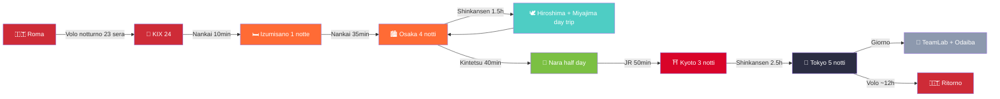
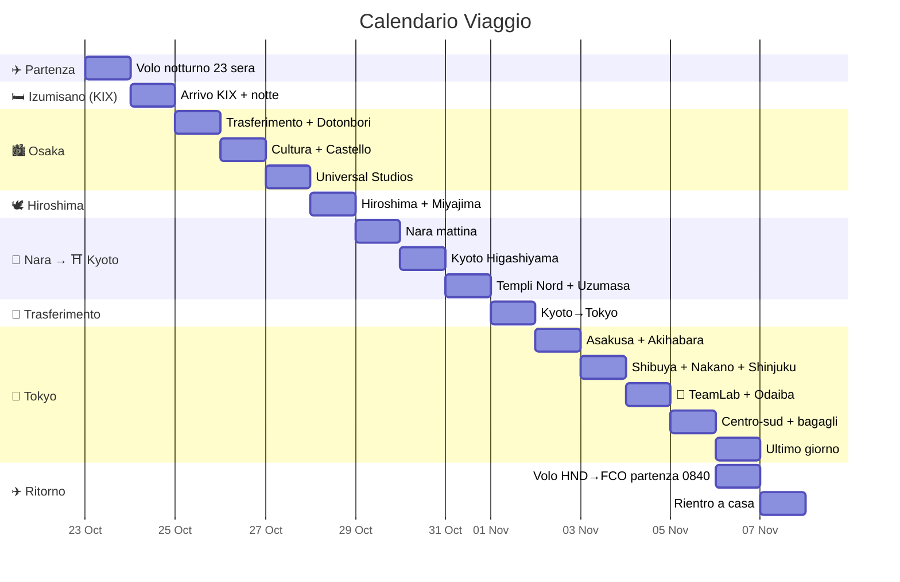
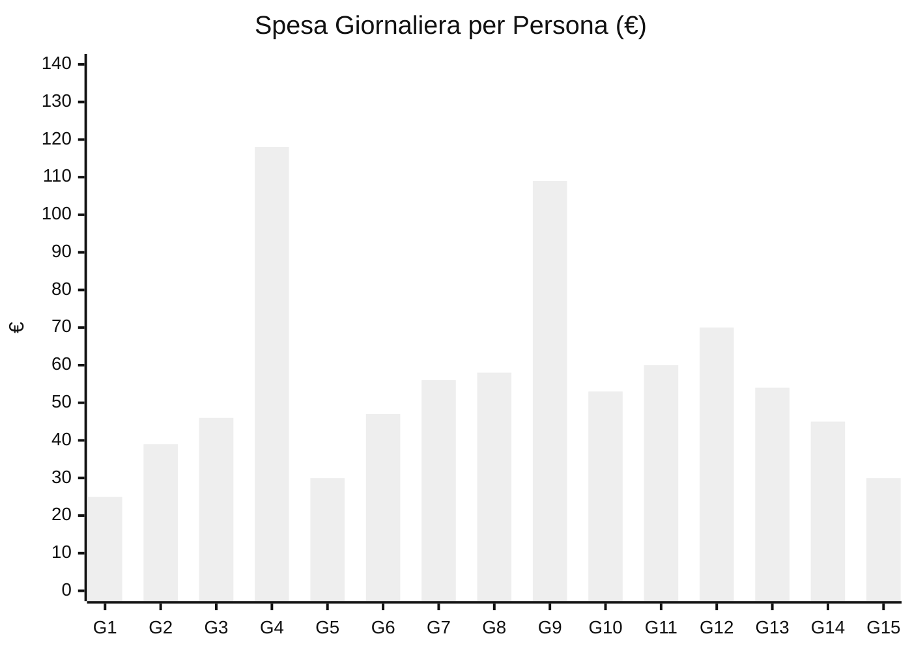

> Creato da @Lorenzo · @Davide · @Rebecca
> ⚡ **Stato:** ✅ **VOLI PRENOTATI** (China Eastern, 09/08/26) · ✅ alloggi prenotati · 🔵 **USJ PRENOTATO (05/09/26)** · ❌ da prenotare: TeamLab, JR Pass, eSIM, assicurazione
> ⚠️ **Allergie Rebecca (CRITICO):** soia, pesce, crostacei, frutta secca, banana, fragola, kiwi, arancia, nichel (lieve). Rebecca **deve cucinare da sola** — alloggi con cucina obbligatori. Vedi [[Allergie Alimentari Rebecca]] per guida completa.

# Giappone 2026 — 23 Ottobre (partenza) · 6 Novembre (ritorno)

Roma → KIX → Izumisano → Osaka → Hiroshima → Nara → Kyoto → Tokyo · 15 giorni / 14 notti

## 🎫 Voli Prenotati — China Eastern (09/08/26, tot. 3.289 € / 3 pax)

| Tratta | Data | Orari | Volo | Costo/pax |
|---|---|---|---|---|
| 🛫 **Andata** FCO → KIX | 23 Ott | 21:10 → 24 Ott 21:00 | MU788 + FM3051 (via PVG) · **16h50** | 575,54 € |
| 🛬 **Ritorno** HND → FCO | 6 Nov | 08:40 → 18:15 | MU576 + MU787 (via PVG) · **17h35** | 520,79 € |
| **Totale A/R** | | | | **1.096,33 €** |

### ✈️ Andata — Viaggio 1 (23→24 Ott, 16h50)

| Volo | Compagnia | Tratta | Orari | Durata |
|---|---|---|---|---|
| **MU788** | China Eastern | Roma FCO → Shanghai PVG | 23/10 21:10 → 24/10 14:40 | 11h30 |
| ⏳ **Cambio a Shanghai (PVG)** | | | 2h45 | |
| **FM3051** | Shanghai Airlines (operato MU) | Shanghai PVG → Osaka KIX | 17:25 → 21:00 | 2h35 |

### ✈️ Ritorno — Viaggio 2 (6 Nov, 17h35)

| Volo | Compagnia | Tratta | Orari | Durata |
|---|---|---|---|---|
| **MU576** | China Eastern | Tokyo HND → Shanghai PVG | 08:40 → 11:05 | 3h25 |
| ⏳ **Cambio a Shanghai (PVG)** | | | 1h35 | |
| **MU787** | China Eastern | Shanghai PVG → Roma FCO | 12:40 → 18:15 | 12h35 |

> ✅ **Pagato con Mastercard Debit** — ordine 09/08/26 · Rebecca/Davide/Lorenzo · Economy
> ⚠️ **Rebecca:** pasto speciale prenotato (no soia, no pesce, no crostacei, no frutta secca) — verificare all'imbarco e sugli scali PVG

## Budget Trend

---

## Riepilogo Tappe

| Tappa | Giorni | Notti | Date |
|:---|:---:|:---:|:---|
| Partenza Italia (volo notturno) | — | — | 23 Ott |
| [[Osaka(大阪市)#Izumisano\|Izumisano (KIX, notte di arrivo)]] | 1 | 1 | 24–25 Ott |
| [[Osaka(大阪市)]] (base per Hiroshima e Nara) | 4 | 4 | 25–29 Ott |
| [[Hiroshima(広島)]] + [[Miyajima (宮島)]] (day trip) | 1 | — | 28 Ott |
| [[Nara (奈良市)]] (half day) | 0.5 | — | 29 Ott |
| [[Kyoto(京都)]] | 3 | 3 | 29 Ott – 1 Nov |
| [[Tokyo(東京)]] | 6 | 5 | 1–6 Nov |
| Ritorno Italia | — | — | 6 Nov |

---

## Info Generali

| Info              | Dettaglio                                                                                        |
| ----------------- | ------------------------------------------------------------------------------------------------ |
| **Fuso**          | +8h rispetto Italia                                                                              |
| **Valuta**        | Yen (¥) — ancora molto cash-friendly, preleva agli ATM 7-Eleven/Poste                            |
| **IC Card**       | [[Suica\|Suica digitale su iPhone]] o [[Icoca]] a KIX (entrambe funzionano in tutto il Giappone) |
| **eSIM**          | Klook o Airalo — comprare prima della partenza                                                   |
| **Assicurazione** | Da stipulare — [[Viaggiare Sicuri\|Viaggiare Sicuri]] per riferimento                            |
| **Lingua**        | Giapponese — frasi base utili. Pochi parlano inglese fluente                                     |
| **Cambio**        | ~184 ¥/€ (agosto 2026, xe.com) — tutte le conversioni yen→€ usano questo tasso                   |

> 🌡️ **Nota meteo:** le temperature indicate giorno per giorno sono il **clima medio storico** di fine ottobre / inizio novembre (fonte: JMA) — non previsioni reali. Verifica le previsioni 1–2 giorni prima della partenza.

---

## Trasporti — JR Pass NON conviene

| Tratta | Mezzo | Tempo | Costo p.p. | Copertura |
|---|---|---|---|---|
| KIX → Izumisano | Nankai Airport Express | ~8-10 min | ~520 ¥ | Suica/Icoca |
| Izumisano → Namba (Osaka) | Nankai Main Line | ~34 min | ~610 ¥ | Suica/Icoca |
| Osaka → Hiroshima A/R | Shinkansen Sakura | ~1h 30m | ~20.000 ¥ | **JR Kansai-Hiroshima Pass** |
| Osaka → Nara | Kintetsu Line | ~40 min | ~570 ¥ | **Non JR** — Suica/Icoca |
| Nara → Kyoto | JR Nara Line | ~50 min | ~720 ¥ | **JR Pass** |
| Kyoto → Tokyo | Shinkansen Hikari | ~2h 40m | ~13.320 ¥ | Biglietto singolo |

**Soluzione consigliata:** [[JR pass|JR Kansai-Hiroshima Area Pass]] (**17.000 ¥ ≈ 92 €**) + biglietto singolo Kyoto→Tokyo (**~13.320 ¥ ≈ 72 €**) + Suica/Icoca per trasporti locali. **Risparmio: ~270 €/persona vs JR Pass 14gg** (80.000 ¥ ≈ 435 €). *Tasso di riferimento: ~184 ¥/€ (agosto 2026).*

---

## Legenda

| Simbolo | Significato |
|---|---|
| 🟢 **LIBERO** | Da fare liberamente, nessuna prenotazione |
| 🟡 **DA PRENOTARE** | Va prenotato in anticipo (settimane/mesi prima) |
| 🔵 **PRENOTATO #COD** | Già prenotato con codice conferma |
| ⚪ **OPZIONALE** | Solo se c'è tempo/energia |
| 🅿 **PIANO B** | Alternativa in caso di pioggia/chiusura |

---

## Budget Giornaliero (per persona)

| Giorno  |   Data    |    Cibo    | Trasporti  |  Ingressi  |    TOT     |
| :-----: | :-------: | :--------: | :--------: | :--------: | :--------: |
|    1    | 23–24 Ott |    15 €    |    10 €    |     —      |    25 €    |
|    2    |  25 Ott   |    25 €    |    14 €    |     —      |    39 €    |
|    3    |  26 Ott   |    30 €    |    8 €     |    8 €     |    46 €    |
|    4    |  27 Ott   |    25 €    |    5 €     |    88 €    |   118 €    |
|    5    |  28 Ott   |    25 €    |  — (pass)  |    5 €     |    30 €    |
|    6    |  29 Ott   |    30 €    |    7 €     |    10 €    |    47 €    |
|    7    |  30 Ott   |    30 €    |    8 €     |    18 €    |    56 €    |
|    8    |  31 Ott   |    30 €    |    8 €     |    20 €    |    58 €    |
|    9    |   1 Nov   |    25 €    |    84 €    |     —      |   109 €    |
|   10    |   2 Nov   |    30 €    |    10 €    |    13 €    |    53 €    |
|   11    |   3 Nov   |    35 €    |    10 €    |    15 €    |    60 €    |
|   12    |   4 Nov   |    35 €    |    10 €    |    25 €    |    70 €    |
|   13    |   5 Nov   |    35 €    |    12 €    |    7 €     |    54 €    |
|   14    |   6 Nov   |    35 €    |    5 €     |    5 €     |    45 €    |
|   15    |   7 Nov   |    15 €    |    15 €    |     —      |    30 €    |
| **TOT** |           | **~420 €** | **~206 €** | **~214 €** | **~840 €** |

> Spese giornaliere **~840 €/persona** (cibo 420 + trasporti 206 + ingressi 214 — inclusi shinkansen Kyoto→Tokyo, **USJ 88 € reali (con pasto incluso)**, **TeamLab il 4 nov** e **Tokyo Tower il 5 nov**; **PokéPark KANTO e Fuji day trip rimossi**; **Umeda Sky rimosso dal Giorno 3**). Costi fissi extra: **Volo A/R 1.096 € (PRENOTATO) + Alloggio 13 notti ~380 € + JR Kansai-Hiroshima Pass ~92 € + Spese personali ~400 € + Assicurazione ~27 € + eSIM ~20 € = ~2.855 €/persona** (~2.800–2.910 €). *Tasso: ~184 ¥/€ (ag. 2026).*

### Alloggi

| #   | Città                  | Struttura                                                        | Date                                           | Notti     | Cucina                        | Ref              |                  |
| --- | ---------------------- | ---------------------------------------------------------------- | ---------------------------------------------- | --------- | ----------------------------- | ---------------- | ---------------- |
| 0   | [[Osaka(大阪市)#Izumisano | Izumisano (KIX)]]                                                | [[KURA Hotel Izumisano\|KURA Hotel Izumisano]] | 24–25 Ott | 1                             | ✅ Kitchenette    | 🔵 **PRENOTATO** |
| 1   | [[Osaka(大阪市)]]         | [[Osaka - Hanazonocho Apartment 103\|Hanazonocho Apartment 103]] | 25–29 Ott                                      | 4         | ✅ Angolo cottura              | 🔵 **PRENOTATO** |                  |
| 2   | [[Kyoto(京都)]]          | [[Kyoto - Miro Nijo Hotel\|Miro Kyoto Nijo Hotel]]               | 29 Ott–1 Nov                                   | 3         | ✅ Cucina attrezzata           | 🔵 **PRENOTATO** |                  |
| 3   | [[Tokyo(東京)]]          | [[Tokyo - Taito City Guesthouse\|Taito City Guesthouse]]         | 1–6 Nov                                        | 5         | ✅ Cucina condivisa (1° piano) | 🔵 **PRENOTATO** |                  |
>
> 🏠 Ogni alloggio ha una pagina dedicata con indirizzo, servizi, e note per Rebecca.

---

# ITINERARIO

---

## Giorno 1 — Venerdì 23 (sera) · Sabato 24 Ottobre — Partenza & Arrivo KIX

**Difficoltà:** 1/4 · **Budget:** ~25 €

**⏱️ Orari indicativi:**
- **18:10** Check-in FCO (volo 21:10, ~3h prima)
- **21:10 → 14:40 (24/10)** Volo MU788 FCO→Shanghai PVG (11h30)
- **14:40–17:25** Cambio a Shanghai PVG (2h45)
- **17:25 → 21:00** Volo FM3051 PVG→KIX (2h35)
- **21:00** Arrivo KIX · Icoca + attivazione eSIM · Nankai Airport Express (~10 min, ¥520) → Izumisano
- **~22:00** Check-in KURA Hotel Izumisano (self) · cena leggera (konbini)

Preparativi e partenza dall'Italia. Volo notturno per Osaka (KIX) **via Shanghai (PVG)** — China Eastern **MU788 + FM3051** (prenotato), partenza **venerdì 23 sera alle 21:10** → arrivo **sabato 24 alle 21:00**. La prima notte si dorme a **Izumisano**, a 2 fermate dall'aeroporto — niente stress di trasferimento notturno fino al centro.

**Checklist pre-partenza:**
- [ ] Passaporti validi 6+ mesi
- [ ] [[Emergenze e Sicurezza#Assicurazione Viaggio|Assicurazione viaggio]] stampata
- [ ] eSIM attivata sul telefono (Klook o Airalo)
- [ ] Suica digitale su iPhone / Wallet
- [ ] Bancomat per prelievi yen (avvisa la banca)
- [ ] Copie digitali documenti su cloud
- [ ] Carica power bank, cavi, adattatore
- [ ] 👕 **Valigia pronta** — vedi [[Packing List]] per lista completa
- [ ] 🗣️ **Frasario giapponese** stampato — vedi [[Frasario Giapponese]]
- [ ] 🏥 **Pasto speciale volo per Rebecca** (contatta compagnia aerea: no soia, no pesce, no crostacei, no frutta secca)
- [ ] 📋 **Cartellino allergie in giapponese** (plastificato) — vedi [[Frasario Giapponese#Cartellino Allergie di Rebecca]]
- [ ] 🏠 **Verificare cucina in TUTTI gli alloggi** — vedi [[Allergie Alimentari Rebecca#Check-list Alloggi]]
- [ ] 📱 **Scaricare app:** Google Maps offline, Safety Tips, Google Translate

**Venerdì 23 (sera):**
- Partenza per aeroporto
- Volo notturno **MU788 FCO→PVG** (11h30) + **FM3051 PVG→KIX** (2h35) — ~16h50 totali con scalo a Shanghai 2h45
- 🅿 **PIANO B:** Se il volo è in ritardo, nessun impatto — il giorno 2 è volutamente leggero

**Sabato 24 — Arrivo a KIX:**
- 🛬 **Volo prenotato:** MU788 (FCO→PVG 11h30) + FM3051 (PVG→KIX 2h35) · cambio a Shanghai 2h45 · arrivo KIX **21:00**
- Ritira **[[Icoca]]** alle macchinette JR in aeroporto (o carica Suica digitale)
- [[E-sim panoramica delle disponibili\|eSIM]] — attivala subito all'arrivo
- **Nankai Airport Express** → [[Osaka(大阪市)#Izumisano|Izumisano]] (~8-10 min, ¥520)
- Check-in al **KURA Hotel Izumisano** (self check-in con codice via email, check-in dalle 16:00)
- Cena leggera nelle vicinanze (konbini o izakaya locali)
- 🅿 **PIANO B (volo in ritardo):** KURA hotel è a 10 min dall'aeroporto — raggiungibile con l'ultimo Nankai senza problemi

---

## Giorno 2 — Domenica 25 Ottobre — Trasferimento a Osaka & Dotonbori

**Difficoltà:** 2/4 · **Budget:** ~40 € · **Meteo:** 18–23°C, 30% possibilità pioggia (dati JMA)

**⏱️ Orari indicativi:**
- **07:30** Sveglia · colazione (konbini)
- **09:30** Check-out KURA Hotel
- **10:00–10:34** Nankai Main Line Izumisano → Namba (~34 min, ¥610)
- **10:50** Metro Yotsubashi Line → Hanazonocho · check-in/deposito bagagli
- **12:00–13:00** Pranzo zona Namba
- **13:30–15:30** Riposo / primo assaggio Dotonbori di giorno (⚪)
- **16:00** Uscita · passeggiata Hozen-ji + Dotonbori
- **19:00** Cena Dotonbori (street food / alternative)
- **20:30** Dotonbori illuminato · Shinsaibashi
- **22:00** Rientro appartamento

**Mattina — Trasferimento a Osaka:**
- Check-out KURA Hotel **entro le 10:00**
- **Nankai Main Line** → Namba (~34 min, ¥610, su Icoca) — oppure JR → Tennoji se preferisci
- Metro Yotsubashi Line → **Hanazonocho** → check-in appartamento
- Deposito bagagli in stazione se il check-in è nel pomeriggio

**Pomeriggio/Sera | Cluster Namba/Dotonbori:**
- Prima passeggiata: [[Dotonbori (道頓堀)]] #5/5 🟢 — il canale illuminato, le insegne al neon, il granchio meccanico del Kani Doraku
- [[Tempio Hozen-ji (法善寺)]] #4/5 🟢 — a 2 min da Dotonbori, statua coperta di muschio, atmosfera raccolta

**Cibo — Alternative:**
- 🅰️ **Street food** [[Dotonbori (道頓堀)]]: takoyaki (¥500), okonomiyaki (¥1.000), kushikatsu (¥800)
- 🅱️ **Bib Gourmand:** [[Mangiare in Giappone]] (Dotonbori, ¥500–800) · [[Mangiare in Giappone#Osaka|Kushikatsu Daruma]] (Shinsekai, ¥1.000–2.000)
- 🅲 **Seduti:** [[Mangiare in Giappone#Catene e Cibo Economico|Okonomiyaki Kiji]] (Umeda, Bib Gourmand ¥1.000–2.000) · ramen · [[Mangiare in Giappone#Kaitenzushi (Conveyor Belt Sushi)|Kura Sushi]] (¥100–500/piatto)
- 🅳 **Rebecca:** [[Mangiare in Giappone#Gyudon e Curry per Rebecca (Sicuri!)|Saizeriya]] (Namba, pasta aglio e olio ✅) · [[Mangiare in Giappone#Gyudon e Curry per Rebecca (Sicuri!)|Matsuya]] (gyudon senza salsa) · [[Mangiare in Giappone#I Preferiti di Rebecca — dalla sua Google Maps|yakiniku]] (Namba, carne alla griglia ✅) · **cucina in hotel**
- 🍨 **Dopo:** matcha gelato (¥300–500) · crepes giapponesi

**Trasporti:** Nankai ¥610 + metro Yotsubashi (~¥200) + Suica
🅿 **PIANO B (pioggia):** Namba Walks (shopping coperto) + Hozen-ji → cena al coperto a Dotonbori

---

## Giorno 3 — Lunedì 26 Ottobre — Osaka: Cultura & Quartieri

**Difficoltà:** 3/4 · **Budget:** ~46 € · **Meteo:** 18–23°C, 25% pioggia (dati JMA)

**⏱️ Orari indicativi:**
- **07:00** Sveglia · colazione
- **08:15** Uscita → Castello di Osaka (metro ~20 min)
- **09:00–10:00** Castello di Osaka (apertura 9:00) · giardini Nishinomaru 10:00–10:30
- **10:45** Metro → Shitennoji-mae (~15 min)
- **11:00–12:00** Tempio Shitenno-ji
- **12:15–13:15** Pranzo zona Shinsekai
- **13:30–15:00** Shinsekai + Tsutenkaku (⚪ ¥900)
- **15:15–16:30** Nipponbashi Den Den Town (⚪ ~1h, ⭐ Lorenzo)
- **17:00–18:30** Shinsaibashi / relax Namba
- **19:00** Cena Namba
- **21:30** Rientro

**Mattina | Cluster Castello:**
- [[Castello di Osaka (大阪城)]] #4/5 🟢 (9:00, ¥600) — arrivo entro 9:00 per evitare code
- Passeggiata nei giardini Nishinomaru (¥350)
- *Spostamento:* Metro Midosuji Line → Shitennoji-mae (~15 min, ¥230)

**Pomeriggio | Cluster Shinsekai (ritmo rilassato — Umeda rimosso):**
- [[Tempio Shitenno-ji (四天王寺)]] #4/5 🟢 (9:00–16:30, ¥500)
- [[Shinsekai (新世界と通天閣​)]] #4/5 🟢 — atmosfera retrò, kushikatsu
- [[Torre Tsutenkaku (通天閣)]] #2/5 🟢 (¥900, optional)
- ⚪ [[Nipponbashi Den Den Town (でんでんタウン)]] #4/5 ⭐ **Lorenzo** — Osaka's Akihabara: retrogame, anime, figure, elettronica. Negozi ~10:00–19:30. A ~10 min a piedi da Shinsekai/Ebisucho (o 1 fermata Sakaisuji → Nihonbashi). **Prevedere ~1h** — in alternativa al Tsutenkaku

> 🧘 **Giornata tranquilla (modifica 03/09/26):** [[Umeda Sky Building (梅田スカイビル)]] **rimosso** — niente trasferimento a Umeda, si resta in zona **Minami** (Shinsekai → Namba). Nessuna corsa: se si è stanchi si rientra presto o si prosegue con calma verso Shinsaibashi.

**Cibo oggi — Alternative:**
- 🅰️ **Pranzo gyudon:** [[Mangiare in Giappone#Catene e Cibo Economico|Sukiya]] (gyudon ¥400) · [[Mangiare in Giappone#Catene e Cibo Economico|Yoshinoya]] (¥400) · [[Mangiare in Giappone#Catene e Cibo Economico|Matsuya]] (curry ¥380)
- 🅱️ **Pranzo ramen:** [[Mangiare in Giappone#Catene e Cibo Economico|Ichiran]] (¥1.000–2.000) · Tenkaippin (¥800–1.200)
- 🅲 **Cena Lorenzo&Davide:** izakaya a Namba (¥1.500–3.000) · [[Mangiare in Giappone#Bib Gourmand — Qualità-Prezzo|Kushikatsu Daruma]] (Bib Gourmand, Shinsekai, ¥1.000–2.000) · [[Mangiare in Giappone#Kaitenzushi (Conveyor Belt Sushi)|Sushiro]] (¥100–500/piatto)
- 🅳 **Rebecca pranzo:** [[Mangiare in Giappone#Gyudon e Curry per Rebecca (Sicuri!)|Matsuya]] (gyudon senza salsa) · konbini (yogurt, frutta, uovo sodo) · [[Mangiare in Giappone#I Preferiti di Rebecca — dalla sua Google Maps|yakiniku]] (carne alla griglia ✅) · preparato in hotel
- 🅴 **Rebecca cena:** [[Mangiare in Giappone#Gyudon e Curry per Rebecca (Sicuri!)|Saizeriya]] (Namba, pasta aglio e olio ✅) · [[Mangiare in Giappone#Gyudon e Curry per Rebecca (Sicuri!)|Sukiya]] (riso + uovo ✅) · [[Mangiare in Giappone#Catene e Cibo Economico|Royal Host]] (steak ✅) · **cucina in hotel**

**Sera | Namba:**
- Shopping a **Shinsaibashi** 🟢 — via coperta aperta fino a tardi 🍽️

🅿 **PIANO B (pioggia):** Sostituisci Castello con TeamLab Botanical Garden (#4/5) — solo serale 18:30–21:30

---

## Giorno 4 — Martedì 27 Ottobre — Universal Studios Japan

**Difficoltà:** 4/4 (camminata intensa) · **Budget:** ~118 € · **Meteo:** 18–23°C, 25% pioggia

**⏱️ Orari indicativi:**
- **07:00** Sveglia · colazione
- **08:00** Partenza → JR Osaka Loop Line → Universal City (~15 min, ¥180)
- **08:30** Arrivo ai cancelli (apertura indicativa 9:00 — verificare calendario)
- **09:00–18:00** USJ: Super Nintendo World (ingresso incluso, orario assegnato) · Harry Potter · Minion/Jurassic — **pranzo coperto da voucher pasto**
- **18:30** Uscita · JR → Namba (~15 min)
- **19:30** Cena Namba (Rebecca: cucina / alternative sicure)
- **21:30** Rientro (giornata ~25.000 passi)

**Giornata intera a [[Universal Studios Japan (ユニバーサル・スタジオ・ジャパン)]]** #3/5 🔵 **PRENOTATO**

> ✅ **Biglietti USJ acquistati il 05/09/26** — **1-day Studio Pass + ingresso Super Nintendo World + voucher pasto**, **88 €/pax**. Portare QR/codice conferma (app o stampa) per il **27 ott**.

*Spostamento:* JR Osaka Loop Line → Universal City (~15 min, ¥180)

**Cibo oggi — Alternative:**
- 🅰️ **Pranzo in USJ:** 🎫 **coperto dal voucher pasto incluso** — verificare i ristoranti accettati al parco · in alternativa hamburger (¥1.500–2.500) · pizza · [[Mangiare in Giappone#Kaitenzushi (Conveyor Belt Sushi)|conveyor belt sushi]] (¥100–500)
- 🅱️ **Cena rientro:** [[Mangiare in Giappone#Catene e Cibo Economico|Sukiya]] (gyudon ¥400) · [[Mangiare in Giappone#Catene e Cibo Economico|Ichiran]] (ramen ¥1.000–2.000) · [[Mangiare in Giappone#Per Fasce di Budget|CoCo Ichibanya]] (curry ¥500–1.000)
- 🅲 **Cena Rebecca:** [[Mangiare in Giappone#Gyudon e Curry per Rebecca (Sicuri!)|Saizeriya]] (Namba, pasta aglio e olio ✅) · [[Mangiare in Giappone#Gyudon e Curry per Rebecca (Sicuri!)|Sukiya]] (riso + uovo ✅) · [[Mangiare in Giappone#I Preferiti di Rebecca — dalla sua Google Maps|Yakiniku Like]] (Namba, carne alla griglia ✅) · **cucina in hotel**
- ⚠️ **Rebecca:** PORTA CIBO DA CASA a USJ (riso, pollo freddo, frutta, uova sode). Niente dentro USJ è sicuro (soia+pesce) — il **voucher pasto** potrebbe non essere utilizzabile per lei → chiedere all'arrivo un'opzione sicura o cederlo a un compagno

**Aree priority:**
- **Super Nintendo World** ✓ *ingresso incluso (orario assegnato — verificare sull'app)* — Mario Kart: Koopa's Challenge
- **The Wizarding World of Harry Potter** — Hogwarts Castle
- **Minion Park** + Jurassic World

**Consigli:**
- 🔵 **Biglietto PRENOTATO (05/09/26):** **1-day Studio Pass + ingresso Super Nintendo World + voucher pasto = 88 €/pax** (tariffa del 27 ott) · **acquisto anticipato OBBLIGATORIO**: dal 2025 niente biglietti al parco
- 🟡 **Express Pass** (~¥8.000–15.000 extra) — NON incluso: da valutare solo per saltare code 2h+ (es. Mario Kart) · acquisto separato
- Arrivare entro 8:00–8:30 (orario tipico novembre: 9:00–20:00; l'apertura effettiva varia per periodo — verificare sul sito ufficiale)
- Scarpe comodissime — si camminano 25.000+ passi

🅿 **PIANO B (fatica/pioggia):** Biglietti già presi — se si è stanchi si esce prima (re-ingresso non consentito) e si rientra a Namba per cena.

---

## Giorno 5 — Mercoledì 28 Ottobre — Hiroshima + Miyajima

**Difficoltà:** 4/4 · **Budget:** ~30 € · **Meteo:** 17–22°C, 25% pioggia · **Attiva JR Kansai-Hiroshima Pass**

**⏱️ Orari indicativi:**
- **05:30** Sveglia · colazione
- **06:10** Metro → Shin-Osaka (attivare JR Pass + **prenotare posti riservati** andata e ritorno)
- **06:45–08:15** Shinkansen Sakura Shin-Osaka → Hiroshima (~1h30)
- **08:30–08:55** JR Sanyo Line → Miyajimaguchi (~25 min, incluso pass)
- **09:00–09:15** Traghetto JR → Miyajima (~10 min, + tassa 100¥)
- **09:30–12:00** Miyajima: Itsukushima Shrine + Daisho-in (controllare maree)
- **12:00–13:00** Pranzo a Miyajima
- **13:15–13:30** Traghetto ritorno · **13:40–14:05** JR → Hiroshima
- **14:15** Bus Meipuru-pu (coperto da pass) o tram → Peace Park (~15 min)
- **14:30–16:30** Museo della Pace (~2h — nov: orario 8:30–18:00)
- **16:30–17:15** Genbaku Dome + parco
- **17:15–17:45** Hondori street (momiji manju da portare a casa) ⚪
- **18:00** Tram → Hiroshima St (~12 min) → **18:15–18:30** Shinkansen riservato → Shin-Osaka (~1h30)
- **~20:00** Rientro Osaka · cena Namba

> 🟡 **Da attivare oggi (28 ott):** [[JR pass|JR Kansai-Hiroshima Area Pass]] (**17.000 ¥ ≈ 92 €**) — copre Shinkansen A/R Shin-Osaka→Hiroshima + traghetto JR Miyajima + linee JR West per i prossimi 4 giorni (**valido 28 ott–1 nov**)

**06:45–08:15** Shinkansen Sakura: [[Shin-Osaka Station]] → [[Hiroshima(広島)]] (~1h 30m)
**08:30–08:55** JR Sanyo Line → [[Miyajima (宮島)|Miyajimaguchi]] (~25 min, incluso JR Pass)
**09:00–09:15** Traghetto JR → Miyajima (~10 min, incluso pass + **tassa visita 100¥** da pagare al terminal)

**Mattina a Miyajima:**
**09:30–12:00** [[Itsukushima shrine (嚴島神社)]] #5/5 🟢 (6:30–17:30, ¥300) — Torii galleggiante + santuario patrimonio UNESCO
  - [[Tempio Daisho-in (大聖院)]] #3/5 🟢 (8:00–17:00) — tempio più antico dell'isola, foliage autunnale
  - Senjokaku + Pagoda Gojunoto (8:30–16:30, ¥100) ⚪
  - ⚠️ **Maree:** controllare l'orario — torii più scenico con alta marea (luna piena il 26/10 = maree ampie)
**12:00–13:00** **Pranzo a Miyajima — Alternative:**
  - 🅰️ Ostriche alla griglia (¥1.000–2.000) · anago meshi (¥1.500–2.500)
  - 🅱️ Momiji manju (¥300) + street food lungo Omotesando
  - ⚠️ **Rebecca:** ostriche NO (crostacei) — okonomiyaki senza salsa o konbini/pasto al sacco
**13:15–13:30** Traghetto ritorno → Miyajimaguchi
**13:40–14:05** JR Sanyo Line → Hiroshima

**Pomeriggio a Hiroshima:**
**14:15–17:15** [[Memorial Park Hiroshima]] #4/5 🟢 (24H, gratuito)
  - [[Memorial Park Hiroshima|Museo della Pace di Hiroshima]] (nov: 8:30–18:00, ultimo ingresso 17:30, ¥200, ~2h) — emotivamente intenso, 🟡 consigliato biglietto online
  - [[Memorial Park Hiroshima|Genbaku Dome]] — simbolo UNESCO
**17:15–17:45** [[Hondori street]] ⚪ — shopping + momiji manju da portare a casa
> ⚠️ **Castello di Hiroshima:** il mastio è **chiuso al pubblico da marzo 2026** (rischio sismico) — restano solo giardini + Ninomaru (gratis, fino 16:30 in autunno). Meglio dedicare il tempo a Hondori.

**18:15–18:30** Shinkansen riservato ritorno → Shin-Osaka (~1h30, arrivo ~20:00)
🅿 **PIANO B (stanchi/pioggia):** Salta Hondori e rientra entro le 17:30. Se piove forte a Miyajima → inversione: prima Museo della Pace, poi Miyajima se schiarisce

---

## Giorno 6 — Giovedì 29 Ottobre — Nara + Arrivo Kyoto

**Difficoltà:** 3/4 · **Budget:** ~47 € · **Meteo:** 15–22°C, 25% pioggia

**⏱️ Orari indicativi:**
- **07:30** Sveglia · colazione veloce · check-out (self)
- **08:30–09:10** Kintetsu Namba → Kintetsu Nara (~40 min, ¥570, non-JR)
- **09:15** Deposito valigie nei **coin locker** di Kintetsu Nara
- **09:30–12:30** Nara: Parco + Todaiji (Gran Buddha) + Kasuga Taisha (~3h)
- **12:30–13:15** Pranzo Nara (zona stazione)
- **13:20** Ripresa valigie dai locker
- **13:25–13:45** A piedi/bus → JR Nara (~20 min)
- **13:50–14:40** JR Nara → Kyoto (~50 min, **incluso pass**)
- **14:50** Metro → check-in Miro Nijo Hotel (deposito bagagli)
- **16:00–17:45** Fushimi Inari (JR 5 min, 24h) — torii nel tardo pomeriggio
- **18:15** Cena Kyoto Station (depachika / alternative)
- **21:00** Rientro hotel

**08:00** Check-out Osaka (self)
**08:30–09:10** Kintetsu Line Namba → Kintetsu Nara (~40 min, ¥570 — NON JR)
**09:15** Deposito valigie nei **coin locker** di Kintetsu Nara (grandi, ¥500–700)

> 🧳 **Bagagli (Opzione B):** le valigie restano ai **coin locker di Kintetsu Nara** durante la visita; a fine Nara si riprendono e si va a piedi/bus a **JR Nara** (~20 min) per il **JR fino a Kyoto (incluso nel pass)**. Takkyubin non necessario (solo alternativa se non trovi locker: spedizione same-day da confermare). Vedi [[Hotel-Hostel-Case-Appartamenti|guida bagagli]].

**Mattina | [[Nara (奈良市)]]:**
- [[Nara (奈良市)#Parco di Nara|Parco di Nara]] 🟢 — cervi Sika, shika senbei (¥150)
- [[Nara (奈良市)#Tempio Todaiji|Tempio Todaiji]] 🟢 (¥800) — Daibutsu (Buddha in bronzo 15m)
- [[Nara (奈良市)]] 🟢 — 3.000 lanterne di pietra

**13:20–14:40** Ripresa valigie ai locker + spostamento a JR Nara (~20 min) → Kyoto (~50 min, **incluso JR Pass**)

**Cibo oggi — Alternative:**
- 🅰️ **Pranzo Nara:** [[Mangiare in Giappone#Budget|kakinoha-zushi]] (sushi in foglia di cachi, ¥800–1.200) · [[Mangiare in Giappone#Catene e Cibo Economico|Sukiya]] (gyudon ¥400) · konbini (onigiri ¥100–200)
- 🅱️ **Cena Kyoto:** [[Mangiare in Giappone#Depachika|depachika Isetan Kyoto Station]] (bento scontati −30% dopo 18:00) · [[Mangiare in Giappone#Catene e Cibo Economico|CoCo Ichibanya]] (curry ¥500–1.000) · [[Mangiare in Giappone#Catene e Cibo Economico|Nakau]] (udon ¥300–600)
- 🅲 **Cena Rebecca:** [[Mangiare in Giappone#Gyudon e Curry per Rebecca (Sicuri!)|Saizeriya]] (Shijo, pasta aglio e olio ✅) · [[Mangiare in Giappone#Gyudon e Curry per Rebecca (Sicuri!)|Sukiya]] (riso + uovo ✅) · [[Mangiare in Giappone#Catene e Cibo Economico|CoCo Ichibanya]] (curry ✅, Kyoto Station) · **cucina in hotel**

**Pomeriggio/Sera | Kyoto:**
- Check-in hotel
- [[Fushimi Inari (伏見稲荷大社)]] #3/5 🟢 (24h, GRATIS) — JR Nara Line → Inari (5 min, incluso JR Pass). 10.000 torii illuminati alla sera, quasi deserto

🅿 **PIANO B (pioggia):** Sostituisci Todaiji con Museo Nazionale di Nara (¥700, al chiuso)

---

## Giorno 7 — Venerdì 30 Ottobre — Kyoto: Higashiyama & Gion

**Difficoltà:** 4/4 · **Budget:** ~56 € · **Meteo:** 15–22°C, 25% pioggia

**⏱️ Orari indicativi:**
- **08:30** Sveglia · colazione
- **09:30** Uscita → Higashiyama (bus/metro ~20 min)
- **10:00–10:45** Sannenzaka / Ninenzaka
- **11:00–12:00** Tempio Kodai-ji
- **12:15–13:15** Pranzo (Nishiki Market / zona Gion)
- **13:30–14:30** Santuario Yasaka
- **14:45–16:00** Gion (Hanamikoji — niente vicoli privati/geisha)
- **16:15–17:45** **Kiyomizu-dera al tramonto** (tramonto ~17:15; uscita entro 18:00)
- **19:00** Cena Gion
- **21:30** Rientro hotel

**Mattina | Higashiyama (Sannenzaka & Kodai-ji):**
- [[Sannenzaka e Ninenzaka (三年坂)(二年坂)]] #4/5 🟢 — viuzze acciottolate, matcha gelato (negozi aperti da ~10:00)
- [[Tempio Kodai-ji (高台寺)]] #3/5 🟢 (9:00–17:00, ¥600) — giardino zen, boschetto bambù (chiude 17:00)

**Pomeriggio | Yasaka & Gion:**
- [[Santuario Yasaka (八坂神社)]] #4/5 🟢 (24h, GRATIS)
- [[Quartiere Gion (祇園)]] #1/5 🟢 ⚠️ **Vietato entrare nei vicoli privati (multa 70€)** — via principale Hanamikoji OK. Rispetta le geisha (niente foto)

**Tramonto | Kiyomizu-dera (16:15–17:45):**
- [[Kiyomizu-dera (清水寺)]] #5/5 🟢 (6:00–18:00, ¥500) — **al tramonto (~17:15)**: terrazza in legno e vista su Kyoto che si accende. ⚠️ Ultimo ingresso ~17:30, uscita entro le 18:00. Foliage autunnale in corso

**Cibo oggi — Alternative:**
- 🅰️ **Pranzo street food:** [[Nishiki Market (錦市場)]] — yakitori, tsukemono, dolci matcha, tofu (¥200–1.000). **Bib Gourmand:** [[Mangiare in Giappone#Bib Gourmand — Qualità-Prezzo|Men-ya Inoichi]] (ramen, Pontochō, ¥1.000–2.000)
- 🅱️ **Pranzo economico:** [[Mangiare in Giappone#Catene e Cibo Economico|CoCo Ichibanya]] (curry ¥500–1.000) · [[Mangiare in Giappone#Catene e Cibo Economico|Hanamaru Udon]] (udon ¥300–600)
- 🅲 **Cena Lorenzo&Davide:** [[Quartiere Gion (祇園)]] — yakitori, izakaya (¥2.000–4.000) · [[Mangiare in Giappone#Bib Gourmand — Qualità-Prezzo|Omen]] (udon, Ginkakuji, ¥1.000–2.000)
- 🅳 **Rebecca cena:** [[Mangiare in Giappone#Gyudon e Curry per Rebecca (Sicuri!)|Saizeriya]] (Shijo, pasta ✅) · [[Mangiare in Giappone#Gyudon e Curry per Rebecca (Sicuri!)|Royal Host]] (steak ✅) · [[Mangiare in Giappone#I Preferiti di Rebecca — dalla sua Google Maps|yakiniku]] (Gion, carne alla griglia ✅) · **cucina in hotel**

**Sera:**
- [[Quartiere Gion (祇園)]] — vicolo sul fiume Kamo, ristoranti con terrazza sull'acqua ⚪

🅿 **PIANO B (troppa folla):** Ginkakuji (Padiglione d'Argento, #1/5) — più tranquillo

---

## Giorno 8 — Sabato 31 Ottobre — Kyoto: Templi del Nord + Uzumasa Kyoto Village + Gion

**Difficoltà:** 3/4 · **Budget:** ~58 € · **Meteo:** 15–22°C, 25% pioggia · 🎃 **Halloween**

**⏱️ Orari indicativi:**
- **09:00** Sveglia · colazione (niente fretta)
- **10:00** Bus → nord Kyoto (~30 min)
- **10:35–11:35** [[Kinkaku-ji (金閣寺)]] (¥500)
- **11:50–12:40** [[Ryoan-ji (龍安寺方丈庭園)]] (⚪, ¥600, a ~15 min a piedi)
- **13:00–14:00** Pranzo (zona nord o di rientro)
- **14:30–15:30** Rientro in centro · pausa breve
- **15:45** Randen (Keifuku) da Shijo-Omiya o bus → **Uzumasa**
- **16:15–19:00** [[TOEI Kyoto studio park (東映太秦映画村)|Uzumasa Kyoto Village]] — **biglietto giornata ¥2.800**: subito **EVA** (ultimo ingresso 17:15) + altre attrazioni anime
- **19:15** Ritorno verso est (~40 min) → **Gion**
- **20:00** Cena a Gion / Ponto-chō
- **21:00–22:30** **Halloween**: Gion, vicoli, fiume Kamo (verificare eventi serali)
- **23:00** Rientro hotel

**Mattina | Templi del Nord:**
- [[Kinkaku-ji (金閣寺)]] #3/5 🟢 (9:00–17:00, ¥500) — Padiglione d'Oro ricoperto di foglia d'oro
- [[Ryoan-ji (龍安寺方丈庭園)]] #2/5 🟢 (8:00–17:00, ¥600) — giardino zen di rocce, meditazione (⚪)

**Tardo pomeriggio | [[TOEI Kyoto studio park (東映太秦映画村)|Uzumasa Kyoto Village]] (16:15–19:00):**
- Villaggio-samurai/parco a tema cinematografico, **riaperto a marzo 2026 dopo il rinnovo** (ex Toei Kyoto Studio Park) · orario tipico 10:00–21:00 (ultimo ingresso 1h prima) · chiuso alcuni martedì
- 🎫 **Biglietto giornata ¥2.800** (serale ¥2.000 solo dopo le 17) · attrazioni extra ¥400–800
- 🎫 **Evangelion Kyoto Base** ✅ **inclusa nel biglietto**: EVA Unit-01 **cavalcabile** (unica al mondo) + test pilota. ⚠️ **Ultimo ingresso 17:15** → entrare entro ~16:00 e fare l'EVA subito
- Altre attrazioni anime (Toei: Kamen Rider ecc.) · **Museo Anime** · ninja/casa stregata (diurne, a pagamento) · noleggio kimono
- *Accesso:* Uzumasa-Koryuji (Randen ~10' da Shijo-Omiya) o JR Hanazono · sito: `en.eigamura.com`

**Cibo oggi — Alternative:**
- 🅰️ **Pranzo (nord/rientro):** soba/udon (¥800–1.500) · [[Mangiare in Giappone#Bib Gourmand — Qualità-Prezzo|Omen]] (Bib Gourmand, udon, Ginkakuji, ¥1.000–2.000) · konbini
- 🅱️ **Cena Halloween a Gion:** izakaya a [[Quartiere Gion (祇園)]] (¥2.000–4.000) · [[Mangiare in Giappone#Catene e Cibo Economico|CoCo Ichibanya]] (curry ¥500–1.000) · [[Mangiare in Giappone#Depachika|depachika Daimaru Kyoto]] (bento)
- 🅲 **Rebecca:** [[Mangiare in Giappone#Gyudon e Curry per Rebecca (Sicuri!)|Saizeriya]] (Shijo, pasta ✅) · [[Mangiare in Giappone#Gyudon e Curry per Rebecca (Sicuri!)|Royal Host]] (steak ✅) · [[Mangiare in Giappone#Gyudon e Curry per Rebecca (Sicuri!)|Sukiya]] (riso+uovo ✅) · **cucina in hotel**

**Sera — Halloween a Gion:**
- Cena a [[Quartiere Gion (祇園)]] / Ponto-chō, poi passeggiata tra i vicoli (solo vie principali, niente vicoli privati)
- Alcuni templi possono avere illuminazioni autunnali serali — chiedere in hotel

🅿 **PIANO B (pioggia):** Uzumasa ha molte aree al coperto (nessun problema per la sera); se piove di mattina si salta Ryoan-ji. Cena al coperto a Gion (izakaya con ombrelloni/aree coperte).

---

## Giorno 9 — Domenica 1 Novembre — Kyoto→Tokyo via Shinkansen

**Difficoltà:** 2/4 · **Budget:** ~109 € · **Meteo Kyoto:** 15–22°C → **Meteo Tokyo:** 12–17°C (inizio Nov, clima medio JMA)

**⏱️ Orari indicativi:**
- **07:30** Sveglia · colazione
- **09:00** Check-out (self) — **niente sosta**: [[Nishiki Market (錦市場)|Nishiki]] già visitato al Giorno 7
- **09:25** Metro Nijo → Kyoto Station
- **09:45** Acquisto biglietto singolo + **prenotazione posto riservato** (Hikari)
- **10:15–12:55** Shinkansen Hikari Kyoto → Tokyo (~2h40, ¥13.320 — pranzo ekiben/depachika)
- **13:10** Metro → Taito · check-in/deposito bagagli
- **13:45–15:30** Sistemazione · pausa
- **16:00–17:30** Passeggiata leggera: fiume Sumida / Asakusa al tramonto (⚪)
- **18:00** Cena veloce vicino all'alloggio (Ueno/Ameyoko o Asakusa)
- **19:30** Rientro guesthouse · riposo

**Mattina:**
- Check-out Kyoto ~09:00 (self). Nishiki Market non serve ripeterlo (fatto al G7)
- Kyoto → Tokyo: biglietto singolo + **posto riservato** Hikari

**Pomeriggio:** Shinkansen Hikari → Tokyo (~2h40, ¥13.320) · arrivo ~13:00

**Cibo oggi — Alternative:**
- 🅰️ **Pranzo shinkansen:** depachika Isetan Kyoto Station (bento ¥800–1.500) · ekiben (¥800–1.200) · konbini
- 🅱️ **Sera vicino casa:** Ueno/Ameyoko (yakitori e spiedini ¥200–800) · [[Mangiare in Giappone#Gyudon e Curry per Rebecca (Sicuri!)|Saizeriya]] · konbini
- 🅲 **Rebecca:** [[Mangiare in Giappone#Gyudon e Curry per Rebecca (Sicuri!)|Saizeriya]] (pasta ✅) · [[Mangiare in Giappone#Gyudon e Curry per Rebecca (Sicuri!)|Matsuya]] (gyudon senza salsa) · konbini · **cucina in guesthouse**

**Sera | Leggera, zona casa (niente corse dopo il treno):**
- Check-in a **Taito (Asakusa/Ueno)** — [[Tokyo - Taito City Guesthouse]]
- Passeggiata Asakusa/Ueno al tramonto (⚪) · cena veloce
- 🧭 **Akihabara** → domani (G10) pomeriggio pieno · **Tokyo Tower/Roppongi** → giorno "centro-sud" (G13)

🅿 **PIANO B (stanchi dal viaggio):** cena vicino all'hotel e passeggiata leggera ad Asakusa/Ueno (niente spostamenti lunghi)

---

## Giorno 10 — Lunedì 2 Novembre — Tokyo: Asakusa, Skytree, Akihabara

**Difficoltà:** 4/4 · **Budget:** ~53 € · **Meteo:** 12–17°C, 25% pioggia

**⏱️ Orari indicativi:**
- **08:00** Sveglia · colazione
- **08:45** Passeggiata ad Asakusa (Kaminarimon, Nakamise)
- **09:00–10:15** Tempio Senso-ji (apertura 6:30)
- **10:30–11:15** A piedi lungo il fiume Sumida → Oshiage/Skytree
- **11:30–13:00** Tokyo Skytree (apertura 10:00) + Pokemon Center Skytree Town
- **13:15–14:15** Pranzo Solamachi
- **14:30** Metro → Akihabara (~15 min)
- **14:45–18:00** **Akihabara** (elettronica, anime) 🧭
- **18:15–19:15** Ameyoko (Ueno) — street food
- **20:00** Cena/rientro verso casa (Rebecca: alternative sicure/cucina)
- **21:00** Rientro guesthouse

**Mattina | Cluster Est:**
- [[Asakusa(浅草)]] #5/5 🟢 — [[Asakusa(浅草)]] (porta lanterna), [[Asakusa(浅草)]] (via shopping)
- [[Tempio Senso-Ji (浅草寺)]] #5/5 🟢 (6:30–17:00, GRATIS) — tempio più antico di Tokyo
- Passeggiata lungo il fiume Sumida verso Skytree

**Pomeriggio:**
- [[Tokyo skytree (東京スカイツリー)]] #3/5 🟢 (10:00–22:00, **¥2.400 feriale** / ¥2.600 weekend; ~¥2.100–2.300 anticipato online) — torre più alta del Giappone (634m)
- [[Pokemon Center Skytree Town]] #3/5 🟢 (10:00–21:00, GRATIS l'ingresso) — in Solamachi, accanto alla Skytree (distretto di Oshiage, **NON ad Asakusa**)
- [[Yanaka Ginza]] #3/5 ⭐ — quartiere storico con atmosfera Showa, a 10 min da Ueno · ⚪ da valutare per il G13 (giorno libero) se avanza tempo
- *Spostamento:* Tokyo Metro → Akihabara (~15 min)

**Cibo oggi — Alternative:**
- 🅰️ **Pranzo Asakusa:** [[Mangiare in Giappone#Catene e Cibo Economico|Ichiran]] (ramen ¥1.000–2.000) · [[Mangiare in Giappone#Kaitenzushi (Conveyor Belt Sushi)|Kura Sushi]] (¥100–500/piatto) · [[Mangiare in Giappone#Catene e Cibo Economico|Sukiya]] (gyudon ¥400)
- 🅱️ **Pranzo Rebecca:** [[Mangiare in Giappone#Gyudon e Curry per Rebecca (Sicuri!)|Matsuya]] (gyudon senza salsa ✅) · [[Mangiare in Giappone#I Preferiti di Rebecca — dalla sua Google Maps|Yakiniku Like]] (Asakusa, carne alla griglia ✅) · konbini (yogurt, frutta, uovo sodo)
- 🅲 **Cena Ueno/Ameyoko:** [[Mangiare in Giappone#Mercati e Street Food|Ameyoko]] — yakitori, spiedini, takoyaki (¥200–800 per Lorenzo e Davide) · [[Mangiare in Giappone#Catene e Cibo Economico|Yoshinoya]] (gyudon ¥400) · [[Mangiare in Giappone#Per Fasce di Budget|CoCo Ichibanya]] (curry ¥500–1.000)
- 🅳 **Cena Rebecca:** [[Mangiare in Giappone#Gyudon e Curry per Rebecca (Sicuri!)|Saizeriya]] · [[Mangiare in Giappone#Gyudon e Curry per Rebecca (Sicuri!)|Royal Host]] (steak ✅) · [[Mangiare in Giappone#I Preferiti di Rebecca — dalla sua Google Maps|Ichinoya Japanese Black Wagyu]] (Asakusa, steak ✅) · **cucina in hotel**

**Pomeriggio | [[Akihabara (秋葉原)]] #4/5 🟢 (14:45–18:00):**
- [[Akihabara (秋葉原)]] — 9 piani di elettronica · anime, figure e retrogame (Mandarake, Super Potato, Animate) · ⭐ Lorenzo
- Dopo: Ameyoko/Ueno per la cena (street food)

🅿 **PIANO B (pioggia):** Skytree è coperto (al chiuso), Akihabara è coperto — zero impatto!

---

## Giorno 11 — Martedì 3 Novembre — Tokyo: Meiji → Nakano → Shinjuku → Shibuya

**Difficoltà:** 3/4 · **Budget:** ~60 € · **Meteo:** 12–17°C, 25% pioggia · **🎌 Festa Nazionale (Bunka no Hi)**

**⏱️ Orari indicativi:**
- **08:30** Sveglia · colazione
- **09:30** Metro → Meiji (~25 min)
- **10:00–11:15** Santuario Meiji
- **11:30–12:15** Harajuku (Takeshita Street)
- **12:30** JR Harajuku → Shinjuku → Nakano (~15 min)
- **12:45–14:15** Nakano Broadway (pranzo) ⭐ Lorenzo
- **14:30** JR Nakano → Shinjuku (~10 min)
- **14:45–16:15** Shinjuku: esplorazione + osservatorio (⚪ Golden Gai di giorno)
- **16:30** JR → Shibuya (~3 min)
- **16:45–19:15** Shibuya: Crossing, Pokemon Center · **Shibuya Sky** (⚪ slot ~17:00 — prenotare online)
- **19:30** Cena Shibuya
- **21:00** Rientro guesthouse

> 3 novembre == **Giorno della Cultura** — templi/musei possono avere eventi speciali, maggiore affluenza. Percorso in **una sola direzione** (anello ovest).

**Mattina | Meiji & Harajuku:**
- [[Santuario Meiji (明治神宮)]] #3/5 🟢 (10:00–16:30, GRATIS) — foresta di 100.000 alberi nel cuore di Tokyo
- [[Harajuku (原宿)]] #2/5 🟢 — Takeshita Street, moda kawaii
- JR Harajuku → Shinjuku (1 stop) → Nakano (Chuo, ~10 min)

**Pomeriggio | Nakano Broadway (pranzo):**
- [[Nakano (中野市)]] #5/5 🟢 — JR Chuo Line da Shinjuku (~10 min)
- [[Nakano Broadway (中野ブロードウェイ)]] #5/5 🟢 — paradiso collezionismo vintage (Mandarake, manga rari, action figure, anime anni '80-'90) — **Lorenzo imperdibile** · pranzo nella zona

**Tardo pomeriggio | Shinjuku:**
- [[Shinjuku (新宿区)]] #4/5 🟢 — negozi, Omoide Yokochō, osservatorio (GRATIS fino 23:00)
- [[Golden Gai (ゴールデン街 )]] #2/5 🟢 ⚪ — vicoli di minuscoli bar (5–8 posti), meglio la sera (in questa versione si passa di giorno)

**Sera | Shibuya (tramonto + cena):**
- [[Shibuya (渋谷区)]] #5/5 🟢 — [[Shibuya (渋谷区)|Shibuya Crossing]] (attraversalo dalla folla!)
- [[Shibuya (渋谷区)|Shibuya Sky]] #4/5 ⭐ (**¥2.700 online** — prenotare, 10:00–22:30) — **Rebecca vuole andare!** ⚪ o [[Shibuya (渋谷区)|Magnet by Shibuya109]] (gratis con consumazione)
- [[Pokemon center Shibuya]] #5/5 🟢 — merchandise esclusivo

**Cibo oggi — Alternative:**
- 🅰️ **Pranzo Nakano:** [[Mangiare in Giappone#Catene e Cibo Economico|CoCo Ichibanya]] (curry ¥500–1.000) · [[Mangiare in Giappone#Kaitenzushi (Conveyor Belt Sushi)|Kura Sushi]] (¥100–500/piatto) · [[Mangiare in Giappone#Catene e Cibo Economico|Sukiya]] (gyudon ¥400)
- 🅱️ **Pranzo Rebecca:** [[Mangiare in Giappone#Gyudon e Curry per Rebecca (Sicuri!)|CoCo Ichibanya]] (curry ✅) · [[Mangiare in Giappone#Gyudon e Curry per Rebecca (Sicuri!)|Sukiya]] (riso+uovo ✅) · konbini
- 🅲 **Cena Shibuya:** [[Mangiare in Giappone#Bib Gourmand — Qualità-Prezzo|Katsukami]] (Bib Gourmand, tonkatsu ¥1.500–2.500) · [[Mangiare in Giappone#Per Fasce di Budget|CoCo Ichibanya]] (curry ¥500–1.000) · [[Shinjuku (新宿区)]] yakitori (⚪)
- 🅳 **Rebecca cena:** [[Mangiare in Giappone#Gyudon e Curry per Rebecca (Sicuri!)|Saizeriya]] (Shinjuku/Shibuya, pasta ✅) · [[Mangiare in Giappone#Gyudon e Curry per Rebecca (Sicuri!)|Royal Host]] (steak ✅) · [[Mangiare in Giappone#I Preferiti di Rebecca — dalla sua Google Maps|Shogun Burger]] (Shibuya, hamburger ✅) · **cucina in hotel**
- 🍽️ **Dopo cena (⚪):** ramen (Ichiran) · dolci matcha · se si vuole la vera Golden Gai serale, rientro via Shinjuku (~10 min)

---

## Giorno 12 — Mercoledì 4 Novembre — TeamLab Planets + Odaiba

**Difficoltà:** 2/4 (giornata tranquilla) · **Budget:** ~70 € · **Meteo:** 12–17°C, 25% pioggia

**⏱️ Orari indicativi:**
- **08:30** Sveglia tardi · colazione (⚪ ultimi acquisti nelle vicinanze)
- **09:30–11:30** Liberi in zona Taito (ultimi acquisti Asakusa/Ueno/Akihabara)
- **12:00** Pranzo zona Taito
- **12:45** Metro/TX → Toyosu / Shin-Toyosu (~30 min)
- **13:30–15:30** TeamLab Planets (slot pomeriggio, ~2h)
- **15:45** Yurikamome → Odaiba (~10 min)
- **16:00–18:30** Odaiba: tramonto ~16:45 da Odaiba Beach · Gundam · DiverCity
- **19:00** Cena Odaiba (vista baia)
- **20:30** Rientro Taito

> ⛔ **PokéPark KANTO RIMOSSO (03/09/26):** non siamo stati selezionati alla lotteria dei biglietti → **non è possibile entrare** (niente vendita walk-in). Il 4 nov diventa una **giornata tranquilla**: mattina libera a Taito, poi **TeamLab Planets** e **Odaiba al tramonto**.
> 🎫 **TeamLab:** prenotare (o cambiare, se già preso lo slot 19:00 — gratis fino a 2h prima, max 3 volte) uno **slot pomeriggio ~13:00–14:00** per uscire verso le 15:30 e godersi il **tramonto (~16:45)** su Odaiba.

**Mattina libera | Taito:**
- 🟢 Recupero/ultimi acquisti in zona alloggio: [[Asakusa(浅草)]] · [[Parco di Ueno (上野恩賜公園)|Ueno]] · [[Akihabara (秋葉原)]]
- 📍 Il mercato di **Tsukiji** (colazione sushi) è al **Giorno 13**

**Pomeriggio | TeamLab Planets:**
- *Trasferimento:* Taito → **Toyosu / Shin-Toyosu** (metro/TX ~30 min, ~¥500)
- **13:30–15:30** [[TeamLab Planets (豊洲)]] 🟡 **DA PRENOTARE** (**¥3.600+** adulti, slot pomeriggio) — esperienza immersiva nell'acqua, a piedi nudi (ultimo ingresso ~1h prima della chiusura)
- *Spostamento:* Toyosu → **Odaiba** (Yurikamome ~5–10 min, ~¥250)

**Tramonto | Odaiba:**
- **~16:00** [[Odaiba (お台場 )]] #2/5 🟢 + [[Rainbow Bridge (レインボーブリッジ)]] — **tramonto (~16:45)** da [[Odaiba Beach]] #3/5 ⭐
- [[Odaiba (お台場 )]] — Gundam gigante, DiverCity, shopping
- **19:00** Cena a Odaiba con vista baia

**Cibo oggi — Alternative:**
- 🅰️ **Pranzo:** zona Taito/Tsukiji o konbini (onigiri ¥100–200)
- 🅱️ **Cena Odaiba:** ristoranti con vista baia (¥2.000–4.000) · [[Mangiare in Giappone#Per Fasce di Budget|Saizeriya]] (¥500–1.000) · [[Mangiare in Giappone#Catene e Cibo Economico|Gusto]] (family restaurant ¥500–1.500) · [[Mangiare in Giappone#I Preferiti di Rebecca — dalla sua Google Maps|bills]] (Odaiba, pancake ✅)
- 🅲 **Rebecca:** [[Mangiare in Giappone#Gyudon e Curry per Rebecca (Sicuri!)|Saizeriya]] (Odaiba, pasta ✅) · [[Mangiare in Giappone#Gyudon e Curry per Rebecca (Sicuri!)|Royal Host]] (steak ✅) · **cucina in hotel**

🅿 **PIANO B (pioggia):** Odaiba è in gran parte coperta (DiverCity) e TeamLab è al chiuso → si anticipa/si posticipa la passeggiata, zero impatto.

---

## Giorno 13 — Giovedì 5 Novembre — Tokyo centro-sud: Tsukiji → Ginza → Tokyo Tower → Roppongi

**Difficoltà:** 2/4 · **Budget:** ~54 € · **Meteo:** 12–17°C, 25% pioggia

**⏱️ Orari indicativi:**
- **07:30** Sveglia (⚪ 07:00 per chi vuole Tsukiji appena apre)
- **08:00–09:30** [[Mercato del pesce di Tsukiji (築地場外市場)|Tsukiji]] — colazione sushi (Lorenzo&Davide) · Rebecca: frutta/konbini
- **09:45** A piedi/metro → **Ginza**
- **10:00–12:00** Ginza · (⚪ Marunouchi / Tokyo Station)
- **12:15–13:15** Pranzo Ginza/Marunouchi (depachika)
- **13:30** Rientro a Taito · **bagagli** (valigie pronte per il volo)
- **14:30–15:30** Pausa · ⚪ [[Yanaka Ginza]] (a ~15 min da Ueno) se si ha tempo
- **16:00** Metro → Tokyo Tower / Azabudai Hills
- **16:30–17:45** [[Tokyo tower (東京タワー)]] (tramonto ~16:40 — vista sulle luci)
- **18:15** Passeggiata Azabudai/Roppongi
- **19:30** Cena a Roppongi
- **21:00** Rientro · ultimo controllo bagagli · riposo (domattina sveglia 04:30)

> 🧭 **Variante 1 (piano a spirale):** il 5 nov chiude l'anello **centro-sud** (Tsukiji → Ginza → Tokyo Tower → Roppongi). Ritmo **moderato**: si rientra per i bagagli a metà pomeriggio prima del volo del 6 (08:40).

**Mattina | Tsukiji (colazione):**
- [[Mercato del pesce di Tsukiji (築地場外市場)]] #4/5 🟢 (5:00–14:00) — sushi/kaisen per colazione (Lorenzo&Davide)
- ⚠️ Rebecca: niente pesce crudo → frutta, yogurt, uovo sodo (konbini) o cucina

**Mattina tardi | Ginza & Marunouchi:**
- [[Ginza (銀座)]] #1/5 🟢 — vetrine, depachika, shopping
- ⚪ Tokyo Station / Marunouchi — architettura + stazione storica

**Pomeriggio | Rientro & bagagli:**
- Valigie pronte (volo 08:40) · ⚪ Yanaka Ginza se si ha tempo e voglia

**Tramonto | Tokyo Tower:**
- [[Tokyo tower (東京タワー)]] #4/5 🟢 (9:00–22:30, ¥1.200) — salire per il tramonto e le luci della città

**Sera | Roppongi:**
- [[Roppongi (六本木)]] #3/5 🟢 — cena e quartiere (izakaya, ramen)

**Cibo oggi — Alternative:**
- 🅰️ **Colazione Tsukiji:** sushi (¥1.000–3.000, Lorenzo&Davide) · konbini
- 🅱️ **Pranzo Ginza/Marunouchi:** depachika (bento ¥800–1.500) · [[Mangiare in Giappone#Catene e Cibo Economico|Sukiya]] (¥400)
- 🅲 **Cena Roppongi:** [[Mangiare in Giappone#Bib Gourmand — Qualità-Prezzo|Afuri]] (ramen yuzu, ¥1.000–1.500) · [[Mangiare in Giappone#Catene e Cibo Economico|Ichiran]] · izakaya (¥2.000–4.000)
- 🅳 **Rebecca:** [[Mangiare in Giappone#Gyudon e Curry per Rebecca (Sicuri!)|Saizeriya]] (pasta ✅) · [[Mangiare in Giappone#I Preferiti di Rebecca — dalla sua Google Maps|THE WAGYU BROTHERS]] (Roppongi, wagyu burger ✅) · **cucina in guesthouse**

🅿 **PIANO B (pioggia/stanchi):** tutto il giro è al coperto tranne gli spostamenti (Tsukiji/Ginza/depachika/Tokyo Tower al chiuso). Se si è stanchi: niente Roppongi, Tokyo Tower + cena vicino casa.

---

## Giorno 14 — Venerdì 6 Novembre — Partenza da Tokyo (volo MU 08:40)

**Difficoltà:** 1/4 · **Budget:** ~45 €

**⏱️ Orari indicativi:**
- **04:30** Sveglia · check-out (bagagli pronti dalla sera prima)
- **05:15** Uscita → HND: Keikyu Line da Asakusa (~50 min, ~¥600) o Tokyo Monorail/limousine
- **06:10** Arrivo Haneda · check-in bagagli
- **08:00** Imbarco
- **08:40–11:05** Volo MU576 HND → Shanghai PVG (3h25)
- **11:05–12:40** Cambio a Shanghai (1h35)
- **12:40–18:15** Volo MU787 PVG → Roma FCO
- **18:15** Arrivo FCO · rientro a casa 🏠

> 🛫 **Volo prenotato:** MU576 (HND→PVG 3h25) + MU787 (PVG→FCO 12h35) · cambio a Shanghai 1h35 · arrivo FCO **18:15**

**Mattina presto (sveglia ~04:30-05:00):**
- Check-out hotel (preparare i bagagli la sera prima)
- **Trasferimento aeroporto (HND — Haneda):** da Asakusa/Taito con **Keikyu Line** (diretta da Asakusa, ~50 min, ~¥600) oppure Tokyo Monorail / limousine bus da Tokyo Station (~45–60 min, ¥600–1.000) — arrivare ~2h prima (06:30)
- Imbarco e volo

**Cibo oggi — Alternative:**
- 🅰️ **Colazione:** konbini (onigiri, yogurt) · aeroporto (¥500-1.000)
- 🅱️ **Rebecca:** konbini/volo — **pasto speciale prenotato** (soia-free, fish-free, nut-free, no banana/fragola/kiwi/arancia)
- 🅲 **Pranzo in scalo (PVG):** konbini/ristorante — per Rebecca: riso bianco, frutta sicura, yogurt
- 🅳 **Cena:** a casa in Italia 🎉

**Sera:**
- Arrivo FCO 18:15 · rientro a casa

🅿 **PIANO B (volo in ritardo):** lo scalo a Shanghai/PVG assorbe eventuali ritardi del primo segmento

---

## Giorno 15 — Sabato 7 Novembre — Rientro 🏠

**Difficoltà:** 1/4 · **Budget:** ~30 €

> Rientro e recupero — nessuna attività pianificata (arrivo della sera prima).

Giorno di rientro a casa dopo l'arrivo della sera prima. Nessuna attività pianificata — recupero del sonno e riorganizzazione.

---

## Monitoraggio Voli e Prenotazioni

> 🎯 **STATO: VOLI PRENOTATI (09/08/26)** — China Eastern open-jaw, 1.096,33 €/pax.

### Calendario Monitoraggio (storico)

| Data | Stato | 🛫 Andata FCO→KIX 23-24 Ott | 🛬 Ritorno TYO→FCO 6 Nov | 💰 TOT A/R | 📎 Fonti |
|---|---|---|---|---|---|
| **09 Ago** | 🔵 | **PRENOTATO** — China Eastern MU788+FM3051 (21:10→21:00) | **PRENOTATO** — China Eastern MU576+MU787 (08:40→18:15) | **1.096,33 €/pax** (3.289 € tot) | Ordine CE 09/08/26 |
| 11 Lug | ✅ | **€290-600** · China Eastern via PVG (15h, da €290) · Finnair via HEL (18h) · Emirates via DXB (16h, da €450) | **€250-750** · Finnair via HEL (17h40, da €250) · KLM via AMS (17h30, da €270) · ITA **diretto** HND→FCO (14h45, €550-750) | **~€650-1.100** | [Rome2Rio FCO→KIX](https://www.rome2rio.com/s/Rome/Osaka) · [Rome2Rio TYO→FCO](https://www.rome2rio.com/s/Tokyo/Rome) |
| 13 Lug | ✅ | **€685 reale** — Etihad via AUH→NRT (18h10) · **€804** LOT via WAW→NRT (16h20) · **€838** EgyptAir (17h10) · **€863** Qatar via DOH (18h45) · **€901** Turkish (17h15) — tutti sotto 21h. **Attenzione:** arrivano a TYO, non KIX. Da TYO a Osaka: Shinkansen ~2,5h + ~€81 | **€601 reale** 🏆 — Qatar Airways via DOH (HND→FCO, 20h05 ✅) · **€664** Asiana via ICN (NRT→FCO) · **€740** Emirates via DXB | **~€685-601 = ~€1.286** | Fonte: [Google Flights FCO→TYO 23 Ott](https://www.google.com/travel/flights?q=Roma+a+Tokyo+23+ottobre+2026+one+way) + [Google Flights TYO→FCO 6 Nov](https://www.google.com/travel/flights?q=flights+from+tokyo+to+rome+on+2026-11-06+one+way) |
| 15 Lug | ⬜ | — | — | — | — |
| 17 Lug | ⬜ | — | — | — | — |
| 19 Lug | ⬜ | — | — | — | — |
| 21 Lug | ⬜ | — | — | — | — |
| 23 Lug | ⬜ | — | — | — | — |
| 25 Lug | ⬜ | — | — | — | — |
| 27 Lug | ⬜ | — | — | — | — |
| 29 Lug | ⬜ | — | — | — | — |
| 31 Lug | ⬜ | — | — | — | — |
| 1-3 Ago 🎯 | ⬜ | **Target: €300-500** · 1 scalo (DXB, DOH, IST) · max 20h totali | **Target: €300-500** · ITA diretto se ~€500, Finnair/KLM se <€350 | **Target: €700-1.000** | Controllare: Skyscanner, Momondo, Google Flights |

**Criteri volo:**
- 🛫 **Andata:** Roma (FCO) → Osaka (KIX), **prenotata 23 sera 21:10** (China Eastern via Shanghai, arrivo 24 ~21:00). Notte del 24 a Izumisano.
- 🛬 **Ritorno:** Tokyo (HND) → Roma (FCO), **prenotato 6 Nov 08:40** (China Eastern via Shanghai, arrivo 18:15).
- 💰 **Target prezzo:** 800–1.000 €/persona A/R
- ✅ **Rebecca:** pasto speciale obbligatorio (no soia, no pesce, no crostacei, no frutta secca)
- 🔍 **Skyscanner, Momondo, Google Flights** con alert di prezzo per tratte separate
- 💡 **Strategia:** Andata economica con scalo + ritorno diretto ITA = miglior rapporto qualità-prezzo

### Log Spostamenti Itinerario

| Modifica | Data | Chi | Note |
|---|---|---|---|
| **Piano Tokyo "a spirale" applicato (G9–G13)** | 05 Set 2026 | Gruppo | G9 leggero arrivo · G10 est (Asakusa→Skytree→Akihabara) · G11 catena unica ovest (Meiji→Nakano→Shinjuku→Shibuya) · G12 baia (TeamLab+Odaiba) · G13 centro-sud (Tsukiji→Ginza→Tokyo Tower→Roppongi). Budget riallineato: spese ~840 €, tot **~2.855 €/pax** |
| **G9/G10 (piano Tokyo): scelta A** — G9 sera leggero (Sumida/Asakusa, cena vicino), **Akihabara al G10 pomeriggio pieno** (14:45–18:00), Ameyoko/Ueno cena · Yanaka Ginza → ⚪ G13 | 05 Set 2026 | Lorenzo | Tokyo Tower/Roppongi: attesa conferma collocamento giorno "centro-sud" |
| **Giorno 9 rivisto** (primo anello est): no sosta Nishiki (già G7) · treno ~10:15 con posto riservato · sera **Ueno/Ameyoko → Akihabara** in direzione unica; Tokyo Tower/Roppongi spostate al piano "centro-sud" | 05 Set 2026 | Agente | G10: Akihabara tolta (ora al G9) · aggiunta **Yanaka Ginza** (⭐ Rebecca) |
| **Giorno 8 ridisegnato: Arashiyama tolta** → mattina templi del Nord + **Uzumasa Kyoto Village** (biglietto giornata ¥2.800, **EVA ultimo ingresso 17:15**) + cena/atmosfera **Halloween a Gion** | 05 Set 2026 | Gruppo | Parco aperto sab 31 (chiuso alcuni mar) · orario 10–21 · sveglia 09:00 · **Evangelion Kyoto Base** inclusa nel biglietto, entrare ~16:00 |
| **Giorno 7 riordinato: Kiyomizu-dera al tramonto** | 05 Set 2026 | Lorenzo | Sveglia 08:30 · mattina Sannenzaka+Kodai-ji → pomeriggio Yasaka+Gion → Kiyomizu 16:15–17:45 (tramonto ~17:15, uscita entro 18:00) |
| **Giorno 5 verificato** — fattibile con accorgimenti | 05 Set 2026 | Agente | ⚠️ Castello Hiroshima CHIUSO (mar 2026) → rimosso, sostituito da Hondori · Museo Pace orari nov 8:30–18:00 · attivare JR Pass a Shin-Osaka ~06:10 e prenotare posti riservati (andata+ritorno) · bus Meipuru-pu coperto da pass per il Peace Park · fonte japan-guide |
| **Sveglie riviste (presto solo se necessario)** | 05 Set 2026 | Agente | G6 07:30 · G7 07:00 · G8 06:45 · G10 08:00 · G11 08:30 · G13 09:00 — orari di giornata ricalibrati di conseguenza |
| Aggiunto timeline orari indicativi a tutti i giorni (trasporti + visite) | 05 Set 2026 | Agente | Per ogni giorno: sveglia, uscita, spostamenti con durata, orari tappe e visite, pasti, rientro |
| **USJ biglietti PRENOTATI (Giorno 4 — 27 ott)** | 05 Set 2026 | Lorenzo | **1-day Studio Pass + ingresso Super Nintendo World = 88 €/pax** · portare QR/codice · Express Pass NON incluso |
| Budget riallineato al prezzo reale USJ (88 €/pax, con pasto) | 05 Set 2026 | Agente | Giorno 4 ~118 € (pranzo coperto da voucher) · ingressi totali ~217 € · spese giornaliere ~841 € · tot **~2.856 €/pax** (~2.800–2.910) |
| **PokéPark KANTO rimosso dal Giorno 12** — lotteria non vinta (biglietto non acquistabile) | 03 Set 2026 | Lorenzo | 4 nov ridisegnato: mattina libera Taito + TeamLab slot pomeriggio + Odaiba al tramonto · budget: G12 ~70 €, ingressi ~179 €, spese ~813 €, tot ~2.828 €/pax |
| **Umeda Sky Building rimosso dal Giorno 3** — giornata più tranquilla in zona Minami | 03 Set 2026 | Lorenzo | Budget ricalibrato: Giorno 3 ~46 €, ingressi totali ~229 €, spese giornaliere ~880 €, tot ~2.895 €/persona |
| Aggiunto Nipponbashi Den Den Town (Giorno 3, ⚪ opzionale, ⭐ Lorenzo) | 03 Set 2026 | Agente | Osaka — Osaka's Akihabara tra Namba e Shinsekai · pagina quartiere + master list + KB + city note · fonte: osaka-info.jp (negozi ~10:00-19:30, chiusure variabili) |
| Fix tabella "Riepilogo Tappe" rotta + allineamento fonti (Attività e Prenotazioni, master list ↔ KB ↔ city note) + verifica prenotazioni imminenti | 03 Set 2026 | Agente | TeamLab adulti ¥3.600+ (store DMM ufficiale, vendita a lotti ~2-3 mesi prima) · USJ acquisto anticipato obbligatorio confermato · PokéPark finestra 4 nov ORA APERTA (max 2 biglietti/persona → 2 ordini per 3 pax) · nuove pagine Azabudai Hills + Monzennakacho (⭐ Rebecca) |
| Fact-check completo (prezzi, trasporti, orari, date) + correzione budget | 11 Ago 2026 | Agente | Fonti: JR West, teamlab.art, todaiji.or.jp, japan-guide, xe.com — vedi report critico |
| Corretti Day 1 (volo via Shanghai) e Day 14 (aeroporto HND) | 11 Ago 2026 | Agente | Narita Express serve NRT, non HND |
| JR Kansai-Hiroshima Pass: prezzo 17.000 ¥, attivazione 28 ott | 11 Ago 2026 | Agente | — |
| Nishiki Market: aperto anche la domenica (fact-check) | 11 Ago 2026 | Agente | Non era "chiuso domenica" |
| Prezzi aggiornati: TeamLab ¥3.600, Skytree ¥2.400, Shibuya Sky ¥2.700, Tenryu-ji ¥500-800, Todaiji ¥800 | 11 Ago 2026 | Agente | — |
| **Aggiunto PokéPark KANTO al Giorno 13** (5 nov): mattina PokéPark + sera TeamLab (slot 19:00) + Odaiba | 11 Ago 2026 | Agente | Palazzo Imperiale e Tsukiji rimossi dal giorno 13 per fare spazio |
| Budget aggiornato a ~2.936 €/pax (PokéPark incluso) | 11 Ago 2026 | Agente | — |
| **Fuji day trip rimosso del tutto** (4 nov) | 11 Ago 2026 | Agente | Togliere il trip a Fujiyoshida |
| **PokéPark + TeamLab accorpati al 4 nov**; 5 nov = ultimo giorno libero senza attrazioni | 11 Ago 2026 | Agente | TeamLab slot 19:00 del 4 nov · budget a ~2.902 €/pax |

---

## Budget Tracker

> 💰 **Budget totale stimato:** ~2.855 €/persona · **Voli prenotati (1.096 €)** · **Budget reale:** da compilare

| Voce                               | Stima              | Reale                 | Delta | Note                                                           |                         |     |
| ---------------------------------- | ------------------ | --------------------- | ----- | -------------------------------------------------------------- | ----------------------- | --- |
| Volo A/R                           | 1.096 €            | 🔵 **PRENOTATO**      | —     | China Eastern open-jaw: FCO→KIX 23/10, HND→FCO 6/11 (09/08/26) |                         |     |
| Alloggio (13 notti, camera/3)      | ~380 €             | ✅ Calcolato           | —     | Izumisano ✅ + Osaka ✅ + Kyoto ✅ + Tokyo ✅ — tutti prenotati    |                         |     |
| Cibo (15 gg)                      | ~420 €             | ❌ Da tenere traccia   | —     | Rebecca cucina = risparmio                                     |                         |     |
| JR Kansai-Hiroshima Area Pass 5gg  | ~92 € (17.000 ¥)   | ❌ Da acquistare       | —     | Attivare il 28 ott · valido 28 ott–1 nov                        |                         |     |
| Kyoto→Tokyo Shinkansen             | ~72 € (13.320 ¥)   | ❌ Da acquistare       | —     | Hikari, posto libero                                            |                         |     |
| Trasporti locali (15 gg)            | ~142 €             | ❌ Da tenere traccia   | —     | Suica/Icoca (metro, bus, Nankai, Kintetsu, TeamLab)     |                         |     |
| Attrazioni (USJ, templi, TeamLab…) | ~214 €             | 🔵 **USJ 88 €/pax**     | —     | Vedi                                                           | [[Attività e Prenotazioni]] |     |
| Spese personali                    | ~400 €             | ❌ Da tenere traccia   | —     | Souvenir, extra                                                |                         |     |
| Assicurazione (Heymondo Premium)   | ~27 €/persona      | ❌ Da stipulare        | —     | Vedi                                                           | [[Assicurazione Heymondo]] |     |
| eSIM 15gg                          | ~15–25 €           | ❌ Da comprare         | —     | Klook o Airalo                                                 |                         |     |
| **TOTALE**                         | **~2.855 €**       | **🔵 Voli prenotati** | —     | ~2.800–2.910 € · tasso 184 ¥/€ (ag. 2026)                      |                         |     |

### Budget Rebecca (extra cibo)

| Voce | Stima |
|---|---|
| Spesa supermarket (pasta, riso, pollo, verdure, frutta) | ~10 €/gg × 15gg = ~150 € |
| Ristoranti sicuri (Saizeriya, yakiniku) | ~3–4 pasti × ~10 € = ~35 € |
| **Extra Rebecca** | **~185 €** (meno dei ~420 € del budget cibo standard) |

---

## Budget Totale (per persona)

| Voce | Stima |
|---|---|
| Volo A/R (China Eastern, open-jaw) — PRENOTATO | 1.096 € |
| Alloggio (13 notti, camera condivisa/3) | ~380 € |
| Spese giornaliere in viaggio (cibo+trasporti+ingressi, 15 gg) | ~840 € |
| JR Kansai-Hiroshima Area Pass 5gg | ~92 € |
| Spese personali (souvenir, extra) | ~400 € |
| Assicurazione viaggio | ~27 € |
| eSIM | ~20 € |
| **TOTALE** | **~2.855 €** (~2.800–2.910 €) |

---

## Booking Checklist

| Cosa                                                      | Da fare entro         | Stato            | Note                                                                                                                                     |
| --------------------------------------------------------- | --------------------- | ---------------- | ---------------------------------------------------------------------------------------------------------------------------------------- |
| Volo A/R Roma→KIX (23/10, 21:10) / HND→Roma (6/11, 08:40) | ✅ **FATTO**           | 🔵 **PRENOTATO** | China Eastern MU788+FM3051 / MU576+MU787 — 1.096,33 €/pax. **Pasto speciale Rebecca (no soia, no pesce, no crostacei, no frutta secca)** |
| Alloggio Izumisano 1 notte (24–25 ott)                    | ✅ **FATTO**           | 🔵 **PRENOTATO** | [[KURA Hotel Izumisano\|KURA Hotel Izumisano]] — kitchenette ✅, self check-in                                                            |
| Alloggio Osaka 4 notti (25–29 ott)                        | ✅ **FATTO**           | 🔵 **PRENOTATO** | [[Osaka - Hanazonocho Apartment 103\|Hanazonocho Apartment 103]] — angolo cottura ✅                                                      |
| Alloggio Kyoto 3 notti (29 ott–1 nov)                     | ✅ **FATTO**           | 🔵 **PRENOTATO** | [[Kyoto - Miro Nijo Hotel\|Miro Kyoto Nijo Hotel]] — cucina ✅                                                                            |
| Alloggio Tokyo 5 notti (1–6 nov)                          | ✅ **CONFERMATO**      | 🔵 **PRENOTATO** | [[Tokyo - Taito City Guesthouse\|Taito City Guesthouse]] — cucina condivisa al 1° piano ✅                                                |
| JR Kansai-Hiroshima Area Pass                             | Entro 1 mese          | ❌ Da acquistare  | 17.000 ¥ (~92 €) · attivare il 28 ott · Klook o JR West online                                                                |
| Universal Studios Japan biglietti                         | ✅ **FATTO (05/09/26)** | 🔵 **PRENOTATO** | **1-day Studio Pass + Super Nintendo World = 88 €/pax** (27 ott) · portare QR/codice · Express Pass NON incluso |
| TeamLab Planets                                           | **Vendita aperta — prenotare subito** | ❌ Da prenotare   | Adulti ¥3.600+ (studenti ¥2.800, bambini ¥1.500) · store ufficiale `teamlabplanets.dmm.com` · **slot pomeriggio ~13:00–14:00 del 4 nov** · se già preso il 19:00, cambiabile gratis fino a 2h prima (max 3 volte) |
| ~~PokéPark KANTO (Yomiuriland)~~                          | ❌ 03/09/26 — lotteria NON vinta | ⛔ **RIMOSSO**     | Non selezionati all'estrazione → **biglietto non acquistabile** (no walk-in). Rimosso dal piano attivo (era Giorno 12, 4 nov) |
| eSIM / SIM                                                | 2 settimane prima     | ❌ Da comprare    | Klook.com o Airalo                                                                                                                       |
| Assicurazione viaggio                                     | **URGENTE**           | ❌ Da stipulare   | ViaggiaSicuri per riferimento. Rebecca: verificare copertura allergie                                                                    |
| Controllo maree Miyajima                                  | Giorno prima          | ❌ Da fare        | Alta marea = torii nell'acqua                                                                                                            |
| Assicurazione Heymondo                                    | **Agosto 2026**       | ❌ Da stipulare   | ~1,80€/gg × 15gg × 3 = ~81€ totali. Vedi [[Assicurazione Heymondo]]                                                                      |

