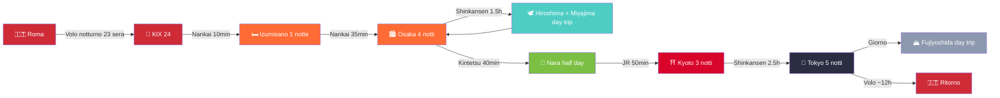
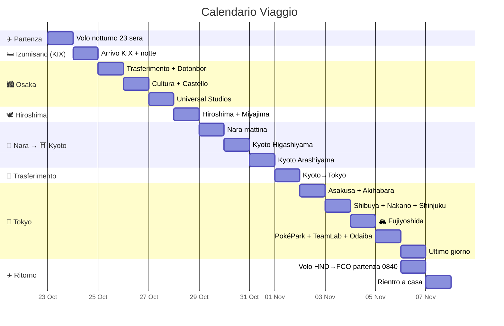
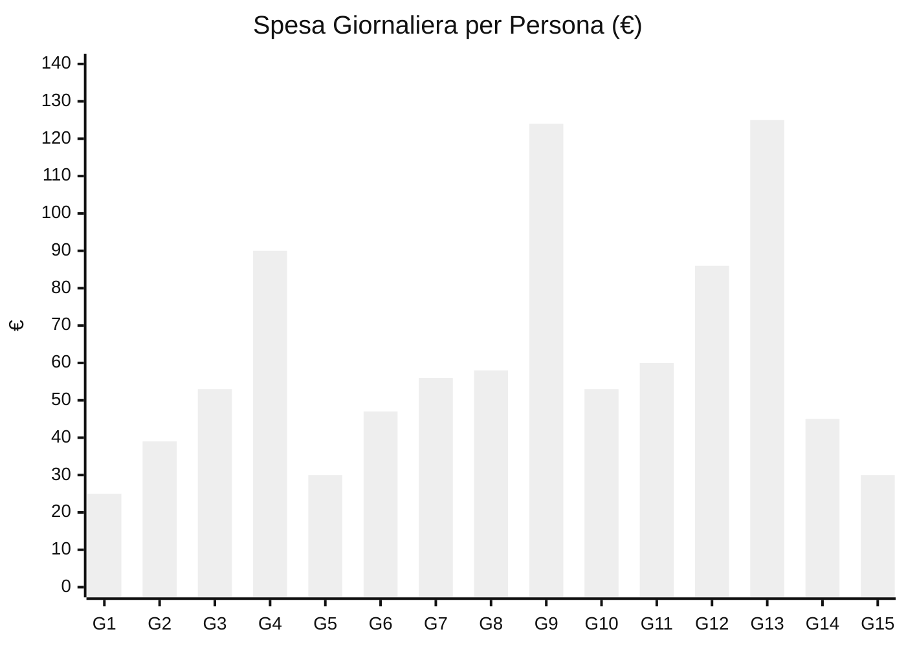

> Creato da @Lorenzo · @Davide · @Rebecca
> ⚡ **Stato:** ✅ **VOLI PRENOTATI** (China Eastern, 09/08/26) · ✅ alloggi prenotati · ❌ attività da prenotare
> ⚠️ **Allergie Rebecca (CRITICO):** soia, pesce, crostacei, frutta secca, banana, fragola, kiwi, arancia, nichel (lieve). Rebecca **deve cucinare da sola** — alloggi con cucina obbligatori. Vedi [[Allergie Alimentari Rebecca]] per guida completa.

# Giappone 2026 — 23 Ottobre (partenza) · 6 Novembre (ritorno)

Roma → KIX → Izumisano → Osaka → Hiroshima → Nara → Kyoto → Tokyo · 15 giorni / 14 notti

## 🎫 Voli Prenotati — China Eastern (09/08/26, tot. 3.289 € / 3 pax)

| Tratta | Data | Orari | Volo | Costo/pax |
|---|---|---|---|---|
| 🛫 **Andata** FCO → KIX | 23 Ott | 21:10 → 24 Ott 21:00 | MU788 + FM3051 (via PVG) · **16h50** | 575,54 € |
| 🛬 **Ritorno** HND → FCO | 6 Nov | 08:40 → 18:15 | MU576 + MU787 (via PVG) · **17h35** | 520,79 € |
| **Totale A/R** | | | | **1.096,33 €** |

### ✈️ Andata — Viaggio 1 (23→24 Ott, 16h50)

| Volo | Compagnia | Tratta | Orari | Durata |
|---|---|---|---|---|
| **MU788** | China Eastern | Roma FCO → Shanghai PVG | 23/10 21:10 → 24/10 14:40 | 11h30 |
| ⏳ **Cambio a Shanghai (PVG)** | | | 2h45 | |
| **FM3051** | Shanghai Airlines (operato MU) | Shanghai PVG → Osaka KIX | 17:25 → 21:00 | 2h35 |

### ✈️ Ritorno — Viaggio 2 (6 Nov, 17h35)

| Volo | Compagnia | Tratta | Orari | Durata |
|---|---|---|---|---|
| **MU576** | China Eastern | Tokyo HND → Shanghai PVG | 08:40 → 11:05 | 3h25 |
| ⏳ **Cambio a Shanghai (PVG)** | | | 1h35 | |
| **MU787** | China Eastern | Shanghai PVG → Roma FCO | 12:40 → 18:15 | 12h35 |

> ✅ **Pagato con Mastercard Debit** — ordine 09/08/26 · Rebecca/Davide/Lorenzo · Economy
> ⚠️ **Rebecca:** pasto speciale prenotato (no soia, no pesce, no crostacei, no frutta secca) — verificare all'imbarco e sugli scali PVG

## Budget Trend

---

## Riepilogo Tappe

| Tappa                                            |               Giorni               | Notti | Date           |           |
| :----------------------------------------------- | :--------------------------------: | :---: | :------------- | --------- |
| Partenza Italia (volo notturno)                  |                 —                  |   —   | 23 Ott         |           |
| [[Osaka(大阪市)#Izumisano]]                         | Izumisano (KIX, notte di arrivo)]] |   1   | 1              | 24–25 Ott |
| [[Osaka(大阪市)]]                                   |                 4                  |   4   | 25–29 Ott      |           |
| [[Hiroshima(広島)]] + [[Miyajima (宮島)]] (day trip) |                 1                  |   —   | 28 Ott         |           |
| [[Nara (奈良市)]] (half day)                        |                0.5                 |   —   | 29 Ott         |           |
| [[Kyoto(京都)]]                                    |                 3                  |   3   | 29 Ott – 1 Nov |           |
| [[Tokyo(東京)]]                                    |                 6                  |   5   | 1–6 Nov        |           |
| Ritorno Italia                                   |                 —                  |   —   | 6 Nov          |           |

---

## Info Generali

| Info              | Dettaglio                                                                                        |
| ----------------- | ------------------------------------------------------------------------------------------------ |
| **Fuso**          | +8h rispetto Italia                                                                              |
| **Valuta**        | Yen (¥) — ancora molto cash-friendly, preleva agli ATM 7-Eleven/Poste                            |
| **IC Card**       | [[Suica\|Suica digitale su iPhone]] o [[Icoca]] a KIX (entrambe funzionano in tutto il Giappone) |
| **eSIM**          | Klook o Airalo — comprare prima della partenza                                                   |
| **Assicurazione** | Da stipulare — [[Viaggiare Sicuri\|Viaggiare Sicuri]] per riferimento                            |
| **Lingua**        | Giapponese — frasi base utili. Pochi parlano inglese fluente                                     |
| **Cambio**        | ~184 ¥/€ (agosto 2026, xe.com) — tutte le conversioni yen→€ usano questo tasso                   |

> 🌡️ **Nota meteo:** le temperature indicate giorno per giorno sono il **clima medio storico** di fine ottobre / inizio novembre (fonte: JMA) — non previsioni reali. Verifica le previsioni 1–2 giorni prima della partenza.

---

## Trasporti — JR Pass NON conviene

| Tratta | Mezzo | Tempo | Costo p.p. | Copertura |
|---|---|---|---|---|
| KIX → Izumisano | Nankai Airport Express | ~8-10 min | ~520 ¥ | Suica/Icoca |
| Izumisano → Namba (Osaka) | Nankai Main Line | ~34 min | ~610 ¥ | Suica/Icoca |
| Osaka → Hiroshima A/R | Shinkansen Sakura | ~1h 30m | ~20.000 ¥ | **JR Kansai-Hiroshima Pass** |
| Osaka → Nara | Kintetsu Line | ~40 min | ~570 ¥ | **Non JR** — Suica/Icoca |
| Nara → Kyoto | JR Nara Line | ~50 min | ~720 ¥ | **JR Pass** |
| Kyoto → Tokyo | Shinkansen Hikari | ~2h 40m | ~13.320 ¥ | Biglietto singolo |
| Tokyo → Fujiyoshida | Fuji Excursion | ~2h | ~4.200 ¥ a tratta (A/R ~8.400 ¥) | Prenotazione posto obbligatoria |

**Soluzione consigliata:** [[JR pass|JR Kansai-Hiroshima Area Pass]] (**17.000 ¥ ≈ 92 €**) + biglietto singolo Kyoto→Tokyo (**~13.320 ¥ ≈ 72 €**) + Suica/Icoca per trasporti locali. **Risparmio: ~270 €/persona vs JR Pass 14gg** (80.000 ¥ ≈ 435 €). *Tasso di riferimento: ~184 ¥/€ (agosto 2026).*

---

## Legenda

| Simbolo | Significato |
|---|---|
| 🟢 **LIBERO** | Da fare liberamente, nessuna prenotazione |
| 🟡 **DA PRENOTARE** | Va prenotato in anticipo (settimane/mesi prima) |
| 🔵 **PRENOTATO #COD** | Già prenotato con codice conferma |
| ⚪ **OPZIONALE** | Solo se c'è tempo/energia |
| 🅿 **PIANO B** | Alternativa in caso di pioggia/chiusura |

---

## Budget Giornaliero (per persona)

| Giorno  |   Data    |    Cibo    | Trasporti  |  Ingressi  |    TOT     |
| :-----: | :-------: | :--------: | :--------: | :--------: | :--------: |
|    1    | 23–24 Ott |    15 €    |    10 €    |     —      |    25 €    |
|    2    |  25 Ott   |    25 €    |    14 €    |     —      |    39 €    |
|    3    |  26 Ott   |    30 €    |    8 €     |    15 €    |    53 €    |
|    4    |  27 Ott   |    35 €    |    5 €     |    50 €    |    90 €    |
|    5    |  28 Ott   |    25 €    |  — (pass)  |    5 €     |    30 €    |
|    6    |  29 Ott   |    30 €    |    7 €     |    10 €    |    47 €    |
|    7    |  30 Ott   |    30 €    |    8 €     |    18 €    |    56 €    |
|    8    |  31 Ott   |    30 €    |    8 €     |    20 €    |    58 €    |
|    9    |   1 Nov   |    30 €    |    84 €    |    10 €    |   124 €    |
|   10    |   2 Nov   |    30 €    |    10 €    |    13 €    |    53 €    |
|   11    |   3 Nov   |    35 €    |    10 €    |    15 €    |    60 €    |
|   12    |   4 Nov   |    30 €    |    51 €    |    5 €     |    86 €    |
|   13    |   5 Nov   |    35 €    |    15 €    |    75 €    |   125 €    |
|   14    |   6 Nov   |    35 €    |    5 €     |    5 €     |    45 €    |
|   15    |   7 Nov   |    15 €    |    15 €    |     —      |    30 €    |
| **TOT** |           | **~430 €** | **~250 €** | **~241 €** | **~921 €** |

> Spese giornaliere **~921 €/persona** (cibo 430 + trasporti 250 + ingressi 241 — inclusi shinkansen Kyoto→Tokyo, **Fuji Excursion A/R ~8.400 ¥**, USJ, **PokéPark KANTO**, TeamLab). Costi fissi extra: **Volo A/R 1.096 € (PRENOTATO) + Alloggio 13 notti ~380 € + JR Kansai-Hiroshima Pass ~92 € + Spese personali ~400 € + Assicurazione ~27 € + eSIM ~20 € = ~2.936 €/persona** (~2.880–2.990 €). *Tasso: ~184 ¥/€ (ag. 2026).*

### Alloggi

| #   | Città          | Struttura                                                        | Date         | Notti | Cucina              | Ref              |
| --- | -------------- | ---------------------------------------------------------------- | ------------ | ----- | ------------------- | ---------------- |
| 0   | [[Osaka(大阪市)#Izumisano|Izumisano (KIX)]] | [[KURA Hotel Izumisano\|KURA Hotel Izumisano]]                    | 24–25 Ott    | 1     | ✅ Kitchenette       | 🔵 **PRENOTATO** |
| 1   | [[Osaka(大阪市)]] | [[Osaka - Hanazonocho Apartment 103\|Hanazonocho Apartment 103]] | 25–29 Ott    | 4     | ✅ Angolo cottura    | 🔵 **PRENOTATO** |
| 2   | [[Kyoto(京都)]]  | [[Kyoto - Miro Nijo Hotel\|Miro Kyoto Nijo Hotel]]               | 29 Ott–1 Nov | 3     | ✅ Cucina attrezzata | 🔵 **PRENOTATO** |
| 3 | [[Tokyo(東京)]] | [[Tokyo - Taito City Guesthouse\|Taito City Guesthouse]] | 1–6 Nov | 5 | ✅ Cucina condivisa (1° piano) | 🔵 **PRENOTATO** |
>
> 🏠 Ogni alloggio ha una pagina dedicata con indirizzo, servizi, e note per Rebecca.

---

# ITINERARIO

---

## Giorno 1 — Venerdì 23 (sera) · Sabato 24 Ottobre — Partenza & Arrivo KIX

**Difficoltà:** 1/4 · **Budget:** 0 €

Preparativi e partenza dall'Italia. Volo notturno per Osaka (KIX) **via Shanghai (PVG)** — China Eastern **MU788 + FM3051** (prenotato), partenza **venerdì 23 sera alle 21:10** → arrivo **sabato 24 alle 21:00**. La prima notte si dorme a **Izumisano**, a 2 fermate dall'aeroporto — niente stress di trasferimento notturno fino al centro.

**Checklist pre-partenza:**
- [ ] Passaporti validi 6+ mesi
- [ ] [[Emergenze e Sicurezza#Assicurazione Viaggio|Assicurazione viaggio]] stampata
- [ ] eSIM attivata sul telefono (Klook o Airalo)
- [ ] Suica digitale su iPhone / Wallet
- [ ] Bancomat per prelievi yen (avvisa la banca)
- [ ] Copie digitali documenti su cloud
- [ ] Carica power bank, cavi, adattatore
- [ ] 👕 **Valigia pronta** — vedi [[Packing List]] per lista completa
- [ ] 🗣️ **Frasario giapponese** stampato — vedi [[Frasario Giapponese]]
- [ ] 🏥 **Pasto speciale volo per Rebecca** (contatta compagnia aerea: no soia, no pesce, no crostacei, no frutta secca)
- [ ] 📋 **Cartellino allergie in giapponese** (plastificato) — vedi [[Frasario Giapponese#Cartellino Allergie di Rebecca]]
- [ ] 🏠 **Verificare cucina in TUTTI gli alloggi** — vedi [[Allergie Alimentari Rebecca#Check-list Alloggi]]
- [ ] 📱 **Scaricare app:** Google Maps offline, Safety Tips, Google Translate

**Venerdì 23 (sera):**
- Partenza per aeroporto
- Volo notturno **MU788 FCO→PVG** (11h30) + **FM3051 PVG→KIX** (2h35) — ~16h50 totali con scalo a Shanghai 2h45
- 🅿 **PIANO B:** Se il volo è in ritardo, nessun impatto — il giorno 2 è volutamente leggero

**Sabato 24 — Arrivo a KIX:**
- 🛬 **Volo prenotato:** MU788 (FCO→PVG 11h30) + FM3051 (PVG→KIX 2h35) · cambio a Shanghai 2h45 · arrivo KIX **21:00**
- Ritira **[[Icoca]]** alle macchinette JR in aeroporto (o carica Suica digitale)
- [[E-sim panoramica delle disponibili\|eSIM]] — attivala subito all'arrivo
- **Nankai Airport Express** → [[Osaka(大阪市)#Izumisano|Izumisano]] (~8-10 min, ¥520)
- Check-in al **KURA Hotel Izumisano** (self check-in con codice via email, check-in dalle 16:00)
- Cena leggera nelle vicinanze (konbini o izakaya locali)
- 🅿 **PIANO B (volo in ritardo):** KURA hotel è a 10 min dall'aeroporto — raggiungibile con l'ultimo Nankai senza problemi

---

## Giorno 2 — Domenica 25 Ottobre — Trasferimento a Osaka & Dotonbori

**Difficoltà:** 2/4 · **Budget:** ~40 € · **Meteo:** 18–23°C, 30% possibilità pioggia (dati JMA)

**Mattina — Trasferimento a Osaka:**
- Check-out KURA Hotel **entro le 10:00**
- **Nankai Main Line** → Namba (~34 min, ¥610, su Icoca) — oppure JR → Tennoji se preferisci
- Metro Yotsubashi Line → **Hanazonocho** → check-in appartamento
- Deposito bagagli in stazione se il check-in è nel pomeriggio

**Pomeriggio/Sera | Cluster Namba/Dotonbori:**
- Prima passeggiata: [[Dotonbori (道頓堀)]] #5/5 🟢 — il canale illuminato, le insegne al neon, il granchio meccanico del Kani Doraku
- [[Tempio Hozen-ji (法善寺)]] #4/5 🟢 — a 2 min da Dotonbori, statua coperta di muschio, atmosfera raccolta

**Cibo — Alternative:**
- 🅰️ **Street food** [[Dotonbori (道頓堀)]]: takoyaki (¥500), okonomiyaki (¥1.000), kushikatsu (¥800)
- 🅱️ **Bib Gourmand:** [[Mangiare in Giappone]] (Dotonbori, ¥500–800) · [[Mangiare in Giappone#Osaka|Kushikatsu Daruma]] (Shinsekai, ¥1.000–2.000)
- 🅲 **Seduti:** [[Mangiare in Giappone#Catene e Cibo Economico|Okonomiyaki Kiji]] (Umeda, Bib Gourmand ¥1.000–2.000) · ramen · [[Mangiare in Giappone#Kaitenzushi (Conveyor Belt Sushi)|Kura Sushi]] (¥100–500/piatto)
- 🅳 **Rebecca:** [[Mangiare in Giappone#Gyudon e Curry per Rebecca (Sicuri!)|Saizeriya]] (Namba, pasta aglio e olio ✅) · [[Mangiare in Giappone#Gyudon e Curry per Rebecca (Sicuri!)|Matsuya]] (gyudon senza salsa) · [[Mangiare in Giappone#I Preferiti di Rebecca — dalla sua Google Maps|yakiniku]] (Namba, carne alla griglia ✅) · **cucina in hotel**
- 🍨 **Dopo:** matcha gelato (¥300–500) · crepes giapponesi

**Trasporti:** Nankai ¥610 + metro Yotsubashi (~¥200) + Suica
🅿 **PIANO B (pioggia):** Namba Walks (shopping coperto) + Hozen-ji → cena al coperto a Dotonbori

---

## Giorno 3 — Lunedì 26 Ottobre — Osaka: Cultura & Quartieri

**Difficoltà:** 3/4 · **Budget:** ~53 € · **Meteo:** 18–23°C, 25% pioggia (dati JMA)

**Mattina | Cluster Castello:**
- [[Castello di Osaka (大阪城)]] #4/5 🟢 (9:00, ¥600) — arrivo entro 9:00 per evitare code
- Passeggiata nei giardini Nishinomaru (¥350)
- *Spostamento:* Metro Midosuji Line → Shitennoji-mae (~15 min, ¥230)

**Pomeriggio | Cluster Shinsekai:**
- [[Tempio Shitenno-ji (四天王寺)]] #4/5 🟢 (9:00–16:30, ¥500)
- [[Shinsekai (新世界と通天閣​)]] #4/5 🟢 — atmosfera retrò, kushikatsu
- [[Torre Tsutenkaku (通天閣)]] #2/5 🟢 (¥900, optional)
- *Spostamento:* Metro → Umeda (~20 min, ¥280)

**Tramonto | Umeda:**
- [[Umeda Sky Building (梅田スカイビル)]] #3/5 🟢 (fino 22:30, ¥1.500) — Floating Garden Observatory al tramonto

**Cibo oggi — Alternative:**
- 🅰️ **Pranzo gyudon:** [[Mangiare in Giappone#Catene e Cibo Economico|Sukiya]] (gyudon ¥400) · [[Mangiare in Giappone#Catene e Cibo Economico|Yoshinoya]] (¥400) · [[Mangiare in Giappone#Catene e Cibo Economico|Matsuya]] (curry ¥380)
- 🅱️ **Pranzo ramen:** [[Mangiare in Giappone#Catene e Cibo Economico|Ichiran]] (¥1.000–2.000) · Tenkaippin (¥800–1.200)
- 🅲 **Cena Lorenzo&Davide:** izakaya a Namba (¥1.500–3.000) · [[Mangiare in Giappone#Bib Gourmand — Qualità-Prezzo|Kushikatsu Daruma]] (Bib Gourmand, Shinsekai, ¥1.000–2.000) · [[Mangiare in Giappone#Kaitenzushi (Conveyor Belt Sushi)|Sushiro]] (¥100–500/piatto)
- 🅳 **Rebecca pranzo:** [[Mangiare in Giappone#Gyudon e Curry per Rebecca (Sicuri!)|Matsuya]] (gyudon senza salsa) · konbini (yogurt, frutta, uovo sodo) · [[Mangiare in Giappone#I Preferiti di Rebecca — dalla sua Google Maps|yakiniku]] (carne alla griglia ✅) · preparato in hotel
- 🅴 **Rebecca cena:** [[Mangiare in Giappone#Gyudon e Curry per Rebecca (Sicuri!)|Saizeriya]] (Namba, pasta aglio e olio ✅) · [[Mangiare in Giappone#Gyudon e Curry per Rebecca (Sicuri!)|Sukiya]] (riso + uovo ✅) · [[Mangiare in Giappone#Catene e Cibo Economico|Royal Host]] (steak ✅) · **cucina in hotel**

**Sera | Namba:**
- Shopping a **Shinsaibashi** 🟢 — via coperta aperta fino a tardi 🍽️

🅿 **PIANO B (pioggia):** Sostituisci Castello con TeamLab Botanical Garden (#4/5) — solo serale 18:30–21:30

---

## Giorno 4 — Martedì 27 Ottobre — Universal Studios Japan

**Difficoltà:** 4/4 (camminata intensa) · **Budget:** ~90 € · **Meteo:** 18–23°C, 25% pioggia

**Giornata intera a [[Universal Studios Japan (ユニバーサル・スタジオ・ジャパン)]]** #3/5 🟡 **DA PRENOTARE**

*Spostamento:* JR Osaka Loop Line → Universal City (~15 min, ¥180)

**Cibo oggi — Alternative:**
- 🅰️ **Pranzo in USJ:** hamburger (¥1.500–2.500) · pizza · [[Mangiare in Giappone#Kaitenzushi (Conveyor Belt Sushi)|conveyor belt sushi]] (¥100–500). Opzione economica: porta onigiri/fruit (permesso)
- 🅱️ **Cena rientro:** [[Mangiare in Giappone#Catene e Cibo Economico|Sukiya]] (gyudon ¥400) · [[Mangiare in Giappone#Catene e Cibo Economico|Ichiran]] (ramen ¥1.000–2.000) · [[Mangiare in Giappone#Per Fasce di Budget|CoCo Ichibanya]] (curry ¥500–1.000)
- 🅲 **Cena Rebecca:** [[Mangiare in Giappone#Gyudon e Curry per Rebecca (Sicuri!)|Saizeriya]] (Namba, pasta aglio e olio ✅) · [[Mangiare in Giappone#Gyudon e Curry per Rebecca (Sicuri!)|Sukiya]] (riso + uovo ✅) · [[Mangiare in Giappone#I Preferiti di Rebecca — dalla sua Google Maps|Yakiniku Like]] (Namba, carne alla griglia ✅) · **cucina in hotel**
- ⚠️ **Rebecca:** PORTA CIBO DA CASA a USJ (riso, pollo freddo, frutta, uova sode). Niente dentro USJ è sicuro (soia+pesce)

**Aree priority:**
- **Super Nintendo World** — Mario Kart: Koopa's Challenge
- **The Wizarding World of Harry Potter** — Hogwarts Castle
- **Minion Park** + Jurassic World

**Consigli:**
- 🟡 **Biglietto ¥8.400–9.400 (~46–51 €)** — **acquisto anticipato OBBLIGATORIO**: dal 2025 i biglietti non si vendono più al parco. Prenotare MESI prima (Halloween season si esaurisce)
- 🟡 **Express Pass** (~¥8.000–15.000 extra) — da valutare se si vuole evitare code 2h+
- Arrivare entro 8:00–8:30 (orario tipico novembre: 9:00–20:00; l'apertura effettiva varia per periodo — verificare sul sito ufficiale)
- Scarpe comodissime — si camminano 25.000+ passi

🅿 **PIANO B:** Se troppo caro o sold-out → intera giornata a [[Kaiyukan aquarium (海遊館)]] #1/5 (¥2.700) + [[Teamlab botanical garden]] #4/5 (¥1.500) — totale ~25 €

---

## Giorno 5 — Mercoledì 28 Ottobre — Hiroshima + Miyajima

**Difficoltà:** 4/4 · **Budget:** ~30 € · **Meteo:** 17–22°C, 25% pioggia · **Attiva JR Kansai-Hiroshima Pass**

> 🟡 **Da attivare oggi (28 ott):** [[JR pass|JR Kansai-Hiroshima Area Pass]] (**17.000 ¥ ≈ 92 €**) — copre Shinkansen A/R Shin-Osaka→Hiroshima + traghetto JR Miyajima + linee JR West per i prossimi 4 giorni (**valido 28 ott–1 nov**)

**06:45–08:15** Shinkansen Sakura: [[Shin-Osaka Station]] → [[Hiroshima(広島)]] (~1h 30m)
**08:30–08:55** JR Sanyo Line → [[Miyajima (宮島)|Miyajimaguchi]] (~25 min, incluso JR Pass)
**09:00–09:15** Traghetto JR → Miyajima (~10 min, incluso pass + **tassa visita 100¥** da pagare al terminal)

**Mattina a Miyajima:**
**09:30–12:00** [[Itsukushima shrine (嚴島神社)]] #5/5 🟢 (6:30–17:30, ¥300) — Torii galleggiante + santuario patrimonio UNESCO
  - [[Tempio Daisho-in (大聖院)]] #3/5 🟢 (8:00–17:00) — tempio più antico dell'isola, foliage autunnale
  - Senjokaku + Pagoda Gojunoto (8:30–16:30, ¥100) ⚪
  - ⚠️ **Maree:** controllare l'orario — torii più scenico con alta marea (luna piena il 26/10 = maree ampie)
**12:00–13:00** **Pranzo a Miyajima — Alternative:**
  - 🅰️ Ostriche alla griglia (¥1.000–2.000) · anago meshi (¥1.500–2.500)
  - 🅱️ Momiji manju (¥300) + street food lungo Omotesando
  - ⚠️ **Rebecca:** ostriche NO (crostacei) — okonomiyaki senza salsa o konbini/pasto al sacco
**13:15–13:30** Traghetto ritorno → Miyajimaguchi
**13:40–14:05** JR Sanyo Line → Hiroshima

**Pomeriggio a Hiroshima:**
**14:15–17:00** [[Memorial Park Hiroshima]] #4/5 🟢 (24H, gratuito)
  - [[Memorial Park Hiroshima|Museo della Pace di Hiroshima]] (7:30–19:00, ¥200, ~2h) — emotivamente intenso, 🟡 consigliato biglietto online
  - [[Memorial Park Hiroshima|Genbaku Dome]] — simbolo UNESCO
**17:00–17:45** [[Hiroshima(広島)|Castello di Hiroshima]] 🟢 (¥370, opzionale) o [[Hondori street]] — momiji manju da portare a casa ⚪

**18:00–19:30** Shinkansen ritorno → Shin-Osaka
🅿 **PIANO B (stanchi/pioggia):** Salta il Castello e rientra entro le 17:00. Se piove forte a Miyajima → inversione: prima Museo della Pace, poi Miyajima se schiarisce

---

## Giorno 6 — Giovedì 29 Ottobre — Nara + Arrivo Kyoto

**Difficoltà:** 3/4 · **Budget:** ~47 € · **Meteo:** 15–22°C, 25% pioggia

**08:00** Check-out Osaka
**08:30–09:15** Kintetsu Line Namba → Kintetsu Nara (~40 min, ¥570 — NON JR)

> 📦 **Takkyubin (spedizione bagagli):** In Giappone puoi spedire le valigie da un hotel all'altro con corriere (takkyubin). L'hotel di Osaka organizza la spedizione verso Kyoto — consegna in 24h. Costa ~¥1.500-2.000 per valigia. Vedi [[Hotel-Hostel-Case-Appartamenti|guida spedizione bagagli]].

**Mattina | [[Nara (奈良市)]]:**
- [[Nara (奈良市)#Parco di Nara|Parco di Nara]] 🟢 — cervi Sika, shika senbei (¥150)
- [[Nara (奈良市)#Tempio Todaiji|Tempio Todaiji]] 🟢 (¥800) — Daibutsu (Buddha in bronzo 15m)
- [[Nara (奈良市)]] 🟢 — 3.000 lanterne di pietra

**13:00–14:00** JR Nara Line → Kyoto (~50 min, ¥720, **incluso JR Pass**)

**Cibo oggi — Alternative:**
- 🅰️ **Pranzo Nara:** [[Mangiare in Giappone#Budget|kakinoha-zushi]] (sushi in foglia di cachi, ¥800–1.200) · [[Mangiare in Giappone#Catene e Cibo Economico|Sukiya]] (gyudon ¥400) · konbini (onigiri ¥100–200)
- 🅱️ **Cena Kyoto:** [[Mangiare in Giappone#Depachika|depachika Isetan Kyoto Station]] (bento scontati −30% dopo 18:00) · [[Mangiare in Giappone#Catene e Cibo Economico|CoCo Ichibanya]] (curry ¥500–1.000) · [[Mangiare in Giappone#Catene e Cibo Economico|Nakau]] (udon ¥300–600)
- 🅲 **Cena Rebecca:** [[Mangiare in Giappone#Gyudon e Curry per Rebecca (Sicuri!)|Saizeriya]] (Shijo, pasta aglio e olio ✅) · [[Mangiare in Giappone#Gyudon e Curry per Rebecca (Sicuri!)|Sukiya]] (riso + uovo ✅) · [[Mangiare in Giappone#Catene e Cibo Economico|CoCo Ichibanya]] (curry ✅, Kyoto Station) · **cucina in hotel**

**Pomeriggio/Sera | Kyoto:**
- Check-in hotel
- [[Fushimi Inari (伏見稲荷大社)]] #3/5 🟢 (24h, GRATIS) — JR Nara Line → Inari (5 min, incluso JR Pass). 10.000 torii illuminati alla sera, quasi deserto

🅿 **PIANO B (pioggia):** Sostituisci Todaiji con Museo Nazionale di Nara (¥700, al chiuso)

---

## Giorno 7 — Venerdì 30 Ottobre — Kyoto: Higashiyama & Gion

**Difficoltà:** 4/4 · **Budget:** ~56 € · **Meteo:** 15–22°C, 25% pioggia

**Mattina presto | Cluster Higashiyama:**
- [[Kiyomizu-dera (清水寺)]] #5/5 🟢 (6:00–18:00, ¥500) — entro 8:00 per luce e folla minima. Terrazza in legno senza chiodi, vista su Kyoto. Foliage autunnale in corso
- [[Sannenzaka e Ninenzaka (三年坂)(二年坂)]] #4/5 🟢 — viuzze acciottolate, matcha gelato
- [[Tempio Kodai-ji (高台寺)]] #3/5 🟢 (9:00–17:00, ¥600) — giardino zen, boschetto bambù

**Pomeriggio | Gion:**
- [[Santuario Yasaka (八坂神社)]] #4/5 🟢 (24h, GRATIS)
- [[Quartiere Gion (祇園)]] #1/5 🟢 ⚠️ **Vietato entrare nei vicoli privati (multa 70€)** — via principale Hanamikoji OK. Rispetta le geisha (niente foto)

**Cibo oggi — Alternative:**
- 🅰️ **Pranzo street food:** [[Nishiki Market (錦市場)]] — yakitori, tsukemono, dolci matcha, tofu (¥200–1.000). **Bib Gourmand:** [[Mangiare in Giappone#Bib Gourmand — Qualità-Prezzo|Men-ya Inoichi]] (ramen, Pontochō, ¥1.000–2.000)
- 🅱️ **Pranzo economico:** [[Mangiare in Giappone#Catene e Cibo Economico|CoCo Ichibanya]] (curry ¥500–1.000) · [[Mangiare in Giappone#Catene e Cibo Economico|Hanamaru Udon]] (udon ¥300–600)
- 🅲 **Cena Lorenzo&Davide:** [[Quartiere Gion (祇園)]] — yakitori, izakaya (¥2.000–4.000) · [[Mangiare in Giappone#Bib Gourmand — Qualità-Prezzo|Omen]] (udon, Ginkakuji, ¥1.000–2.000)
- 🅳 **Rebecca cena:** [[Mangiare in Giappone#Gyudon e Curry per Rebecca (Sicuri!)|Saizeriya]] (Shijo, pasta ✅) · [[Mangiare in Giappone#Gyudon e Curry per Rebecca (Sicuri!)|Royal Host]] (steak ✅) · [[Mangiare in Giappone#I Preferiti di Rebecca — dalla sua Google Maps|yakiniku]] (Gion, carne alla griglia ✅) · **cucina in hotel**

**Sera:**
- [[Quartiere Gion (祇園)]] — vicolo sul fiume Kamo, ristoranti con terrazza sull'acqua ⚪

🅿 **PIANO B (troppa folla):** Ginkakuji (Padiglione d'Argento, #1/5) — più tranquillo

---

## Giorno 8 — Sabato 31 Ottobre — Kyoto: Arashiyama & Kinkakuji

**Difficoltà:** 3/4 · **Budget:** ~58 € · **Meteo:** 15–22°C, 25% pioggia · 🎃 **Halloween**

**Mattina presto | [[Arashiyama (嵐山)]] #5/5:**
- Treno Sagano Line da Kyoto → Arashiyama (~15 min)
- **Foresta di bambù** 🟢 — entro 8:00 per evitare la folla, luce magica
- [[Arashiyama (嵐山)]] 🟢 — panorama sul fiume Katsura
- [[Arashiyama (嵐山)]] — **Tenryu-ji** (giardino **¥500** + edifici **¥300** = ¥800, 8:30–17:00) — giardino zen patrimonio UNESCO

**Pomeriggio | Cluster Nord:**
- [[Kinkaku-ji (金閣寺)]] #3/5 🟢 (9:00–17:00, ¥500) — Padiglione d'Oro ricoperto di foglia d'oro
- [[Ryoan-ji (龍安寺方丈庭園)]] #2/5 🟢 (8:00–17:00, ¥600) — giardino zen di rocce, meditazione

**Cibo oggi — Alternative:**
- 🅰️ **Pranzo Arashiyama:** soba (¥1.000–1.500) · [[Mangiare in Giappone#Mercati e Street Food|dolci matcha]] (¥300–500) · [[Mangiare in Giappone#Bib Gourmand — Qualità-Prezzo|Omen]] (Bib Gourmand, udon, Ginkakuji, ¥1.000–2.000)
- 🅱️ **Pranzo economico:** [[Mangiare in Giappone#Catene e Cibo Economico|Nakau]] (udon ¥300–600) · konbini (onigiri ¥100–200)
- 🅲 **Cena Halloween:** izakaya a [[Quartiere Gion (祇園)]] (¥2.000–4.000) · [[Mangiare in Giappone#Catene e Cibo Economico|CoCo Ichibanya]] (curry ¥500–1.000) · [[Mangiare in Giappone#Depachika|depachika Daimaru Kyoto]] (bento takeaway)
- 🅳 **Rebecca:** [[Mangiare in Giappone#Gyudon e Curry per Rebecca (Sicuri!)|Sukiya]] (Arashiyama, riso+uovo ✅) · [[Mangiare in Giappone#Gyudon e Curry per Rebecca (Sicuri!)|Saizeriya]] · [[Mangiare in Giappone#Catene e Cibo Economico|Gusto]] (family restaurant, Arashiyama, ¥500–1.500) · **cucina in hotel**

**Sera — Halloween:**
- Rientro a [[Quartiere Gion (祇園)]] per cena
- Alcuni templi hanno illuminazioni autunnali serali (momiji illumination) — chiedere in hotel

🅿 **PIANO B:** Se pioggia → [[Nishiki Market (錦市場)]] #4/5 🟢 (9:00–17:30, chiuso dom) + [[TOEI Kyoto studio park (東映太秦映画村)]] (#1/5)

---

## Giorno 9 — Domenica 1 Novembre — Kyoto→Tokyo via Shinkansen

**Difficoltà:** 2/4 · **Budget:** ~124 € · **Meteo Kyoto:** 15–22°C → **Meteo Tokyo:** 12–17°C (inizio Nov, clima medio JMA)

**Mattina:**
- Check-out Kyoto
- [[Nishiki Market (錦市場)]] #4/5 🟢 — **CORREZIONE fact-check (11/08/26):** il mercato **NON è chiuso la domenica** (i singoli negozi chiudono in giorni variabili — molti di mercoledì). Tuttavia con check-out + shinkansen il tempo è poco: meglio una sosta breve o la sostituzione con [[Tempio Kodai-ji (高台寺)]] / passeggiata a [[Quartiere Gion (祇園)|Gion]]

**Pomeriggio:** Shinkansen Hikari → Tokyo (~2h 40m, ¥13.320 — biglietto singolo)

**Cibo oggi — Alternative:**
- 🅰️ **Pranzo shinkansen:** [[Mangiare in Giappone#Depachika|depachika Isetan Kyoto Station]] (bento di qualità ¥800–1.500) · ekiben classico (¥800–1.200) · konbini (onigiri ¥100–200)
- 🅱️ **Cena Roppongi:** [[Mangiare in Giappone#Bib Gourmand — Qualità-Prezzo|Afuri]] (Bib Gourmand, ramen yuzu, ¥1.000–1.500) · [[Mangiare in Giappone#Catene e Cibo Economico|Ichiran]] (ramen ¥1.000–2.000) · [[Mangiare in Giappone#Catene e Cibo Economico|Saizeriya]] (¥500–1.000)
- 🅲 **Cena media:** [[Mangiare in Giappone#Per Fasce di Budget|izakaya]] a Roppongi (¥2.000–4.000) · yakitori ([[:Roppongi (六本木)]]) · steakhouse
- 🅳 **Rebecca:** [[Mangiare in Giappone#Gyudon e Curry per Rebecca (Sicuri!)|Saizeriya]] (Roppongi, pasta ✅) · [[Mangiare in Giappone#Gyudon e Curry per Rebecca (Sicuri!)|Matsuya]] (gyudon senza salsa) · [[Mangiare in Giappone#I Preferiti di Rebecca — dalla sua Google Maps|THE WAGYU BROTHERS]] (Roppongi, wagyu burger ✅) · **cucina in hotel**

**Sera | Tokyo — Roppongi:**
- Check-in alloggio a **Taito (Asakusa/Ueno)** — [[Tokyo - Taito City Guesthouse]]
- ⚠️ Roppongi è a ~35–40 min in metro dall'alloggio — alternativa serale più vicina: Asakusa o Akihabara
- [[Roppongi (六本木)]] #3/5 🟢 — quartiere musei, vita notturna
- [[Tokyo tower (東京タワー)]] #4/5 🟢 (9:00–22:30, ¥1.200) — illuminata di notte, vista sulla città

🅿 **PIANO B:** Se stanchi dal viaggio — cena vicino hotel, esplorazione leggera del quartiere

---

## Giorno 10 — Lunedì 2 Novembre — Tokyo: Asakusa, Skytree, Akihabara

**Difficoltà:** 4/4 · **Budget:** ~53 € · **Meteo:** 12–17°C, 25% pioggia

**Mattina | Cluster Est:**
- [[Asakusa(浅草)]] #5/5 🟢 — [[Asakusa(浅草)]] (porta lanterna), [[Asakusa(浅草)]] (via shopping)
- [[Tempio Senso-Ji (浅草寺)]] #5/5 🟢 (6:30–17:00, GRATIS) — tempio più antico di Tokyo
- Passeggiata lungo il fiume Sumida verso Skytree

**Pomeriggio:**
- [[Tokyo skytree (東京スカイツリー)]] #3/5 🟢 (10:00–22:00, **¥2.400 feriale** / ¥2.600 weekend; ~¥2.100–2.300 anticipato online) — torre più alta del Giappone (634m)
- [[Pokemon Center Skytree Town]] #3/5 🟢 (10:00–21:00, GRATIS l'ingresso) — in Solamachi, accanto alla Skytree (distretto di Oshiage, **NON ad Asakusa**)
- [[Yanaka Ginza]] #3/5 ⭐ — quartiere storico con atmosfera Showa, a 10min da Ueno (sostitutivo se stanchi di Skytree)
- *Spostamento:* Tokyo Metro → Akihabara (~15 min)

**Cibo oggi — Alternative:**
- 🅰️ **Pranzo Asakusa:** [[Mangiare in Giappone#Catene e Cibo Economico|Ichiran]] (ramen ¥1.000–2.000) · [[Mangiare in Giappone#Kaitenzushi (Conveyor Belt Sushi)|Kura Sushi]] (¥100–500/piatto) · [[Mangiare in Giappone#Catene e Cibo Economico|Sukiya]] (gyudon ¥400)
- 🅱️ **Pranzo Rebecca:** [[Mangiare in Giappone#Gyudon e Curry per Rebecca (Sicuri!)|Matsuya]] (gyudon senza salsa ✅) · [[Mangiare in Giappone#I Preferiti di Rebecca — dalla sua Google Maps|Yakiniku Like]] (Asakusa, carne alla griglia ✅) · konbini (yogurt, frutta, uovo sodo)
- 🅲 **Cena Ueno/Ameyoko:** [[Mangiare in Giappone#Mercati e Street Food|Ameyoko]] — yakitori, spiedini, takoyaki (¥200–800 per Lorenzo e Davide) · [[Mangiare in Giappone#Catene e Cibo Economico|Yoshinoya]] (gyudon ¥400) · [[Mangiare in Giappone#Per Fasce di Budget|CoCo Ichibanya]] (curry ¥500–1.000)
- 🅳 **Cena Rebecca:** [[Mangiare in Giappone#Gyudon e Curry per Rebecca (Sicuri!)|Saizeriya]] · [[Mangiare in Giappone#Gyudon e Curry per Rebecca (Sicuri!)|Royal Host]] (steak ✅) · [[Mangiare in Giappone#I Preferiti di Rebecca — dalla sua Google Maps|Ichinoya Japanese Black Wagyu]] (Asakusa, steak ✅) · **cucina in hotel**

**Sera | [[Akihabara (秋葉原)]] #4/5 🟢:**
- [[Nakano Broadway (中野ブロードウェイ)]] — manga e action figure usate
- [[Akihabara (秋葉原)]] — 9 piani di elettronica

🅿 **PIANO B (pioggia):** Skytree è coperto (al chiuso), Akihabara è coperto — zero impatto!

---

## Giorno 11 — Martedì 3 Novembre — Tokyo: Meiji → Nakano → Shibuya → Shinjuku

**Difficoltà:** 3/4 · **Budget:** ~60 € · **Meteo:** 12–17°C, 25% pioggia · **🎌 Festa Nazionale (Bunka no Hi)**

> 3 novembre == **Giorno della Cultura** — templi/musei possono avere eventi speciali, maggiore affluenza.

**Mattina | Harajuku + Shinjuku:**
- [[Santuario Meiji (明治神宮)]] #3/5 🟢 (10:00–16:30, GRATIS) — foresta di 100.000 alberi nel cuore di Tokyo
- [[Harajuku (原宿)]] #2/5 🟢 — Takeshita Street, moda kawaii
- JR da Harajuku → Shinjuku (1 stop) → Nakano (10 min)

**Pomeriggio | Nakano:**
- [[Nakano (中野市)]] #5/5 🟢 — JR Chuo Line da Shinjuku (~10 min, ¥170)
- [[Nakano Broadway (中野ブロードウェイ)]] #5/5 🟢 — paradiso collezionismo vintage (Mandarake, manga rari, action figure, anime anni '80-'90) — **Lorenzo imperdibile**
- JR Nakano → Shinjuku → Shibuya (~15 min)

**Tardo Pomeriggio | Shibuya:**
- [[Shibuya (渋谷区)]] #5/5 🟢 — [[Shibuya (渋谷区)|Shibuya Crossing]] (attraversalo dalla folla!)
- [[Shibuya (渋谷区)|Shibuya Sky]] #4/5 ⭐ (**¥2.700 online**; prezzo in loco più alto — prenotare online, 10:00–22:30) — **Rebecca vuole andare!** ⚪ o [[Shibuya (渋谷区)|Magnet by Shibuya109]] (gratis con consumazione)
- [[Pokemon center Shibuya]] #5/5 🟢 — merchandise esclusivo

**Cibo oggi — Alternative:**
- 🅰️ **Pranzo Nakano:** [[Mangiare in Giappone#Catene e Cibo Economico|CoCo Ichibanya]] (curry ¥500–1.000) · [[Mangiare in Giappone#Kaitenzushi (Conveyor Belt Sushi)|Kura Sushi]] (¥100–500/piatto) · [[Mangiare in Giappone#Catene e Cibo Economico|Sukiya]] (gyudon ¥400)
- 🅱️ **Pranzo Rebecca:** [[Mangiare in Giappone#Gyudon e Curry per Rebecca (Sicuri!)|CoCo Ichibanya]] (curry ✅) · [[Mangiare in Giappone#Gyudon e Curry per Rebecca (Sicuri!)|Sukiya]] (riso+uovo ✅) · konbini
- 🅲 **Cena Shibuya/Shinjuku:** [[Mangiare in Giappone#Per Fasce di Budget|CoCo Ichibanya]] (curry ¥500–1.000) · [[Mangiare in Giappone#Bib Gourmand — Qualità-Prezzo|Katsukami]] (Bib Gourmand, tonkatsu ¥1.500–2.500) · [[Shinjuku (新宿区)]] — yakitori (¥200–500/spiedino)
- 🅳 **Cena media:** [[Mangiare in Giappone#Per Fasce di Budget|izakaya]] a Shinjuku · [[Mangiare in Giappone#Catene e Cibo Economico|Gusto]] (family restaurant, ¥500–1.500)
- 🅴 **Rebecca cena:** [[Mangiare in Giappone#Gyudon e Curry per Rebecca (Sicuri!)|Saizeriya]] (Shinjuku, pasta ✅) · [[Mangiare in Giappone#Gyudon e Curry per Rebecca (Sicuri!)|Royal Host]] (steak ✅) · [[Mangiare in Giappone#I Preferiti di Rebecca — dalla sua Google Maps|Shogun Burger]] (Shibuya, hamburger ✅) · **cucina in hotel**
- 🍽️ **Dopo cena:** ramen (Ichiran, aperto fino a tardi) · hōjicha (¥300) · bar Golden Gai

**Sera | Shinjuku:**
- [[Shinjuku (新宿区)]] #4/5 🟢
- [[Golden Gai (ゴールデン街 )]] #2/5 🟢 — vicoli di minuscoli bar (5–8 posti)
- [[Shinjuku (新宿区)]] 🟢 (GRATIS fino 23:00) — vista notturna su tutta Tokyo

---

## Giorno 12 — Mercoledì 4 Novembre — Fujiyoshida & Chureito Pagoda

**Difficoltà:** 2/4 (camminata, non scalata) · **Budget:** ~86 € · **Meteo Fuji:** 8–14°C (fresco, porta giacca) · 25% pioggia

> 🟢 **Miglior periodo per Fuji:** fine Ott–inizio Nov = foliage + prima neve in cima + cielo più limpido

**Come arrivare:** Shinjuku → **Fuji Excursion** (~2h, **¥4.200 a tratta — A/R ~¥8.400**) — 🟡 **prenotazione posto OBBLIGATORIA** (pochi treni diretti al giorno)

**Mattina:**
- Arrivo [[Fujiyoshida (富士吉田市)]] (~10:00)
- [[Chureito Pagoda (忠霊塔)]] #3/5 🟢 — da **stazione Shimo-Yoshida** ~10 min a piedi + salita (~400 gradini): pagoda a 5 piani + Fuji sullo sfondo = iconico
- [[Kanandorii (金鳥居)]] #3/5 🟢 — grande torii rosso a Fujiyoshida

**Pomeriggio:**
- ⚪ **Lago Kawaguchiko** (Fujikyu Railway da Fujiyoshida ~20 min, extra ~¥230) — riflesso del Fuji sul lago. Solo se in anticipo: il rientro a Tokyo dura ~2h
- Rientro Tokyo entro 16:00–17:00

**Cibo oggi — Alternative:**
- 🅰️ **Pranzo Fujiyoshida:** konbini (onigiri ¥100–200, frutta) · [[Mangiare in Giappone#Catene e Cibo Economico|Nakau]] (udon ¥300–600) · [[Mangiare in Giappone#Catene e Cibo Economico|Sukiya]] (gyudon ¥400)
- 🅱️ **Pranzo Rebecca:** konbini (riso bianco + frutta) · [[Mangiare in Giappone#Gyudon e Curry per Rebecca (Sicuri!)|Sukiya]] (riso+uovo ✅) · [[Mangiare in Giappone#Catene e Cibo Economico|Yoshinoya]] (riso+uovo+carne non marinata ✅)
- 🅲 **Cena Shinjuku:** [[Shinjuku (新宿区)]] — yakitori (¥200–500/spiedino) · [[Mangiare in Giappone#Bib Gourmand — Qualità-Prezzo|Afuri]] (ramen yuzu ¥1.000–1.500) · [[Mangiare in Giappone#Catene e Cibo Economico|CoCo Ichibanya]] (curry ¥500–1.000)
- 🅳 **Cena Rebecca:** [[Mangiare in Giappone#Gyudon e Curry per Rebecca (Sicuri!)|Saizeriya]] (Shinjuku, pasta ✅) · [[Mangiare in Giappone#Gyudon e Curry per Rebecca (Sicuri!)|Sukiya]] (riso+uovo ✅) · [[Mangiare in Giappone#Catene e Cibo Economico|Gusto]] (family restaurant, ¥500–1.500) · **cucina in hotel**
- 🍽️ **Dopo cena:** hōjicha · sakè a [[Golden Gai (ゴールデン街 )]] (¥500–1.500)

**Sera:**
- [[Shinjuku (新宿区)]] 🟢 (GRATIS, fino ~22:00) — vista su tutta Tokyo ⚪ se ancora luce

🅿 **PIANO B (nuvoloso — Fuji non visibile):** Kamakura day trip (#3/5) invece — JR Yokosuka Line ~1h

---

## Giorno 13 — Giovedì 5 Novembre — Tokyo: PokéPark KANTO + TeamLab + Odaiba

**Difficoltà:** 3/4 · **Budget:** ~125 € · **Meteo:** 12–17°C, 25% pioggia

> 🎡 **Nuovo (11/08/26):** mattina al **PokéPark KANTO** — il primo parco a tema Pokémon permanente al mondo (aperto feb 2026) — poi sera al **TeamLab Planets**. Il [[Palazzo Imperiale di Tokyo (皇居)|Palazzo Imperiale]] e la sosta a Tsukiji escono da questo giorno per fare spazio al PokéPark.

**Mattina | PokéPark KANTO (Yomiuriland, Tokyo ovest):**
- **08:00** Taito → Shinjuku (metro ~30 min) → **Keio-Yomiuriland** (Keio Line ~25 min, ¥314) → gondola Sky Shuttle (¥300) o bus (¥240)
- **10:00–16:30** [[PokéPark KANTO]] 🟡 **DA PRENOTARE** — **Trainer's Pass ¥7.900–9.400** (~43–51 €; include Yomiuriland + 1 ingresso orario Foresta) — **stare il più possibile** (chiusura ~18:00, verificare orario di novembre)
  - **Pokémon Forest** — sentiero ~500 m con 600+ Pokémon, ~110 gradini (solo 5+; scarpe comode)
  - **Sedge Town** — giostre **Pika Pika Paradise / Vee Vee Voyage** (¥1.200 a testa extra), show *Pika Pika Sparks!*, parata, Pokémon Center, Daisuki Shop
  - ⚠️ **Scaricare l'app ufficiale**: show, giostre e Playhouse si prenotano da lì appena entrati (limited-access ticket)
  - *Pranzo rapido a tema: onigiri di Pikachu, café Eevee, popcorn Snorlax*

**16:30–18:00 | Trasferimento → Toyosu:**
- Keio-Yomiuriland → Shinjuku (~25 min) → metro Oedo Line → Toyosu / Shin-Toyosu (~25–30 min)

**Sera | TeamLab Planets + Odaiba:**
- **19:00–21:00** [[TeamLab Planets (豊洲)]] 🟡 **DA PRENOTARE** (**¥3.600**, biglietti novembre da **fine agosto 2026**, **slot 19:00**) — esperienza immersiva nell'acqua, a piedi nudi (8:00–22:00, ultimo ingresso 21:00)
- **21:00+** [[Odaiba (お台場 )]] #2/5 🟢 — [[Rainbow Bridge (レインボーブリッジ)]] illuminata, Gundam gigante, DiverCity (breve) o rientro in hotel
- [[Odaiba Beach]] #3/5 ⭐ — vista Rainbow Bridge notturna (⚠️ TeamLab serale = niente tramonto)

**Cibo oggi — Alternative:**
> 🍽️ **Timing cena:** o **cena anticipata ~18:00** a Odaiba / LaLaport Toyosu prima del TeamLab, oppure **cena tardi ~21:15** dopo (TeamLab fino alle 22:00).
- 🅰️ **Pranzo PokéPark:** onigiri shop di Pikachu (karaage) · café Eevee (latte art) · popcorn Snorlax (bucket collezionabili) · Altaria's Roost (sandwich)
- 🅱️ **Pranzo Rebecca:** ⚠️ cibo a tema rischioso (soia+pesce) → **pranzo al sacco / konbini** (riso, pollo freddo, frutta)
- 🅲 **Cena Odaiba:** ristoranti con vista baia (¥2.000–4.000) · [[Mangiare in Giappone#Per Fasce di Budget|Saizeriya]] (¥500–1.000) · [[Mangiare in Giappone#Catene e Cibo Economico|Gusto]] (family restaurant ¥500–1.500) · [[Mangiare in Giappone#I Preferiti di Rebecca — dalla sua Google Maps|bills]] (Odaiba, pancake ✅)
- 🅳 **Cena Rebecca:** [[Mangiare in Giappone#Gyudon e Curry per Rebecca (Sicuri!)|Saizeriya]] (Odaiba, pasta ✅) · [[Mangiare in Giappone#Gyudon e Curry per Rebecca (Sicuri!)|Royal Host]] (steak ✅) · **cucina in hotel**

🅿 **PIANO B (pioggia):** PokéPark è all'aperto → anticipa TeamLab al pomeriggio (slot 15:00) e Odaiba coperto (DiverCity/indoor). **PIANO B (TeamLab sold-out):** mattina PokéPark + pomeriggio Odaiba/Toyosu

---

## Giorno 14 — Venerdì 6 Novembre — Partenza da Tokyo (volo MU 08:40)

**Difficoltà:** 1/4 · **Budget:** ~45 €

> 🛫 **Volo prenotato:** MU576 (HND→PVG 3h25) + MU787 (PVG→FCO 12h35) · cambio a Shanghai 1h35 · arrivo FCO **18:15**

**Mattina presto (sveglia ~04:30-05:00):**
- Check-out hotel (preparare i bagagli la sera prima)
- **Trasferimento aeroporto (HND — Haneda):** da Asakusa/Taito con **Keikyu Line** (diretta da Asakusa, ~50 min, ~¥600) oppure Tokyo Monorail / limousine bus da Tokyo Station (~45–60 min, ¥600–1.000) — arrivare ~2h prima (06:30)
- Imbarco e volo

**Cibo oggi — Alternative:**
- 🅰️ **Colazione:** konbini (onigiri, yogurt) · aeroporto (¥500-1.000)
- 🅱️ **Rebecca:** konbini/volo — **pasto speciale prenotato** (soia-free, fish-free, nut-free, no banana/fragola/kiwi/arancia)
- 🅲 **Pranzo in scalo (PVG):** konbini/ristorante — per Rebecca: riso bianco, frutta sicura, yogurt
- 🅳 **Cena:** a casa in Italia 🎉

**Sera:**
- Arrivo FCO 18:15 · rientro a casa

🅿 **PIANO B (volo in ritardo):** lo scalo a Shanghai/PVG assorbe eventuali ritardi del primo segmento

---

## Giorno 15 — Sabato 7 Novembre — Rientro 🏠

**Difficoltà:** 1/4 · **Budget:** 0 €

Giorno di rientro a casa dopo l'arrivo della sera prima. Nessuna attività pianificata — recupero del sonno e riorganizzazione.

---

## Monitoraggio Voli e Prenotazioni

> 🎯 **STATO: VOLI PRENOTATI (09/08/26)** — China Eastern open-jaw, 1.096,33 €/pax.

### Calendario Monitoraggio (storico)

| Data | Stato | 🛫 Andata FCO→KIX 23-24 Ott | 🛬 Ritorno TYO→FCO 6 Nov | 💰 TOT A/R | 📎 Fonti |
|---|---|---|---|---|---|
| **09 Ago** | 🔵 | **PRENOTATO** — China Eastern MU788+FM3051 (21:10→21:00) | **PRENOTATO** — China Eastern MU576+MU787 (08:40→18:15) | **1.096,33 €/pax** (3.289 € tot) | Ordine CE 09/08/26 |
| 11 Lug | ✅ | **€290-600** · China Eastern via PVG (15h, da €290) · Finnair via HEL (18h) · Emirates via DXB (16h, da €450) | **€250-750** · Finnair via HEL (17h40, da €250) · KLM via AMS (17h30, da €270) · ITA **diretto** HND→FCO (14h45, €550-750) | **~€650-1.100** | [Rome2Rio FCO→KIX](https://www.rome2rio.com/s/Rome/Osaka) · [Rome2Rio TYO→FCO](https://www.rome2rio.com/s/Tokyo/Rome) |
| 13 Lug | ✅ | **€685 reale** — Etihad via AUH→NRT (18h10) · **€804** LOT via WAW→NRT (16h20) · **€838** EgyptAir (17h10) · **€863** Qatar via DOH (18h45) · **€901** Turkish (17h15) — tutti sotto 21h. **Attenzione:** arrivano a TYO, non KIX. Da TYO a Osaka: Shinkansen ~2,5h + ~€81 | **€601 reale** 🏆 — Qatar Airways via DOH (HND→FCO, 20h05 ✅) · **€664** Asiana via ICN (NRT→FCO) · **€740** Emirates via DXB | **~€685-601 = ~€1.286** | Fonte: [Google Flights FCO→TYO 23 Ott](https://www.google.com/travel/flights?q=Roma+a+Tokyo+23+ottobre+2026+one+way) + [Google Flights TYO→FCO 6 Nov](https://www.google.com/travel/flights?q=flights+from+tokyo+to+rome+on+2026-11-06+one+way) |
| 15 Lug | ⬜ | — | — | — | — |
| 17 Lug | ⬜ | — | — | — | — |
| 19 Lug | ⬜ | — | — | — | — |
| 21 Lug | ⬜ | — | — | — | — |
| 23 Lug | ⬜ | — | — | — | — |
| 25 Lug | ⬜ | — | — | — | — |
| 27 Lug | ⬜ | — | — | — | — |
| 29 Lug | ⬜ | — | — | — | — |
| 31 Lug | ⬜ | — | — | — | — |
| 1-3 Ago 🎯 | ⬜ | **Target: €300-500** · 1 scalo (DXB, DOH, IST) · max 20h totali | **Target: €300-500** · ITA diretto se ~€500, Finnair/KLM se <€350 | **Target: €700-1.000** | Controllare: Skyscanner, Momondo, Google Flights |

**Criteri volo:**
- 🛫 **Andata:** Roma (FCO) → Osaka (KIX), **prenotata 23 sera 21:10** (China Eastern via Shanghai, arrivo 24 ~21:00). Notte del 24 a Izumisano.
- 🛬 **Ritorno:** Tokyo (HND) → Roma (FCO), **prenotato 6 Nov 08:40** (China Eastern via Shanghai, arrivo 18:15).
- 💰 **Target prezzo:** 800–1.000 €/persona A/R
- ✅ **Rebecca:** pasto speciale obbligatorio (no soia, no pesce, no crostacei, no frutta secca)
- 🔍 **Skyscanner, Momondo, Google Flights** con alert di prezzo per tratte separate
- 💡 **Strategia:** Andata economica con scalo + ritorno diretto ITA = miglior rapporto qualità-prezzo

### Log Spostamenti Itinerario

| Modifica | Data | Chi | Note |
|---|---|---|---|
| Fact-check completo (prezzi, trasporti, orari, date) + correzione budget | 11 Ago 2026 | Agente | Fonti: JR West, teamlab.art, todaiji.or.jp, japan-guide, xe.com — vedi report critico |
| Corretti Day 1 (volo via Shanghai) e Day 14 (aeroporto HND) | 11 Ago 2026 | Agente | Narita Express serve NRT, non HND |
| JR Kansai-Hiroshima Pass: prezzo 17.000 ¥, attivazione 28 ott | 11 Ago 2026 | Agente | — |
| Nishiki Market: aperto anche la domenica (fact-check) | 11 Ago 2026 | Agente | Non era "chiuso domenica" |
| Prezzi aggiornati: TeamLab ¥3.600, Skytree ¥2.400, Shibuya Sky ¥2.700, Tenryu-ji ¥500-800, Todaiji ¥800 | 11 Ago 2026 | Agente | — |
| **Aggiunto PokéPark KANTO al Giorno 13** (5 nov): mattina PokéPark + sera TeamLab (slot 19:00) + Odaiba | 11 Ago 2026 | Agente | Palazzo Imperiale e Tsukiji rimossi dal giorno 13 per fare spazio |
| Budget aggiornato a ~2.936 €/pax (PokéPark incluso) | 11 Ago 2026 | Agente | — |

---

## Budget Tracker

> 💰 **Budget totale stimato:** ~2.936 €/persona · **Voli prenotati (1.096 €)** · **Budget reale:** da compilare

| Voce                               | Stima              | Reale                 | Delta | Note                                                           |                         |     |
| ---------------------------------- | ------------------ | --------------------- | ----- | -------------------------------------------------------------- | ----------------------- | --- |
| Volo A/R                           | 1.096 €            | 🔵 **PRENOTATO**      | —     | China Eastern open-jaw: FCO→KIX 23/10, HND→FCO 6/11 (09/08/26) |                         |     |
| Alloggio (13 notti, camera/3)      | ~380 €             | ✅ Calcolato           | —     | Izumisano ✅ + Osaka ✅ + Kyoto ✅ + Tokyo ✅ — tutti prenotati    |                         |     |
| Cibo (15 gg × ~30 €)               | ~430 €             | ❌ Da tenere traccia   | —     | Rebecca cucina = risparmio                                     |                         |     |
| JR Kansai-Hiroshima Area Pass 5gg  | ~92 € (17.000 ¥)   | ❌ Da acquistare       | —     | Attivare il 28 ott · valido 28 ott–1 nov                        |                         |     |
| Kyoto→Tokyo Shinkansen             | ~72 € (13.320 ¥)   | ❌ Da acquistare       | —     | Hikari, posto libero                                            |                         |     |
| Fuji Excursion A/R                  | ~46 € (8.400 ¥)    | ❌ Da prenotare        | —     | Prenotazione posto obbligatoria                                 |                         |     |
| Trasporti locali (15 gg)            | ~127 €             | ❌ Da tenere traccia   | —     | Suica/Icoca (metro, bus, Nankai, Kintetsu)                       |                         |     |
| Attrazioni (USJ, PokéPark, templi, TeamLab…) | ~241 €             | ❌ Da calcolare        | —     | Vedi                                                           | Attività e Prenotazioni |     |
| Spese personali                    | ~400 €             | ❌ Da tenere traccia   | —     | Souvenir, extra                                                |                         |     |
| Assicurazione (Heymondo Premium)   | ~27 €/persona      | ❌ Da stipulare        | —     | Vedi                                                           | Assicurazione Heymondo  |     |
| eSIM 15gg                          | ~15–25 €           | ❌ Da comprare         | —     | Klook o Airalo                                                 |                         |     |
| **TOTALE**                         | **~2.936 €**       | **🔵 Voli prenotati** | —     | ~2.880–2.990 € · tasso 184 ¥/€ (ag. 2026)                      |                         |     |

### Budget Rebecca (extra cibo)

| Voce | Stima |
|---|---|
| Spesa supermarket (pasta, riso, pollo, verdure, frutta) | ~10 €/gg × 15gg = ~150 € |
| Ristoranti sicuri (Saizeriya, yakiniku) | ~3–4 pasti × ~10 € = ~35 € |
| **Extra Rebecca** | **~185 €** (meno dei ~430 € del budget cibo standard) |

---

## Budget Totale (per persona)

| Voce | Stima |
|---|---|
| Volo A/R (China Eastern, open-jaw) — PRENOTATO | 1.096 € |
| Alloggio (13 notti, camera condivisa/3) | ~380 € |
| Spese giornaliere in viaggio (cibo+trasporti+ingressi, 15 gg) | ~921 € |
| JR Kansai-Hiroshima Area Pass 5gg | ~92 € |
| Spese personali (souvenir, extra) | ~400 € |
| Assicurazione viaggio | ~27 € |
| eSIM | ~20 € |
| **TOTALE** | **~2.936 €** (~2.880–2.990 €) |

---

## Booking Checklist

| Cosa                                                      | Da fare entro         | Stato            | Note                                                                                                                                     |
| --------------------------------------------------------- | --------------------- | ---------------- | ---------------------------------------------------------------------------------------------------------------------------------------- |
| Volo A/R Roma→KIX (23/10, 21:10) / HND→Roma (6/11, 08:40) | ✅ **FATTO**           | 🔵 **PRENOTATO** | China Eastern MU788+FM3051 / MU576+MU787 — 1.096,33 €/pax. **Pasto speciale Rebecca (no soia, no pesce, no crostacei, no frutta secca)** |
| Alloggio Izumisano 1 notte (24–25 ott)                    | ✅ **FATTO**           | 🔵 **PRENOTATO** | [[KURA Hotel Izumisano\|KURA Hotel Izumisano]] — kitchenette ✅, self check-in                                                            |
| Alloggio Osaka 4 notti (25–29 ott)                        | ✅ **FATTO**           | 🔵 **PRENOTATO** | [[Osaka - Hanazonocho Apartment 103\|Hanazonocho Apartment 103]] — angolo cottura ✅                                                      |
| Alloggio Kyoto 3 notti (29 ott–1 nov)                     | ✅ **FATTO**           | 🔵 **PRENOTATO** | [[Kyoto - Miro Nijo Hotel\|Miro Kyoto Nijo Hotel]] — cucina ✅                                                                            |
| Alloggio Tokyo 5 notti (1–6 nov)                          | ✅ **CONFERMATO**      | 🔵 **PRENOTATO** | [[Tokyo - Taito City Guesthouse\|Taito City Guesthouse]] — cucina condivisa al 1° piano ✅                                                |
| JR Kansai-Hiroshima Area Pass                             | Entro 1 mese          | ❌ Da acquistare  | 17.000 ¥ (~92 €) · attivare il 28 ott · Klook o JR West online                                                                |
| Universal Studios Japan biglietti                         | **URGENTE (2+ mesi)** | ❌ Da prenotare   | ¥8.400–9.400 · **acquisto anticipato OBBLIGATORIO** (dal 2025 niente biglietti al parco) · Klook                             |
| TeamLab Planets                                           | **Fine agosto 2026**  | ❌ Da prenotare   | ¥3.600 · biglietti novembre in vendita da fine agosto · **slot 19:00 del 5 nov** · teamlab.art                                       |
| PokéPark KANTO (Yomiuriland)                              | **Inizio settembre**  | ❌ Da prenotare   | Trainer's Pass ¥7.900–9.400 · **NO walk-in** · ~2 mesi prima · `ticket-en.pokepark-kanto.co.jp` · max 2 biglietti/persona · 5 nov     |
| eSIM / SIM                                                | 2 settimane prima     | ❌ Da comprare    | Klook.com o Airalo                                                                                                                       |
| Assicurazione viaggio                                     | **URGENTE**           | ❌ Da stipulare   | ViaggiaSicuri per riferimento. Rebecca: verificare copertura allergie                                                                    |
| Prenotazione Fuji Excursion treno                         | 1 mese prima          | ❌ Da prenotare   | ¥4.200 · **prenotazione posto OBBLIGATORIA** · JR East online                                                                  |
| Controllo maree Miyajima                                  | Giorno prima          | ❌ Da fare        | Alta marea = torii nell'acqua                                                                                                            |
| Assicurazione Heymondo                                    | **Agosto 2026**       | ❌ Da stipulare   | ~1,80€/gg × 15gg × 3 = ~81€ totali. Vedi [[Assicurazione Heymondo]]                                                                      |

