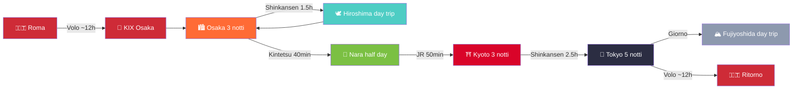
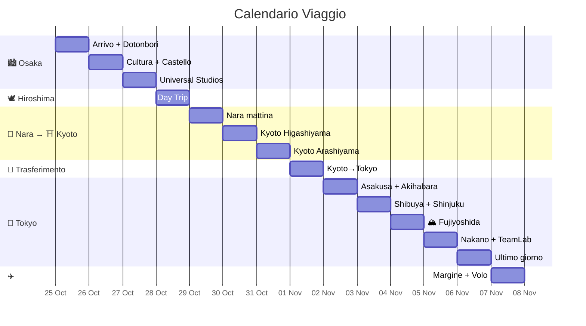
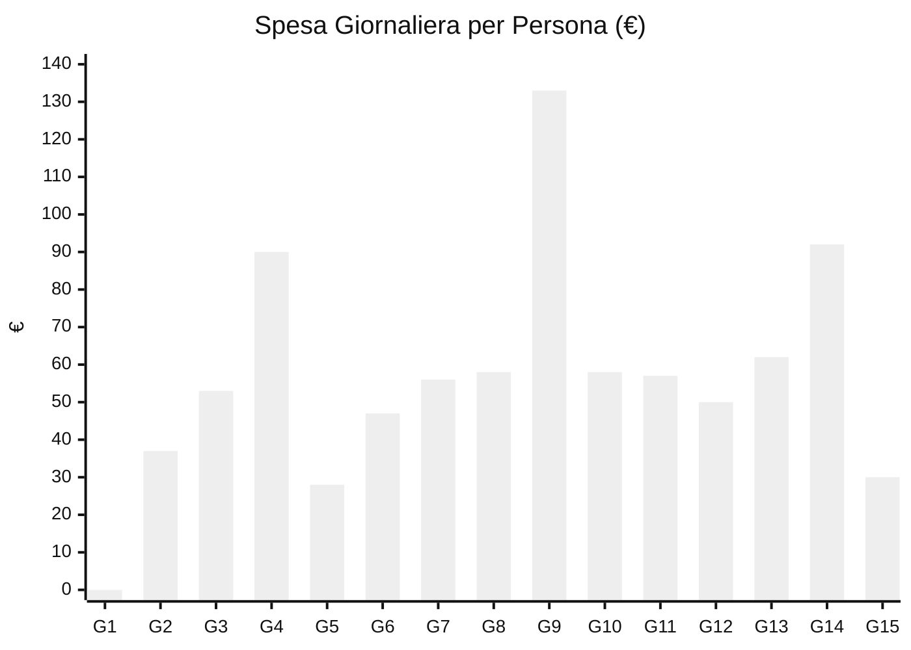

> Creato da @Lorenzo · @Davide · @Rebecca
> ⚡ **Stato:** Pianificazione completa — nulla è ancora prenotato
> ⚠️ **Allergie Rebecca (CRITICO):** soia, pesce, crostacei, frutta secca, banana, fragola, kiwi, arancia, nichel (lieve). Rebecca **deve cucinare da sola** — alloggi con cucina obbligatori. Vedi [[Allergie Alimentari Rebecca]] per guida completa.

# Giappone 2026 — 24 Ottobre · 7 Novembre

Osaka → Hiroshima → Nara → Kyoto → Tokyo · 15 giorni / 14 notti

## Budget Trend

---

## Riepilogo Tappe

| Tappa | Giorni | Notti | Date |
|:---|:---:|:---:|:---|
| Partenza Italia | — | — | 24 Ott |
| [[Osaka(大阪市)]] | 3 | 3 | 25–28 Ott |
| [[Hiroshima(広島)]] (day trip) | 1 | — | 28 Ott |
| [[Nara (奈良市)]] (half day) | 0.5 | — | 29 Ott |
| [[Kyoto(京都)]] | 3 | 3 | 29 Ott – 1 Nov |
| [[Tokyo(東京)]] | 6 | 5 | 1–6 Nov |
| Ritorno Italia | — | — | 6–7 Nov |

---

## Info Generali

| Info | Dettaglio |
|---|---|
| **Fuso** | +8h rispetto Italia |
| **Valuta** | Yen (¥) — ancora molto cash-friendly, preleva agli ATM 7-Eleven/Poste |
| **IC Card** | [[Suica\|Suica digitale su iPhone]] o [[Icoca]] a KIX (entrambe funzionano in tutto il Giappone) |
| **eSIM** | Klook o Airalo — comprare prima della partenza |
| **Assicurazione** | Da stipulare — [[Viaggiare Sicuri\|Viaggiare Sicuri]] per riferimento |
| **Lingua** | Giapponese — frasi base utili. Pochi parlano inglese fluente |

---

## Trasporti — JR Pass NON conviene

| Tratta | Mezzo | Tempo | Costo p.p. | Copertura |
|---|---|---|---|---|
| KIX → Osaka | Haruka Express / Bus | 50–75 min | ~1.100–1.800 ¥ | Suica/Icoca |
| Osaka → Hiroshima A/R | Shinkansen Sakura | ~1h 30m | ~20.000 ¥ | **JR Kansai-Hiroshima Pass** |
| Osaka → Nara | Kintetsu Line | ~40 min | ~570 ¥ | **Non JR** — Suica/Icoca |
| Nara → Kyoto | JR Nara Line | ~50 min | ~720 ¥ | **JR Pass** |
| Kyoto → Tokyo | Shinkansen Hikari | ~2h 40m | ~14.000 ¥ | Biglietto singolo |
| Tokyo → Fujiyoshida | Fuji Excursion | ~1h 45m | ~1.800 ¥ | Suica + biglietto |

**Soluzione consigliata:** [[JR pass#JR Kansai-Hiroshima Area Pass\|JR Kansai-Hiroshima Area Pass 5gg]] (~99 €) + biglietto singolo Kyoto→Tokyo (~81 €) + Suica/Icoca per trasporti locali. **Risparmio: ~280 €/persona vs JR Pass 14gg.**

---

## Legenda

| Simbolo | Significato |
|---|---|
| 🟢 **LIBERO** | Da fare liberamente, nessuna prenotazione |
| 🟡 **DA PRENOTARE** | Va prenotato in anticipo (settimane/mesi prima) |
| 🔵 **PRENOTATO #COD** | Già prenotato con codice conferma |
| ⚪ **OPZIONALE** | Solo se c'è tempo/energia |
| 🅿 **PIANO B** | Alternativa in caso di pioggia/chiusura |

---

## Budget Giornaliero (per persona)

| Giorno | Data | Cibo | Trasporti | Ingressi | TOT |
|:---:|:---:|:---:|:---:|:---:|:---:|
| 1 | 24 Ott | — | — | — | 0 € |
| 2 | 25 Ott | 25 € | 12 € | — | 37 € |
| 3 | 26 Ott | 30 € | 8 € | 15 € | 53 € |
| 4 | 27 Ott | 35 € | 5 € | 50 € | 90 € |
| 5 | 28 Ott | 25 € | — (pass) | 3 € | 28 € |
| 6 | 29 Ott | 30 € | 7 € | 10 € | 47 € |
| 7 | 30 Ott | 30 € | 8 € | 18 € | 56 € |
| 8 | 31 Ott | 30 € | 8 € | 20 € | 58 € |
| 9 | 1 Nov | 30 € | 93 € | 10 € | 133 € |
| 10 | 2 Nov | 30 € | 10 € | 18 € | 58 € |
| 11 | 3 Nov | 35 € | 10 € | 12 € | 57 € |
| 12 | 4 Nov | 30 € | 15 € | 5 € | 50 € |
| 13 | 5 Nov | 30 € | 10 € | 22 € | 62 € |
| 14 | 6 Nov | 35 € | 12 € | 45 € | 92 € |
| 15 | 7 Nov | 15 € | 15 € | — | 30 € |
| **TOT** | | **~425 €** | **~213 €** | **~228 €** | **~866 €** |

+ Volo A/R ~900 € + Alloggio ~350 € + Spese personali ~400 € = **~2.516 € totali**

### Alloggi

| #   | Città          | Struttura                                                        | Date         | Notti | Cucina              | Ref              |
| --- | -------------- | ---------------------------------------------------------------- | ------------ | ----- | ------------------- | ---------------- |
| 1   | [[Osaka(大阪市)]] | [[Osaka - Hanazonocho Apartment 103\|Hanazonocho Apartment 103]] | 25–29 Ott    | 4     | ✅ Angolo cottura    | 🔵 **PRENOTATO** |
| 2   | [[Kyoto(京都)]]  | [[Kyoto - Miro Nijo Hotel\|Miro Kyoto Nijo Hotel]]               | 29 Ott–1 Nov | 3     | ✅ Cucina attrezzata | 🔵 **PRENOTATO** |
| 3 | [[Tokyo(東京)]] | [[Tokyo - Taito City Guesthouse\|Taito City Guesthouse]] | 1–6 Nov | 5 | ✅ Cucina condivisa (1° piano) | 🔵 **PRENOTATO** |
>
> 🏠 Ogni alloggio ha una pagina dedicata con indirizzo, servizi, e note per Rebecca.

---

# ITINERARIO

---

## Giorno 1 — Sabato 24 Ottobre — Partenza

**Difficoltà:** 1/4 · **Budget:** 0 €

Preparativi e partenza dall'Italia. Volo notturno per Osaka (KIX) via Dubai/Doha/Abu Dhabi.

**Checklist pre-partenza:**
- [ ] Passaporti validi 6+ mesi
- [ ] [[Emergenze e Sicurezza#Assicurazione Viaggio|Assicurazione viaggio]] stampata
- [ ] eSIM attivata sul telefono (Klook o Airalo)
- [ ] Suica digitale su iPhone / Wallet
- [ ] Bancomat per prelievi yen (avvisa la banca)
- [ ] Copie digitali documenti su cloud
- [ ] Carica power bank, cavi, adattatore
- [ ] 👕 **Valigia pronta** — vedi [[Packing List]] per lista completa
- [ ] 🗣️ **Frasario giapponese** stampato — vedi [[Frasario Giapponese]]
- [ ] 🏥 **Pasto speciale volo per Rebecca** (contatta compagnia aerea: no soia, no pesce, no crostacei, no frutta secca)
- [ ] 📋 **Cartellino allergie in giapponese** (plastificato) — vedi [[Frasario Giapponese#Cartellino Allergie di Rebecca]]
- [ ] 🏠 **Verificare cucina in TUTTI gli alloggi** — vedi [[Allergie Alimentari Rebecca#Check-list Alloggi]]
- [ ] 📱 **Scaricare app:** Google Maps offline, Safety Tips, Google Translate

**Sera:**
- Partenza per aeroporto
- Volo notturno (~12–16h con scalo)
- 🅿 **PIANO B:** Se il volo è in ritardo, nessun impatto — il giorno 2 è volutamente leggero

---

## Giorno 2 — Domenica 25 Ottobre — Osaka: Arrivo & Dotonbori

**Difficoltà:** 2/4 · **Budget:** ~37 € · **Meteo:** 18–23°C, 30% possibilità pioggia (dati JMA)

**Arrivo al [[Osaka(大阪市)#Aeroporto del Kansai (KIX)]].**
- Ritira **[[Icoca]]** alle macchinette JR in aeroporto (o carica Suica digitale)
- [[E-sim panoramica delle disponibili\|eSIM]] — attivala subito all'arrivo
- [[Osaka(大阪市)#Dall'aeroporto del Kansai (KIX)|Haruka Express]] o bus per il centro (~50–75 min)
- Check-in hotel

**Pomeriggio/Sera | Cluster Namba/Dotonbori:**
- Prima passeggiata: [[Dotonbori (道頓堀)]] #5/5 🟢 — il canale illuminato, le insegne al neon, il granchio meccanico del Kani Doraku
- [[Tempio Hozen-ji (法善寺)]] #4/5 🟢 — a 2 min da Dotonbori, statua coperta di muschio, atmosfera raccolta

**Cibo — Alternative:**
- 🅰️ **Street food** [[Dotonbori (道頓堀)]]: takoyaki (¥500), okonomiyaki (¥1.000), kushikatsu (¥800)
- 🅱️ **Bib Gourmand:** [[Mangiare in Giappone#Osaka_2|Takoyaki Wanaka]] (Dotonbori, ¥500–800) · [[Mangiare in Giappone#Osaka|Kushikatsu Daruma]] (Shinsekai, ¥1.000–2.000)
- 🅲 **Seduti:** [[Mangiare in Giappone#Catene e Cibo Economico|Okonomiyaki Kiji]] (Umeda, Bib Gourmand ¥1.000–2.000) · ramen · [[Mangiare in Giappone#Kaitenzushi (Conveyor Belt Sushi)|Kura Sushi]] (¥100–500/piatto)
- 🅳 **Rebecca:** [[Mangiare in Giappone#Gyudon e Curry per Rebecca (Sicuri!)|Saizeriya]] (Namba, pasta aglio e olio ✅) · [[Mangiare in Giappone#Gyudon e Curry per Rebecca (Sicuri!)|Matsuya]] (gyudon senza salsa) · **cucina in hotel**
- 🍨 **Dopo:** matcha gelato (¥300–500) · crepes giapponesi

**Trasporti:** Haruka Express ¥1.800 (o bus ¥1.100) + Suica per metro
🅿 **PIANO B (pioggia):** Namba Walks (shopping coperto) + Hozen-ji → cena al coperto a Dotonbori

---

## Giorno 3 — Lunedì 26 Ottobre — Osaka: Cultura & Quartieri

**Difficoltà:** 3/4 · **Budget:** ~53 € · **Meteo:** 18–23°C, 25% pioggia (dati JMA)

**Mattina | Cluster Castello:**
- [[Castello di Osaka (大阪城)]] #4/5 🟢 (9:00, ¥600) — arrivo entro 9:00 per evitare code
- Passeggiata nei giardini Nishinomaru (¥350)
- *Spostamento:* Metro Midosuji Line → Shitennoji-mae (~15 min, ¥230)

**Pomeriggio | Cluster Shinsekai:**
- [[Tempio Shitenno-ji (四天王寺)]] #4/5 🟢 (9:00–16:30, ¥500)
- [[Shinsekai (新世界と通天閣​)]] #4/5 🟢 — atmosfera retrò, kushikatsu
- [[Torre Tsutenkaku (通天閣)]] #2/5 🟢 (¥900, optional)
- *Spostamento:* Metro → Umeda (~20 min, ¥280)

**Tramonto | Umeda:**
- [[Umeda Sky Building (梅田スカイビル)]] #3/5 🟢 (fino 22:30, ¥1.500) — Floating Garden Observatory al tramonto

**Cibo oggi — Alternative:**
- 🅰️ **Pranzo gyudon:** [[Mangiare in Giappone#Catene e Cibo Economico|Sukiya]] (gyudon ¥400) · [[Mangiare in Giappone#Catene e Cibo Economico|Yoshinoya]] (¥400) · [[Mangiare in Giappone#Catene e Cibo Economico|Matsuya]] (curry ¥380)
- 🅱️ **Pranzo ramen:** [[Mangiare in Giappone#Catene e Cibo Economico|Ichiran]] (¥1.000–2.000) · Tenkaippin (¥800–1.200)
- 🅲 **Cena Lorenzo&Davide:** izakaya a Namba (¥1.500–3.000) · [[Mangiare in Giappone#Bib Gourmand — Qualità-Prezzo|Kushikatsu Daruma]] (Bib Gourmand, Shinsekai, ¥1.000–2.000) · [[Mangiare in Giappone#Kaitenzushi (Conveyor Belt Sushi)|Sushiro]] (¥100–500/piatto)
- 🅳 **Rebecca pranzo:** [[Mangiare in Giappone#Gyudon e Curry per Rebecca (Sicuri!)|Matsuya]] (gyudon senza salsa) · konbini (yogurt, frutta, uovo sodo) · preparato in hotel
- 🅴 **Rebecca cena:** [[Mangiare in Giappone#Gyudon e Curry per Rebecca (Sicuri!)|Saizeriya]] (Namba, pasta aglio e olio ✅) · [[Mangiare in Giappone#Gyudon e Curry per Rebecca (Sicuri!)|Sukiya]] (riso + uovo ✅) · **cucina in hotel**

**Sera | Namba:**
- Shopping a **Shinsaibashi** 🟢 — via coperta aperta fino a tardi 🍽️

🅿 **PIANO B (pioggia):** Sostituisci Castello con TeamLab Botanical Garden (#4/5) — solo serale 18:30–21:30

---

## Giorno 4 — Martedì 27 Ottobre — Universal Studios Japan

**Difficoltà:** 4/4 (camminata intensa) · **Budget:** ~90 € · **Meteo:** 18–23°C, 25% pioggia

**Giornata intera a [[Universal Studios Japan (ユニバーサル・スタジオ・ジャパン)]]** #3/5 🟡 **DA PRENOTARE**

*Spostamento:* JR Osaka Loop Line → Universal City (~15 min, ¥180)

**Cibo oggi — Alternative:**
- 🅰️ **Pranzo in USJ:** hamburger (¥1.500–2.500) · pizza · [[Mangiare in Giappone#Kaitenzushi (Conveyor Belt Sushi)|conveyor belt sushi]] (¥100–500). Opzione economica: porta onigiri/fruit (permesso)
- 🅱️ **Cena rientro:** [[Mangiare in Giappone#Catene e Cibo Economico|Sukiya]] (gyudon ¥400) · [[Mangiare in Giappone#Catene e Cibo Economico|Ichiran]] (ramen ¥1.000–2.000) · [[Mangiare in Giappone#Per Fasce di Budget|CoCo Ichibanya]] (curry ¥500–1.000)
- 🅲 **Cena Rebecca:** [[Mangiare in Giappone#Gyudon e Curry per Rebecca (Sicuri!)|Saizeriya]] (Namba, pasta aglio e olio ✅) · [[Mangiare in Giappone#Gyudon e Curry per Rebecca (Sicuri!)|Sukiya]] (riso + uovo ✅) · **cucina in hotel**
- ⚠️ **Rebecca:** PORTA CIBO DA CASA a USJ (riso, pollo freddo, frutta, uova sode). Niente dentro USJ è sicuro (soia+pesce)

**Aree priority:**
- **Super Nintendo World** — Mario Kart: Koopa's Challenge
- **The Wizarding World of Harry Potter** — Hogwarts Castle
- **Minion Park** + Jurassic World

**Consigli:**
- 🟡 Biglietto ~¥8.600 (~50 €) su Klook — prenotare MESI prima (Halloween season si esaurisce)
- 🟡 **Express Pass** (~¥8.000–15.000 extra) — da valutare se si vuole evitare code 2h+
- Arrivare entro 8:00–8:30 (apertura 9:00, ma aprono prima in alta stagione)
- Scarpe comodissime — si camminano 25.000+ passi

🅿 **PIANO B:** Se troppo caro o sold-out → intera giornata a [[Kaiyukan aquarium (海遊館)]] #1/5 (¥2.700) + [[Teamlab botanical garden]] #4/5 (¥1.500) — totale ~25 €

---

## Giorno 5 — Mercoledì 28 Ottobre — Hiroshima Day Trip

**Difficoltà:** 3/4 · **Budget:** ~28 € · **Meteo:** 17–22°C, 25% pioggia · **Attiva JR Kansai-Hiroshima Pass**

> 🟡 **Da attivare oggi:** [[JR pass#JR Kansai-Hiroshima Area Pass\|JR Kansai-Hiroshima Area Pass 5gg]] (~99 €) — copre questo viaggio A/R (~20.000 ¥) + prossimi 4 giorni

**06:30–07:00** Sveglia
**07:30–09:00** Shinkansen Sakura: [[Shin-Osaka]] → [[Hiroshima(広島)]] (~1h 30m)
**09:00–12:00** [[Memorial Park Hiroshima]] #4/5 🟢 (24H, gratuito)
  - [[Memorial Park Hiroshima#Museo della Pace|Museo della Pace di Hiroshima]] (¥200, ~2h) — emotivamente intenso
  - [[Memorial Park Hiroshima#Genbaku Dome|Genbaku Dome]] — simbolo UNESCO
**12:00–13:00** **Pranzo — Alternative:**
  - 🅰️ [[Mangiare in Giappone#Hiroshima|Okonomimura]] (3 piani di stands okonomiyaki, ¥800–1.500)
  - 🅱️ [[Mangiare in Giappone#Hiroshima_2|Nagataya]] (Hondori, okonomiyaki ¥1.000–2.000)
  - 🅲 [[Mangiare in Giappone#Catene e Cibo Economico|Sukiya]] vicino stazione (gyudon ¥400)
  ⚠️ **Rebecca:** colazione konbini (yogurt, frutta). Pranzo al sacco (onigiri riso, frutta) o [[Mangiare in Giappone#Gyudon e Curry per Rebecca (Sicuri!)|Matsuya]] (gyudon senza salsa). Cena: [[Mangiare in Giappone#Gyudon e Curry per Rebecca (Sicuri!)|Saizeriya]] o italiano vicino hotel
**13:00–15:00** [[Nagarekawa (流川)]] #3/5 🟢 + [[Hondori street]] — shopping, momiji manju (¥300–500)
**15:00–15:30** [[Hiroshima(広島)#Castello di Hiroshima|Castello di Hiroshima]] 🟢 (¥370, optional)

**Opzionale — [[Miyajima (宮島)]]:** Se partiti alle 7:00 e ritmo spedito, si può aggiungere:
- *Spostamento:* JR Sanyo Line → Miyajimaguchi (~30 min, incluso JR Pass) + traghetto (~10 min, incluso)
- [[Itsukushima shrine (嚴島神社)]] #5/5 🟢 — Torii galleggiante (controlla maree!)
- ⚪ **Solo se c'è tempo e voglia**

**18:30–20:00** Rientro a Osaka
🅿 **PIANO B (stanchi):** Salta Castello e Hondori, torna a Osaka per le 16:00 e riposo

---

## Giorno 6 — Giovedì 29 Ottobre — Nara + Arrivo Kyoto

**Difficoltà:** 3/4 · **Budget:** ~47 € · **Meteo:** 15–22°C, 25% pioggia

**08:00** Check-out Osaka
**08:30–09:15** Kintetsu Line Namba → Kintetsu Nara (~40 min, ¥570 — NON JR)

**Mattina | [[Nara (奈良市)]]:**
- [[Nara (奈良市)#Parco di Nara|Parco di Nara]] 🟢 — cervi Sika, shika senbei (¥150)
- [[Nara (奈良市)#Tempio Todaiji|Tempio Todaiji]] 🟢 (¥800) — Daibutsu (Buddha in bronzo 15m)
- [[Nara (奈良市)#Santuario Kasuga Taisha|Santuario Kasuga Taisha]] 🟢 — 3.000 lanterne di pietra

**13:00–14:00** JR Nara Line → Kyoto (~50 min, ¥720, **incluso JR Pass**)

**Cibo oggi — Alternative:**
- 🅰️ **Pranzo Nara:** [[Mangiare in Giappone#Budget|kakinoha-zushi]] (sushi in foglia di cachi, ¥800–1.200) · [[Mangiare in Giappone#Catene e Cibo Economico|Sukiya]] (gyudon ¥400) · konbini (onigiri ¥100–200)
- 🅱️ **Cena Kyoto:** [[Mangiare in Giappone#Depachika|depachika Isetan Kyoto Station]] (bento scontati −30% dopo 18:00) · [[Mangiare in Giappone#Catene e Cibo Economico|CoCo Ichibanya]] (curry ¥500–1.000) · [[Mangiare in Giappone#Catene e Cibo Economico|Nakau]] (udon ¥300–600)
- 🅲 **Cena Rebecca:** [[Mangiare in Giappone#Gyudon e Curry per Rebecca (Sicuri!)|Saizeriya]] (Shijo, pasta aglio e olio ✅) · [[Mangiare in Giappone#Gyudon e Curry per Rebecca (Sicuri!)|Sukiya]] (riso + uovo ✅) · **cucina in hotel**

**Pomeriggio/Sera | Kyoto:**
- Check-in hotel
- [[Fushimi Inari (伏見稲荷大社)]] #3/5 🟢 (24h, GRATIS) — JR Nara Line → Inari (5 min, incluso JR Pass). 10.000 torii illuminati alla sera, quasi deserto

🅿 **PIANO B (pioggia):** Sostituisci Todaiji con Museo Nazionale di Nara (¥700, al chiuso)

---

## Giorno 7 — Venerdì 30 Ottobre — Kyoto: Higashiyama & Gion

**Difficoltà:** 4/4 · **Budget:** ~56 € · **Meteo:** 15–22°C, 25% pioggia

**Mattina presto | Cluster Higashiyama:**
- [[Kiyomizu-dera (清水寺)]] #5/5 🟢 (6:00–18:00, ¥500) — entro 8:00 per luce e folla minima. Terrazza in legno senza chiodi, vista su Kyoto. Foliage autunnale in corso
- [[Sannenzaka e Ninenzaka (三年坂)(二年坂)]] #4/5 🟢 — viuzze acciottolate, matcha gelato
- [[Tempio Kodai-ji (高台寺)]] #3/5 🟢 (9:00–17:00, ¥600) — giardino zen, boschetto bambù

**Pomeriggio | Gion:**
- [[Santuario Yasaka (八坂神社)]] #4/5 🟢 (24h, GRATIS)
- [[Quartiere Gion (祇園)]] #1/5 🟢 ⚠️ **Vietato entrare nei vicoli privati (multa 70€)** — via principale Hanamikoji OK. Rispetta le geisha (niente foto)

**Cibo oggi — Alternative:**
- 🅰️ **Pranzo street food:** [[Nishiki Market (錦市場)]] — yakitori, tsukemono, dolci matcha, tofu (¥200–1.000). **Bib Gourmand:** [[Mangiare in Giappone#Bib Gourmand — Qualità-Prezzo|Men-ya Inoichi]] (ramen, Pontochō, ¥1.000–2.000)
- 🅱️ **Pranzo economico:** [[Mangiare in Giappone#Catene e Cibo Economico|CoCo Ichibanya]] (curry ¥500–1.000) · [[Mangiare in Giappone#Catene e Cibo Economico|Hanamaru Udon]] (udon ¥300–600)
- 🅲 **Cena Lorenzo&Davide:** [[Quartiere Gion (祇園)#Pontochō|Pontochō]] — yakitori, izakaya (¥2.000–4.000) · [[Mangiare in Giappone#Bib Gourmand — Qualità-Prezzo|Omen]] (udon, Ginkakuji, ¥1.000–2.000)
- 🅳 **Rebecca cena:** [[Mangiare in Giappone#Gyudon e Curry per Rebecca (Sicuri!)|Saizeriya]] (Shijo, pasta ✅) · [[Mangiare in Giappone#Gyudon e Curry per Rebecca (Sicuri!)|Royal Host]] (steak ✅) · **cucina in hotel**

**Sera:**
- [[Quartiere Gion (祇園)#Pontochō|Pontochō]] — vicolo sul fiume Kamo, ristoranti con terrazza sull'acqua ⚪

🅿 **PIANO B (troppa folla):** Ginkakuji (Padiglione d'Argento, #1/5) — più tranquillo

---

## Giorno 8 — Sabato 31 Ottobre — Kyoto: Arashiyama & Kinkakuji

**Difficoltà:** 3/4 · **Budget:** ~58 € · **Meteo:** 15–22°C, 25% pioggia · 🎃 **Halloween**

**Mattina presto | [[Arashiyama (嵐山)]] #5/5:**
- Treno Sagano Line da Kyoto → Arashiyama (~15 min)
- **Foresta di bambù** 🟢 — entro 8:00 per evitare la folla, luce magica
- [[Arashiyama (嵐山)#Ponte Togetsukyo|Ponte Togetsukyo]] 🟢 — panorama sul fiume Katsura
- [[Arashiyama (嵐山)#Tempio Tenryuji|Tempio Tenryuji]] 🟢 (¥1.000, giardino zen patrimonio UNESCO)

**Pomeriggio | Cluster Nord:**
- [[Kinkaku-ji (金閣寺)]] #3/5 🟢 (9:00–17:00, ¥500) — Padiglione d'Oro ricoperto di foglia d'oro
- [[Ryoan-ji (龍安寺方丈庭園)]] #2/5 🟢 (8:00–17:00, ¥600) — giardino zen di rocce, meditazione

**Cibo oggi — Alternative:**
- 🅰️ **Pranzo Arashiyama:** soba (¥1.000–1.500) · [[Mangiare in Giappone#Mercati e Street Food|dolci matcha]] (¥300–500) · [[Mangiare in Giappone#Bib Gourmand — Qualità-Prezzo|Omen]] (Bib Gourmand, udon, Ginkakuji, ¥1.000–2.000)
- 🅱️ **Pranzo economico:** [[Mangiare in Giappone#Catene e Cibo Economico|Nakau]] (udon ¥300–600) · konbini (onigiri ¥100–200)
- 🅲 **Cena Halloween:** izakaya a [[Quartiere Gion (祇園)#Pontochō|Pontochō]] (¥2.000–4.000) · [[Mangiare in Giappone#Catene e Cibo Economico|CoCo Ichibanya]] (curry ¥500–1.000) · [[Mangiare in Giappone#Depachika|depachika Daimaru Kyoto]] (bento takeaway)
- 🅳 **Rebecca:** [[Mangiare in Giappone#Gyudon e Curry per Rebecca (Sicuri!)|Sukiya]] (Arashiyama, riso+uovo ✅) · [[Mangiare in Giappone#Gyudon e Curry per Rebecca (Sicuri!)|Saizeriya]] · **cucina in hotel**

**Sera — Halloween:**
- Rientro a [[Quartiere Gion (祇園)#Pontochō|Pontochō]] per cena
- Alcuni templi hanno illuminazioni autunnali serali (momiji illumination) — chiedere in hotel

🅿 **PIANO B:** Se pioggia → [[Nishiki Market (錦市場)]] #4/5 🟢 (9:00–17:30, chiuso dom) + [[TOEI Kyoto studio park (東映太秦映画村)]] (#1/5)

---

## Giorno 9 — Domenica 1 Novembre — Kyoto→Tokyo via Shinkansen

**Difficoltà:** 2/4 · **Budget:** ~133 € · **Meteo Kyoto:** 15–22°C → **Meteo Tokyo:** 17–23°C (inizio Nov, dati JMA)

**Mattina:**
- Check-out Kyoto
- [[Nishiki Market (錦市場)]] #4/5 🟢 (9:00–17:30 — **chiuso domenica** ❌) — AHH! Il 1 Nov è **domenica**, salta!
- ⚪ Sostituisci con [[Tempio Kodai-ji (高台寺)]] o passeggiata a [[Quartiere Gion (祇園)|Gion]]

**Pomeriggio:** Shinkansen Hikari → Tokyo (~2h 40m, ¥14.000 — biglietto singolo)

**Cibo oggi — Alternative:**
- 🅰️ **Pranzo shinkansen:** [[Mangiare in Giappone#Depachika|depachika Isetan Kyoto Station]] (bento di qualità ¥800–1.500) · ekiben classico (¥800–1.200) · konbini (onigiri ¥100–200)
- 🅱️ **Cena Roppongi:** [[Mangiare in Giappone#Bib Gourmand — Qualità-Prezzo|Afuri]] (Bib Gourmand, ramen yuzu, ¥1.000–1.500) · [[Mangiare in Giappone#Catene e Cibo Economico|Ichiran]] (ramen ¥1.000–2.000) · [[Mangiare in Giappone#Catene e Cibo Economico|Saizeriya]] (¥500–1.000)
- 🅲 **Cena media:** [[Mangiare in Giappone#Per Fasce di Budget|izakaya]] a Roppongi (¥2.000–4.000) · yakitori ([[:Roppongi (六本木)#Ristoranti]]) · steakhouse
- 🅳 **Rebecca:** [[Mangiare in Giappone#Gyudon e Curry per Rebecca (Sicuri!)|Saizeriya]] (Roppongi, pasta ✅) · [[Mangiare in Giappone#Gyudon e Curry per Rebecca (Sicuri!)|Matsuya]] (gyudon senza salsa) · **cucina in hotel**

**Sera | Tokyo — Roppongi:**
- Check-in hotel (zona Shinjuku/Shibuya consigliata)
- [[Roppongi (六本木)]] #3/5 🟢 — quartiere musei, vita notturna
- [[Tokyo tower (東京タワー)]] #4/5 🟢 (9:00–22:30, ¥1.200) — illuminata di notte, vista sulla città

🅿 **PIANO B:** Se stanchi dal viaggio — cena vicino hotel, esplorazione leggera del quartiere

---

## Giorno 10 — Lunedì 2 Novembre — Tokyo: Asakusa, Skytree, Akihabara

**Difficoltà:** 4/4 · **Budget:** ~58 € · **Meteo:** 15–19°C, 20% pioggia (dati JMA)

**Mattina | Cluster Est:**
- [[Asakusa(浅草)]] #5/5 🟢 — [[Asakusa(浅草)#Kaminarimon|Kaminarimon]] (porta lanterna), [[Asakusa(浅草)#Nakamise|Nakamise]] (via shopping)
- [[Tempio Senso-Ji (浅草寺)]] #5/5 🟢 (6:30–17:00, GRATIS) — tempio più antico di Tokyo
- Passeggiata lungo il fiume Sumida verso Skytree

**Pomeriggio:**
- [[Tokyo skytree (東京スカイツリー)]] #3/5 🟢 (10:00–21:00, ¥3.000) — torre più alta del Giappone (634m)
- [[Pokemon center Asakusa]] #3/5 🟢 (10:00–21:00, GRATIS l'ingresso)
- [[Yanaka Ginza]] #3/5 ⭐ — quartiere storico con atmosfera Showa, a 10min da Ueno (sostitutivo se stanchi di Skytree)
- *Spostamento:* Tokyo Metro → Akihabara (~15 min)

**Cibo oggi — Alternative:**
- 🅰️ **Pranzo Asakusa:** [[Mangiare in Giappone#Catene e Cibo Economico|Ichiran]] (ramen ¥1.000–2.000) · [[Mangiare in Giappone#Kaitenzushi (Conveyor Belt Sushi)|Kura Sushi]] (¥100–500/piatto) · [[Mangiare in Giappone#Catene e Cibo Economico|Sukiya]] (gyudon ¥400)
- 🅱️ **Pranzo Rebecca:** [[Mangiare in Giappone#Gyudon e Curry per Rebecca (Sicuri!)|Matsuya]] (gyudon senza salsa ✅) · konbini (yogurt, frutta, uovo sodo)
- 🅲 **Cena Ueno/Ameyoko:** [[Mangiare in Giappone#Mercati e Street Food|Ameyoko]] — yakitori, spiedini, takoyaki (¥200–800 per Lorenzo e Davide) · [[Mangiare in Giappone#Catene e Cibo Economico|Yoshinoya]] (gyudon ¥400) · [[Mangiare in Giappone#Per Fasce di Budget|CoCo Ichibanya]] (curry ¥500–1.000)
- 🅳 **Cena Rebecca:** [[Mangiare in Giappone#Gyudon e Curry per Rebecca (Sicuri!)|Saizeriya]] · [[Mangiare in Giappone#Gyudon e Curry per Rebecca (Sicuri!)|Royal Host]] · **cucina in hotel**

**Sera | [[Akihabara (秋葉原)]] #4/5 🟢:**
- [[Nakano Broadway (中野ブロードウェイ)#Mandarake|Mandarake]] — manga e action figure usate
- [[Akihabara (秋葉原)#Yodobashi Camera|Yodobashi Camera]] — 9 piani di elettronica
- Maid café (~¥500–1.000 + consumazione) ⚪

🅿 **PIANO B (pioggia):** Skytree è coperto (al chiuso), Akihabara è coperto — zero impatto!

---

## Giorno 11 — Martedì 3 Novembre — Tokyo: Shibuya, Meiji, Shinjuku

**Difficoltà:** 3/4 · **Budget:** ~57 € · **Meteo:** 15–19°C, 20% pioggia · **🎌 Festa Nazionale (Bunka no Hi)**

> 3 novembre == **Giorno della Cultura** — templi/musei possono avere eventi speciali, maggiore affluenza.

**Mattina | Cluster Ovest:**
- [[Santuario Meiji (明治神宮)]] #3/5 🟢 (10:00–16:30, GRATIS) — foresta di 100.000 alberi nel cuore di Tokyo
- [[Harajuku (原宿)]] #2/5 🟢 — Takeshita Street, moda kawaii

**Pomeriggio | Shibuya:**
- [[Shibuya (渋谷区)]] #5/5 🟢 — [[Shibuya (渋谷区)#Shibuya Crossing|Shibuya Crossing]] (attraversalo dalla folla!)
- [[Shibuya (渋谷区)#Shibuya Sky|Shibuya Sky]] #4/5 ⭐ (¥2.000, vista 360°) — **Rebecca vuole andare!** ⚪ o [[Shibuya (渋谷区)#Shibuya109|Magnet by Shibuya109]] (gratis con consumazione)
- [[Pokemon center Shibuya]] #5/5 🟢 — merchandise esclusivo
- 🟡 **Pokémon Café** — prenotare online con MESI di anticipo

**Cibo oggi — Alternative:**
- 🅰️ **Pranzo Shibuya:** [[Mangiare in Giappone#Per Fasce di Budget|CoCo Ichibanya]] (curry ¥500–1.000) · [[Mangiare in Giappone#Bib Gourmand — Qualità-Prezzo|Katsukami]] (Bib Gourmand, tonkatsu ¥1.500–2.500) · [[Mangiare in Giappone#Kaitenzushi (Conveyor Belt Sushi)|Uobei]] (¥100/piatto, Shibuya)
- 🅱️ **Pranzo Rebecca:** [[Mangiare in Giappone#Gyudon e Curry per Rebecca (Sicuri!)|CoCo Ichibanya]] (curry ✅) · [[Mangiare in Giappone#Catene e Cibo Economico|Yoshinoya]] (gyudon ¥400) · konbini
- 🅲 **Cena Shinjuku:** [[Shinjuku (新宿区)#Omoide Yokocho|Omoide Yokocho]] — yakitori (¥200–500/spiedino) · [[Mangiare in Giappone#Bib Gourmand — Qualità-Prezzo|Afuri]] (Bib Gourmand, ramen yuzu ¥1.000–1.500) · [[Mangiare in Giappone#Catene e Cibo Economico|Ichiran]] (ramen ¥1.000–2.000)
- 🅳 **Cena media:** [[Mangiare in Giappone#Per Fasce di Budget|izakaya]] a Shinjuku · [[Mangiare in Giappone#Catene e Cibo Economico|Gusto]] (family restaurant, ¥500–1.500)
- 🅴 **Rebecca cena:** [[Mangiare in Giappone#Gyudon e Curry per Rebecca (Sicuri!)|Saizeriya]] (Shinjuku, pasta ✅) · [[Mangiare in Giappone#Gyudon e Curry per Rebecca (Sicuri!)|Royal Host]] (steak ✅) · **cucina in hotel**
- 🍽️ **Dopo cena:** ramen (Ichiran, aperto fino a tardi) · hōjicha (¥300) · bar Golden Gai

**Sera | Shinjuku:**
- [[Shinjuku (新宿区)]] #4/5 🟢
- [[Golden Gai (ゴールデン街 )]] #2/5 🟢 — vicoli di minuscoli bar (5–8 posti)
- [[Shinjuku (新宿区)#Tokyo Metropolitan Government Building|Tokyo Metropolitan Government Building]] 🟢 (GRATIS fino 23:00) — vista notturna su tutta Tokyo

🅿 **PIANO B:** Se troppo pieno per Festa Nazionale → Nakano Broadway (#5/5, vedi Giorno 13) — scambia giorni

---

## Giorno 12 — Mercoledì 4 Novembre — Fujiyoshida & Chureito Pagoda

**Difficoltà:** 2/4 (camminata, non scalata) · **Budget:** ~50 € · **Meteo Fuji:** 8–14°C (fresco, porta giacca) · 20% pioggia

> 🟢 **Miglior periodo per Fuji:** fine Ott–inizio Nov = foliage + prima neve in cima + cielo più limpido

**Come arrivare:** JR Chuo Line → Shinjuku → **Fuji Excursion** (~1h 45m, ¥1.800) — 🟡 prenotazione consigliata (treno popolare)

**Mattina:**
- Arrivo [[Fujiyoshida (富士吉田市)]] (~10:00)
- [[Chureito Pagoda (忠霊塔)]] #3/5 🟢 — 398 gradini, pagoda a 5 piani + Fuji sullo sfondo = iconico
- [[Kanandorii (金鳥居)]] #3/5 🟢 — grande torii rosso

**Pomeriggio:**
- [[Fujiyoshida (富士吉田市)#Lago Kawaguchiko|Lago Kawaguchiko]] (Fujikyu Railway ~10 min) — riflesso del Fuji sul lago 🟢
- Rientro Tokyo entro 16:00–17:00

**Cibo oggi — Alternative:**
- 🅰️ **Pranzo Fujiyoshida:** konbini (onigiri ¥100–200, frutta) · [[Mangiare in Giappone#Catene e Cibo Economico|Nakau]] (udon ¥300–600) · [[Mangiare in Giappone#Catene e Cibo Economico|Sukiya]] (gyudon ¥400)
- 🅱️ **Pranzo Rebecca:** konbini (riso bianco + frutta) · [[Mangiare in Giappone#Gyudon e Curry per Rebecca (Sicuri!)|Sukiya]] (riso+uovo ✅)
- 🅲 **Cena Shinjuku:** [[Shinjuku (新宿区)#Omoide Yokocho|Omoide Yokocho]] — yakitori (¥200–500/spiedino) · [[Mangiare in Giappone#Bib Gourmand — Qualità-Prezzo|Afuri]] (ramen yuzu ¥1.000–1.500) · [[Mangiare in Giappone#Catene e Cibo Economico|CoCo Ichibanya]] (curry ¥500–1.000)
- 🅳 **Cena Rebecca:** [[Mangiare in Giappone#Gyudon e Curry per Rebecca (Sicuri!)|Saizeriya]] (Shinjuku, pasta ✅) · [[Mangiare in Giappone#Gyudon e Curry per Rebecca (Sicuri!)|Sukiya]] (riso+uovo ✅) · **cucina in hotel**
- 🍽️ **Dopo cena:** hōjicha · sakè a [[Golden Gai (ゴールデン街 )]] (¥500–1.500)

**Sera:**
- [[Shinjuku (新宿区)#Shinjuku Gyoen|Shinjuku Gyoen]] 🟢 (¥500, fino 18:00) — foliage autunnale ⚪ se ancora luce

🅿 **PIANO B (nuvoloso — Fuji non visibile):** Kamakura day trip (#3/5) invece — JR Yokosuka Line ~1h

---

## Giorno 13 — Giovedì 5 Novembre — Tokyo: Nakano, TeamLab, Odaiba

**Difficoltà:** 3/4 · **Budget:** ~62 € · **Meteo:** 14–18°C, 20% pioggia

**Mattina | Nakano:**
- [[Nakano (中野市)]] #5/5 🟢 — JR Chuo Line da Shinjuku (~10 min, ¥170)
- [[Nakano Broadway (中野ブロードウェイ)]] #5/5 🟢 — paradiso collezionismo vintage (Mandarake, manga rari, action figure)

**Pomeriggio | Odaiba:**
- Yurikamome monorotaia da Shimbashi → Odaiba (~15 min, ¥330) 🟢
- [[Teamlab botanical garden]]?? No — [[Odaiba (お台場 )#TeamLab Planets|TeamLab Planets]] 🟡 **DA PRENOTARE** (¥3.200, prenotazione obbligatoria settimane prima)
- [[Odaiba (お台場 )]] #2/5 🟢 — [[Rainbow Bridge (レインボーブリッジ)]], DiverCity Tokyo, Gundam gigante gratuito
- [[Odaiba Beach]] #3/5 ⭐ — spiaggia artificiale con vista Rainbow Bridge (Rebecca vuole vedere)

**Cibo oggi — Alternative:**
- 🅰️ **Pranzo Nakano:** [[Mangiare in Giappone#Catene e Cibo Economico|CoCo Ichibanya]] (curry ¥500–1.000) · [[Mangiare in Giappone#Kaitenzushi (Conveyor Belt Sushi)|Kura Sushi]] (¥100–500/piatto) · [[Mangiare in Giappone#Catene e Cibo Economico|Sukiya]] (gyudon ¥400)
- 🅱️ **Pranzo Rebecca:** [[Mangiare in Giappone#Gyudon e Curry per Rebecca (Sicuri!)|CoCo Ichibanya]] (curry ✅) · konbini
- 🅲 **Cena Odaiba:** ristoranti con vista baia (¥2.000–4.000) · [[Mangiare in Giappone#Per Fasce di Budget|Saizeriya]] (¥500–1.000) · [[Mangiare in Giappone#Catene e Cibo Economico|Gusto]] (family restaurant ¥500–1.500)
- 🅳 **Cena Rebecca:** [[Mangiare in Giappone#Gyudon e Curry per Rebecca (Sicuri!)|Saizeriya]] (Odaiba, pasta ✅) · [[Mangiare in Giappone#Gyudon e Curry per Rebecca (Sicuri!)|Royal Host]] (steak ✅) · **cucina in hotel**

**Sera:**
- Cena a Odaiba con vista Rainbow Bridge illuminato
- [[Mario kart ride]] #2/5 🟡 (~€100, patente necessaria) — prenotare con largo anticipo ⚪

🅿 **PIANO B:** TeamLab sold-out → [[Mercato del pesce di Tsukiji (築地場外市場)]] #4/5 🟢 (5:00–14:00)

---

## Giorno 14 — Venerdì 6 Novembre — Tokyo: Ultimo Giorno + Partenza

**Difficoltà:** 2/4 · **Budget:** ~92 € · **Meteo:** 14–18°C, 20% pioggia

**Cibo oggi — Alternative:**
- 🅰️ **Colazione Lorenzo&Davide:** [[Mercato del pesce di Tsukiji (築地場外市場)]] — sushi fresco al banco (¥1.000–3.000)
- 🅱️ **Colazione Rebecca:** konbini — yogurt bianco, mela/pera ✅ (niente banana/kiwi/arancia)
- 🅲 **Pranzo ultimo:** [[Mangiare in Giappone#Catene e Cibo Economico|Ichiran]] (ramen ¥1.000–2.000) · [[Mangiare in Giappone#Kaitenzushi (Conveyor Belt Sushi)|Kura Sushi]] (¥100–500/piatto) · [[Mangiare in Giappone#Bib Gourmand — Qualità-Prezzo|Afuri]] (ramen yuzu, ¥1.000–1.500)
- 🅳 **Pranzo Rebecca:** [[Mangiare in Giappone#Gyudon e Curry per Rebecca (Sicuri!)|Saizeriya]] (pasta aglio e olio ✅) · [[Mangiare in Giappone#Gyudon e Curry per Rebecca (Sicuri!)|Matsuya]] (gyudon senza salsa)
- 🅴 **Cena tutti:** [[Mangiare in Giappone#Depachika|depachika Daimaru Tokyo Station]] (bento di qualità da portare sul volo) · aeroporto (¥1.000–2.000)
- 🅵 **Rebecca cena:** volo — **pasto speciale prenotato** (soia-free, fish-free, nut-free, no banana/fragola/kiwi/arancia)

**Mattina:**
- [[Palazzo Imperiale di Tokyo (皇居)]] #4/5 🟢 (9:00–11:15, GRATIS) — tour guidato del palazzo, giardini orientali
- Ultimi acquisti: [[Ginza (銀座)]] #1/5 🟢 o [[Mercato del pesce di Tsukiji (築地場外市場)]] #4/5 🟢 (se non fatto)

**Pomeriggio:**
- Opzioni:
  - ⚪ **Kamakura day trip leggero** — se partenza è sera tardi (vedi Giorno 12 PIANO B)
  - 🟢 **Rientro hotel → preparazione bagagli**
- *Spostamento aeroporto:* Narita Express (~60 min, ¥3.000+) o bus (~90 min, ¥1.200)

**Sera/Notte:**
- Volo ritorno Tokyo → Italia

🅿 **PIANO B:** Se partite il 7 mattina (non sera), avete la giornata intera libera il 6 — suggerito [[The making of harry potter (ワーナー ブラザース スタジオツアー東京 - メイキング・オブ・ハリー・ポッター)]] #1/5 🟡 DA PRENOTARE

---

## Giorno 15 — Sabato 7 Novembre — Margine

**Difficoltà:** 1/4 · **Budget:** ~30 €

Giorno cuscinetto. Se partenza è il 7, si ha la mattina per ultimi acquisti o zona Shibuya/[[Parco di Ueno (上野恩賜公園)]]. Se già rientrati, niente.

**Cibo oggi — Alternative:**
- 🅰️ **Colazione:** [[Mangiare in Giappone#Catene e Cibo Economico|Sukiya]] (colazione ¥300–500) · konbini (onigiri, yogurt) · volo (pasto speciale)
- 🅱️ **Rebecca:** colazione konbini/volo (pasto speciale). Pranzo aeroporto (konbini — riso bianco, yogurt, frutta sicura). Cena: **a casa in Italia** 🎉

---

## Monitoraggio Voli e Prenotazioni

> 🎯 **Obiettivo:** Prenotare tutto entro **inizio Agosto 2026**. Da oggi (11 Lug) controllare prezzi voli ogni 2 giorni.

### Calendario Monitoraggio

| Data | Stato | 🛫 Andata FCO→KIX 24-25 Ott | 🛬 Ritorno TYO→FCO 6-7 Nov | 💰 TOT A/R | 📎 Fonti |
|---|---|---|---|---|---|
| 11 Lug | ✅ | **€290-600** · China Eastern via PVG (15h, da €290) · Finnair via HEL (18h) · Emirates via DXB (16h, da €450) | **€250-750** · Finnair via HEL (17h40, da €250) · KLM via AMS (17h30, da €270) · ITA **diretto** HND→FCO (14h45, €550-750) | **~€650-1.100** | [Rome2Rio FCO→KIX](https://www.rome2rio.com/s/Rome/Osaka) · [Rome2Rio TYO→FCO](https://www.rome2rio.com/s/Tokyo/Rome) |
| 13 Lug | ✅ | **€685 reale** — Etihad via AUH→NRT (18h10) · **€804** LOT via WAW→NRT (16h20) · **€838** EgyptAir (17h10) · **€863** Qatar via DOH (18h45) · **€901** Turkish (17h15) — tutti sotto 21h. **Attenzione:** arrivano a TYO, non KIX. Da TYO a Osaka: Shinkansen ~2,5h + ~€81 | **€601 reale** 🏆 — Qatar Airways via DOH (HND→FCO, 20h05 ✅) · **€664** Asiana via ICN (NRT→FCO) · **€740** Emirates via DXB | **~€685-601 = ~€1.286** | Fonte: [Google Flights FCO→TYO 24 Ott](https://www.google.com/travel/flights?q=Roma+a+Tokyo+24+ottobre+2026+one+way) + [Google Flights TYO→FCO 6 Nov](https://www.google.com/travel/flights?q=flights+from+tokyo+to+rome+on+2026-11-06+one+way) |
| 15 Lug | ⬜ | — | — | — | — |
| 17 Lug | ⬜ | — | — | — | — |
| 19 Lug | ⬜ | — | — | — | — |
| 21 Lug | ⬜ | — | — | — | — |
| 23 Lug | ⬜ | — | — | — | — |
| 25 Lug | ⬜ | — | — | — | — |
| 27 Lug | ⬜ | — | — | — | — |
| 29 Lug | ⬜ | — | — | — | — |
| 31 Lug | ⬜ | — | — | — | — |
| 1-3 Ago 🎯 | ⬜ | **Target: €300-500** · 1 scalo (DXB, DOH, IST) · max 20h totali | **Target: €300-500** · ITA diretto se ~€500, Finnair/KLM se <€350 | **Target: €700-1.000** | Controllare: Skyscanner, Momondo, Google Flights |

**Criteri volo:**
- 🛫 **Andata:** Roma (FCO) → Osaka (KIX), arrivo 25 Ottobre. **NON diretto** — 1 scalo (Dubai, Doha, Istanbul). Durata: ~16-20h totali. **Evitare scali lunghi >6h che portano a 24-30h totali.**
- 🛬 **Ritorno:** Tokyo (HND) → Roma (FCO), partenza 6-7 Novembre. **DIRETTO ITA disponibile** (~13h) oppure 1 scalo economico (Dubai/Doha, ~16-18h).
- 💰 **Target prezzo:** 800–1.000 €/persona A/R
- ✅ **Rebecca:** pasto speciale obbligatorio (no soia, no pesce, no crostacei, no frutta secca)
- 🔍 **Skyscanner, Momondo, Google Flights** con alert di prezzo per tratte separate
- 💡 **Strategia:** Andata economica con scalo + ritorno diretto ITA = miglior rapporto qualità-prezzo

### Log Spostamenti Itinerario

| Modifica | Data | Chi | Note |
|---|---|---|---|
| — | — | — | Inserire modifiche all'itinerario qui |

---

## Budget Tracker

> 💰 **Budget totale stimato:** ~2.513–2.713 €/persona · **Budget reale:** da compilare

| Voce | Stima | Reale | Delta | Note |
|---|---|---|---|---|
| Volo A/R | 800–1.000 € | ❌ Da prenotare | — | — |
| Alloggio (14 notti, camera/3) | ~350 € | ❌ Da calcolare | — | Osaka+Kyoto ✅ prenotati, Tokyo da verificare |
| Cibo (14 gg × ~30 €) | ~425 € | ❌ Da tenere traccia | — | Rebecca cucina = risparmio |
| JR Kansai-Hiroshima Area Pass 5gg | ~99 € | ❌ Da acquistare | — | — |
| Kyoto→Tokyo Shinkansen | ~81 € | ❌ Da acquistare | — | — |
| Trasporti locali (14 gg × ~10 €) | ~130 € | ❌ Da tenere traccia | — | Suica/Icoca |
| Attrazioni (USJ, templi, TeamLab…) | ~228 € | ❌ Da calcolare | — | Vedi |Attività e Prenotazioni| |
| Spese personali | ~400 € | ❌ Da tenere traccia | — | Souvenir, extra |
| Assicurazione (Heymondo Premium) | ~27 €/persona | ❌ Da stipulare | — | Vedi |Assicurazione Heymondo| |
| eSIM 15gg | ~15–25 € | ❌ Da comprare | — | Klook o Airalo |
| **TOTALE** | **~2.540–2.740 €** | **❌ Da compilare** | — | — |

### Budget Rebecca (extra cibo)

| Voce | Stima |
|---|---|
| Spesa supermarket (pasta, riso, pollo, verdure, frutta) | ~10 €/gg × 14gg = ~140 € |
| Ristoranti sicuri (Saizeriya, yakiniku) | ~3–4 pasti × ~10 € = ~35 € |
| **Extra Rebecca** | **~175 €** (meno dei ~425 € del budget cibo standard) |

---

## Budget Totale (per persona)

| Voce | Stima |
|---|---|
| Volo A/R | 800–1.000 € |
| Alloggio (14 notti, camera condivisa/3) | ~350 € |
| Cibo (14 gg × ~30 €) | ~425 € |
| JR Kansai-Hiroshima Area Pass 5gg | ~99 € |
| Kyoto→Tokyo Shinkansen (singolo) | ~81 € |
| Trasporti locali (14 gg × ~10 €) | ~130 € |
| Attrazioni (USJ, SkyTree, TeamLab, templi…) | ~228 € |
| Spese personali | ~400 € |
| **TOTALE** | **~2.513–2.713 €** |

---

## Booking Checklist

| Cosa | Da fare entro | Stato | Note |
|---|---|---|---|
| Volo A/R Roma→KIX (arrivo 25 ott) / NRT→Roma | **URGENTE** | ❌ Da prenotare | Cerca su Skyscanner, Momondo. **Pasto speciale Rebecca (no soia, no pesce, no crostacei, no frutta secca)** |
| Alloggio Osaka 4 notti (25–29 ott) | ✅ **FATTO** | 🔵 **PRENOTATO** | [[Osaka - Hanazonocho Apartment 103\|Hanazonocho Apartment 103]] — angolo cottura ✅ |
| Alloggio Kyoto 3 notti (29 ott–1 nov) | ✅ **FATTO** | 🔵 **PRENOTATO** | [[Kyoto - Miro Nijo Hotel\|Miro Kyoto Nijo Hotel]] — cucina ✅ |
| Alloggio Tokyo 5 notti (1–6 nov) | ✅ **CONFERMATO** | 🔵 **PRENOTATO** | [[Tokyo - Taito City Guesthouse\|Taito City Guesthouse]] — cucina condivisa al 1° piano ✅ |
| JR Kansai-Hiroshima Area Pass | Entro 1 mese | ❌ Da acquistare | Klook o JR West online |
| Universal Studios Japan biglietti | **URGENTE (2+ mesi)** | ❌ Da prenotare | Klook — Halloween season si esaurisce |
| TeamLab Planets | 1 mese prima | ❌ Da prenotare | teamlab.art |
| Pokémon Café | 1 mese prima | ❌ Da prenotare | Sito ufficiale Pokémon |
| Mario Kart Ride | 1 mese prima | ❌ Da prenotare | ~€100, patente guida necessaria |
| eSIM / SIM | 2 settimane prima | ❌ Da comprare | Klook.com o Airalo |
| Assicurazione viaggio | **URGENTE** | ❌ Da stipulare | ViaggiaSicuri per riferimento. Rebecca: verificare copertura allergie |
| Prenotazione Fuji Excursion treno | 1 mese prima | ❌ Da prenotare | JR East online |
| Controllo maree Miyajima | Giorno prima | ❌ Da fare | Alta marea = torii nell'acqua |
| Assicurazione Heymondo | **Agosto 2026** | ❌ Da stipulare | ~1,80€/gg × 15gg × 3 = ~81€ totali. Vedi [[Assicurazione Heymondo]] |
